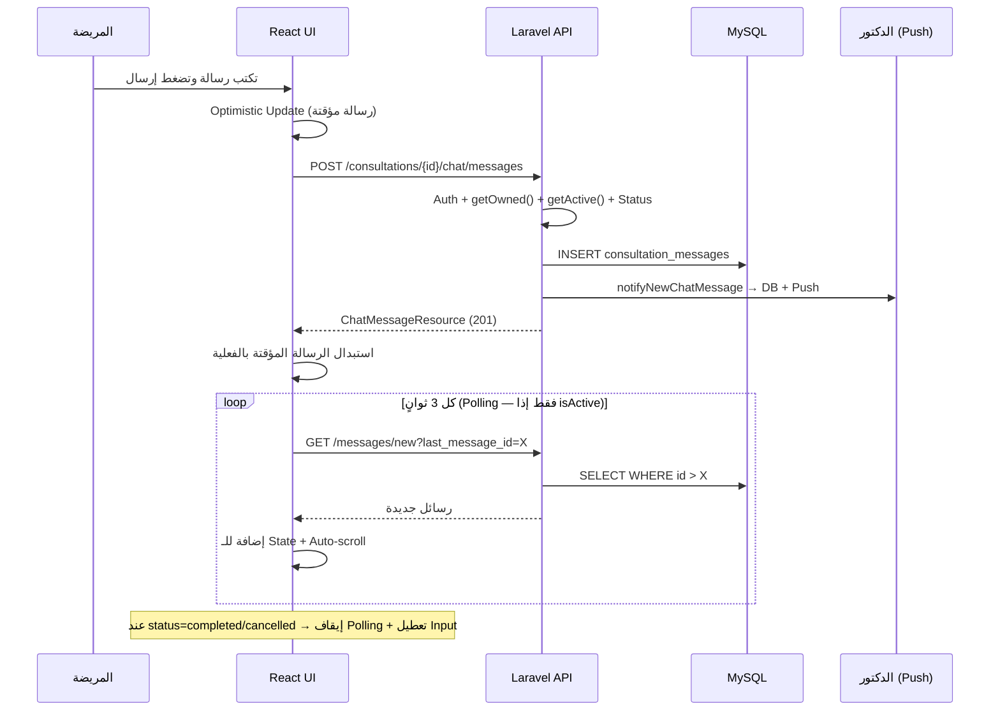

# خطة نظام شات الدكتور والمريضة — الجزء الثاني (النسخة النهائية)

> تكملة لـ [implementation_plan.md](file:///C:/Users/world/.gemini/antigravity/brain/27f1e117-46e4-4f46-b96b-dcaab62ce474/implementation_plan.md)
> جميع التعديلات الـ 6 مطبقة بناءً على مراجعة الكود.

---

## 5.3 الـ Controllers الكاملة

### Patient `ConsultationChatController`
**الملف**: `app/Http/Controllers/Api/Patient/ConsultationChatController.php`

```php
<?php
namespace App\Http\Controllers\Api\Patient;

use App\Http\Controllers\Controller;
use App\Http\Requests\Shared\SendChatMessageRequest;
use App\Http\Resources\Shared\ChatMessageResource;
use App\Models\Consultation;
use App\Models\ConsultationMessage;
use App\Services\ChatImageService;
use App\Services\NotificationService;
use App\Traits\ApiResponse;
use Illuminate\Http\JsonResponse;
use Illuminate\Http\Request;

class ConsultationChatController extends Controller
{
    use ApiResponse;

    public function __construct(
        private ChatImageService $imageService,
        private NotificationService $notificationService,
    ) {}

    // ✅ FIX #1 — دالتان منفصلتان
    // getOwned: تحقق من الملكية فقط — تُستخدم لـ getMessages (تعمل حتى بعد انتهاء الاستشارة)
    private function getOwned(int $id): Consultation
    {
        return Consultation::where('id', $id)
            ->where('user_id', auth('patient')->id())->firstOrFail();
    }

    // getActive: تحقق من الملكية + السطاتوس — تُستخدم لـ sendMessage فقط
    private function getActive(int $id): Consultation
    {
        $c = $this->getOwned($id);
        abort_if(!in_array($c->status, ['confirmed', 'in_progress']), 403,
            'المحادثة مغلقة — انتهت الاستشارة');
        return $c;
    }

    /** GET /consultations/{id}/chat/messages — يعمل حتى على الاستشارات المنتهية */
    public function getMessages(int $consultationId): JsonResponse
    {
        $c = $this->getOwned($consultationId);
        $msgs = ConsultationMessage::where('consultation_id', $c->id)
            ->with(['consultation.patient', 'consultation.doctor'])->oldest()
            ->paginate(config('chat.limits.messages_per_page', 50));
        return $this->successResponse(ChatMessageResource::collection($msgs), 'تم جلب الرسائل');
    }

    /** GET /consultations/{id}/chat/messages/new?last_message_id=X */
    public function getNewMessages(Request $request, int $consultationId): JsonResponse
    {
        $c = $this->getOwned($consultationId);
        $lastId = (int) $request->query('last_message_id', 0);
        $msgs = ConsultationMessage::where('consultation_id', $c->id)
            ->when($lastId > 0, fn($q) => $q->where('id', '>', $lastId))
            ->with(['consultation.patient', 'consultation.doctor'])->oldest()->get();
        ConsultationMessage::where('consultation_id', $c->id)
            ->where('sender_type', 'doctor')->where('is_read', false)
            ->update(['is_read' => true, 'read_at' => now()]);
        return $this->successResponse(ChatMessageResource::collection($msgs), 'رسائل جديدة');
    }

    /** POST /consultations/{id}/chat/messages — يستخدم getActive */
    public function sendMessage(SendChatMessageRequest $request, int $consultationId): JsonResponse
    {
        $c = $this->getActive($consultationId);
        $patient = auth('patient')->user();
        $imagePath = null;
        $type = 'text';
        if ($request->hasFile('image')) {
            $imagePath = $this->imageService->store($request->file('image'), $consultationId);
            $type = $request->filled('message') ? 'text_image' : 'image';
        }
        $msg = ConsultationMessage::create([
            'consultation_id' => $c->id, 'sender_type' => 'patient',
            'sender_id' => $patient->id, 'message' => $request->input('message'),
            'image_path' => $imagePath, 'message_type' => $type,
        ]);
        $c->load('doctor');
        $this->notificationService->notifyNewChatMessage($c->doctor, $patient, $c, $msg);
        return $this->successResponse(
            new ChatMessageResource($msg->load(['consultation.patient', 'consultation.doctor'])),
            'تم إرسال الرسالة', 201
        );
    }

    /** PUT /consultations/{id}/chat/messages/read */
    public function markAsRead(int $consultationId): JsonResponse
    {
        $c = $this->getOwned($consultationId);
        ConsultationMessage::where('consultation_id', $c->id)
            ->where('sender_type', 'doctor')->where('is_read', false)
            ->update(['is_read' => true, 'read_at' => now()]);
        return $this->successResponse(null, 'تم تحديد الرسائل كمقروءة');
    }

    /** GET /consultations/chat/unread-count */
    public function getUnreadCount(): JsonResponse
    {
        $count = ConsultationMessage::whereHas('consultation',
            fn($q) => $q->where('user_id', auth('patient')->id())
        )->where('sender_type', 'doctor')->where('is_read', false)->count();
        return $this->successResponse(['unread_count' => $count], 'عدد الرسائل غير المقروءة');
    }
}
```

### Doctor `ConsultationChatController`
**الملف**: `app/Http/Controllers/Api/Doctor/ConsultationChatController.php`

```php
<?php
namespace App\Http\Controllers\Api\Doctor;

use App\Http\Controllers\Controller;
use App\Http\Requests\Shared\SendChatMessageRequest;
use App\Http\Resources\Shared\ChatMessageResource;
use App\Models\Consultation;
use App\Models\ConsultationMessage;
use App\Services\ChatImageService;
use App\Services\NotificationService;
use App\Traits\ApiResponse;
use Illuminate\Http\JsonResponse;
use Illuminate\Http\Request;

class ConsultationChatController extends Controller
{
    use ApiResponse;

    public function __construct(
        private ChatImageService $imageService,
        private NotificationService $notificationService,
    ) {}

    // ✅ FIX #1 — نفس النمط للدكتور
    private function getOwned(int $id): Consultation
    {
        return Consultation::where('id', $id)
            ->where('doctor_id', auth('doctor')->id())->firstOrFail();
    }

    private function getActive(int $id): Consultation
    {
        $c = $this->getOwned($id);
        abort_if(!in_array($c->status, ['confirmed', 'in_progress']), 403,
            'المحادثة مغلقة — انتهت الاستشارة');
        return $c;
    }

    public function getMessages(int $consultationId): JsonResponse
    {
        $c = $this->getOwned($consultationId); // قراءة التاريخ حتى بعد الانتهاء
        $msgs = ConsultationMessage::where('consultation_id', $c->id)
            ->with(['consultation.patient', 'consultation.doctor'])->oldest()
            ->paginate(config('chat.limits.messages_per_page', 50));
        return $this->successResponse(ChatMessageResource::collection($msgs), 'تم جلب الرسائل');
    }

    public function getNewMessages(Request $request, int $consultationId): JsonResponse
    {
        $c = $this->getOwned($consultationId);
        $lastId = (int) $request->query('last_message_id', 0);
        $msgs = ConsultationMessage::where('consultation_id', $c->id)
            ->when($lastId > 0, fn($q) => $q->where('id', '>', $lastId))
            ->with(['consultation.patient', 'consultation.doctor'])->oldest()->get();
        ConsultationMessage::where('consultation_id', $c->id)
            ->where('sender_type', 'patient')->where('is_read', false)
            ->update(['is_read' => true, 'read_at' => now()]);
        return $this->successResponse(ChatMessageResource::collection($msgs), 'رسائل جديدة');
    }

    public function sendMessage(SendChatMessageRequest $request, int $consultationId): JsonResponse
    {
        $c = $this->getActive($consultationId); // الإرسال يستلزم الاستشارة نشطة
        $doctor = auth('doctor')->user();
        $imagePath = null;
        $type = 'text';
        if ($request->hasFile('image')) {
            $imagePath = $this->imageService->store($request->file('image'), $consultationId);
            $type = $request->filled('message') ? 'text_image' : 'image';
        }
        $msg = ConsultationMessage::create([
            'consultation_id' => $c->id, 'sender_type' => 'doctor',
            'sender_id' => $doctor->id, 'message' => $request->input('message'),
            'image_path' => $imagePath, 'message_type' => $type,
        ]);
        $c->load('patient');
        $this->notificationService->notifyNewChatMessage($c->patient, $doctor, $c, $msg);
        return $this->successResponse(
            new ChatMessageResource($msg->load(['consultation.patient', 'consultation.doctor'])),
            'تم إرسال الرسالة', 201
        );
    }

    public function markAsRead(int $consultationId): JsonResponse
    {
        $c = $this->getOwned($consultationId);
        ConsultationMessage::where('consultation_id', $c->id)
            ->where('sender_type', 'patient')->where('is_read', false)
            ->update(['is_read' => true, 'read_at' => now()]);
        return $this->successResponse(null, 'تم تحديد الرسائل كمقروءة');
    }

    public function getUnreadCount(): JsonResponse
    {
        $count = ConsultationMessage::whereHas('consultation',
            fn($q) => $q->where('doctor_id', auth('doctor')->id())
        )->where('sender_type', 'patient')->where('is_read', false)->count();
        return $this->successResponse(['unread_count' => $count], 'عدد الرسائل غير المقروءة');
    }
}
```

### Admin `ChatMonitorController`
**الملف**: `app/Http/Controllers/Api/Admin/ChatMonitorController.php`

```php
<?php
namespace App\Http\Controllers\Api\Admin;

use App\Http\Controllers\Controller;
use App\Http\Resources\Shared\ChatMessageResource;
use App\Models\Consultation;
use App\Models\ConsultationMessage;
use App\Traits\ApiResponse;
use Illuminate\Http\JsonResponse;
use Illuminate\Http\Request;

class ChatMonitorController extends Controller
{
    use ApiResponse;

    public function getConversation(int $consultationId): JsonResponse
    {
        $c = Consultation::with(['patient', 'doctor'])->findOrFail($consultationId);
        $msgs = ConsultationMessage::where('consultation_id', $consultationId)
            ->with(['consultation.patient', 'consultation.doctor'])
            ->oldest()->paginate(50);
        return $this->successResponse([
            'consultation' => [
                'id' => $c->id, 'status' => $c->status,
                'patient_name' => $c->patient->name,
                'doctor_name' => $c->doctor->name,
            ],
            'messages' => ChatMessageResource::collection($msgs),
        ], 'تفاصيل المحادثة');
    }

    public function getAllActiveChats(Request $request): JsonResponse
    {
        $query = Consultation::whereIn('status', ['confirmed', 'in_progress'])
            ->withCount('messages')->with(['patient:id,name', 'doctor:id,name'])
            ->having('messages_count', '>', 0)
            ->when($request->filled('doctor_id'), fn($q) => $q->where('doctor_id', $request->doctor_id))
            ->when($request->filled('date'), fn($q) => $q->whereDate('date', $request->date))
            ->latest();
        return $this->successResponse($query->paginate(20), 'المحادثات النشطة');
    }

    public function getChatStats(): JsonResponse
    {
        return $this->successResponse([
            'total_messages_today' => ConsultationMessage::whereDate('created_at', today())->count(),
            'active_consultations' => Consultation::whereIn('status', ['confirmed', 'in_progress'])
                ->whereHas('messages', fn($q) => $q->where('created_at', '>=', now()->subDay()))->count(),
            'unresponded_chats' => Consultation::whereIn('status', ['confirmed', 'in_progress'])
                ->whereDoesntHave('messages', fn($q) => $q->where('sender_type', 'doctor'))
                ->where('updated_at', '<=', now()->subDay())->count(),
        ], 'إحصاءات الشات');
    }
}
```

---

## 5.4 الـ Routes الكاملة

### [routes/patient.php](file:///d:/Final_Project_Implementation/Final_Project_Front_And_Back/Back-end/routes/patient.php) — بعد سطر 218

> [!IMPORTANT]
> **FIX #2 — Route Conflict:** `unread-count` يجب أن يأتي **قبل** الـ prefix group وإلا سيفسر Laravel كلمة `chat` كـ `{consultation}`.

```php
use App\Http\Controllers\Api\Patient\ConsultationChatController;

// ✅ unread-count أولاً — ثم الـ prefix group
Route::get('consultations/chat/unread-count',
    [ConsultationChatController::class, 'getUnreadCount']);

Route::prefix('consultations/{consultation}/chat')
    ->controller(ConsultationChatController::class)->group(function () {
        Route::get('messages',      'getMessages');
        Route::get('messages/new',  'getNewMessages')->middleware('throttle:chat_polling');
        Route::post('messages',     'sendMessage')->middleware('throttle:chat_message');
        Route::put('messages/read', 'markAsRead');
    });
```

### [routes/doctor.php](file:///d:/Final_Project_Implementation/Final_Project_Front_And_Back/Back-end/routes/doctor.php) — داخل DoctorVerified group، بعد سطر 120

```php
use App\Http\Controllers\Api\Doctor\ConsultationChatController as DoctorChatController;

// ✅ unread-count أولاً لتفادي conflict
Route::get('consultations/chat/unread-count',
    [DoctorChatController::class, 'getUnreadCount']);

Route::prefix('consultations/{consultation}/chat')
    ->controller(DoctorChatController::class)->group(function () {
        Route::get('messages',      'getMessages');
        Route::get('messages/new',  'getNewMessages')->middleware('throttle:chat_polling');
        Route::post('messages',     'sendMessage')->middleware('throttle:chat_message');
        Route::put('messages/read', 'markAsRead');
    });
```

### [routes/admin.php](file:///d:/Final_Project_Implementation/Final_Project_Front_And_Back/Back-end/routes/admin.php) — بعد Consultations block (سطر 141)

```php
use App\Http\Controllers\Api\Admin\ChatMonitorController;

Route::prefix('chat')
    ->middleware('permission:' . Permission::VIEW_CONSULTATIONS)
    ->controller(ChatMonitorController::class)->group(function () {
        Route::get('active',             'getAllActiveChats');
        Route::get('stats',              'getChatStats');
        Route::get('consultations/{id}', 'getConversation');
    });
```

---

## 5.5 `ChatImageService`

```php
<?php
namespace App\Services;

use Illuminate\Http\UploadedFile;
use Illuminate\Support\Facades\Storage;
use Illuminate\Support\Str;

class ChatImageService
{
    public function store(UploadedFile $file, int $consultationId): string
    {
        $dir  = config('chat.storage.path', 'chat-images') . '/' . $consultationId;
        $name = Str::uuid() . '.' . $file->getClientOriginalExtension();
        return $file->storeAs($dir, $name, config('chat.storage.disk', 'public'));
    }

    public function delete(?string $path): void
    {
        if ($path) Storage::disk(config('chat.storage.disk', 'public'))->delete($path);
    }
}
```

---

## 5.6 الإشعارات

### إضافة في [NotificationService](file:///d:/Final_Project_Implementation/Final_Project_Front_And_Back/Back-end/app/Services/NotificationService.php#16-332)

```php
public function notifyNewChatMessage(
    \Illuminate\Database\Eloquent\Model $recipient,
    \Illuminate\Database\Eloquent\Model $sender,
    \App\Models\Consultation $consultation,
    \App\Models\ConsultationMessage $message,
): void {
    $name    = $sender->name ?? 'مرسل';
    $preview = \Illuminate\Support\Str::limit($message->message ?? '📷 صورة', 50);
    $isDoc   = $recipient instanceof \App\Models\Doctor;
    $base    = $isDoc ? '/doctor' : '/patient';

    $this->create(
        $recipient, 'chat.new_message',
        "رسالة جديدة من {$name}", $preview,
        [
            'type'            => 'new_chat_message',
            'consultation_id' => $consultation->id,
            'sender_name'     => $name,
            'message_preview' => $preview,
            'redirect_url'    => "{$base}/consultations/{$consultation->id}",
        ],
        sendEmail: false
    );

    if (config('chat.notifications.new_message_push', true)) {
        try {
            $payload = WebPushService::createChatMessagePayload(
                $name, $preview, $consultation->id, $isDoc ? 'doctor' : 'patient'
            );
            app(WebPushService::class)->sendToUser($recipient, $payload);
        } catch (\Exception $e) {
            \Illuminate\Support\Facades\Log::warning('Chat push failed: ' . $e->getMessage());
        }
    }
}
```

### إضافة في [WebPushService](file:///d:/Final_Project_Implementation/Final_Project_Front_And_Back/Back-end/app/Services/WebPushService.php#11-177)

```php
public static function createChatMessagePayload(
    string $senderName, string $preview, int $consultationId, string $recipientType = 'patient'
): array {
    $base = $recipientType === 'doctor' ? '/doctor' : '/patient';
    return [
        'title'   => "رسالة جديدة من {$senderName}",
        'body'    => $preview,
        'icon'    => '/icons/icon-192x192.png',
        'badge'   => '/icons/badge-72x72.png',
        'tag'     => "chat-{$consultationId}",
        'vibrate' => [100, 50, 100],
        'data'    => [
            'type'            => 'new_chat_message',
            'consultation_id' => $consultationId,
            'url'             => "{$base}/consultations/{$consultationId}",
        ],
    ];
}
```

---

## 5.7 Rate Limiting في [AppServiceProvider](file:///d:/Final_Project_Implementation/Final_Project_Front_And_Back/Back-end/app/Providers/AppServiceProvider.php#11-77)

```php
RateLimiter::for('chat_message', fn(Request $request) =>
    Limit::perMinute(30)->by($request->user()?->id ?: $request->ip())
        ->response(fn() => $this->errorResponse('تجاوزت حد الرسائل المسموح به (30/دقيقة)', 429))
);

RateLimiter::for('chat_polling', fn(Request $request) =>
    Limit::perMinute(60)->by($request->user()?->id ?: $request->ip())
        ->response(fn() => $this->errorResponse('طلبات كثيرة جداً', 429))
);
```

---

## 6. الفرونت إند — الكود الكامل

### 6.1 `src/types/chat.ts`

```typescript
export interface ChatMessage {
    id: number;
    sender_type: 'patient' | 'doctor';
    sender_id: number;
    sender_name: string;
    sender_avatar: string | null;
    message: string | null;
    image_url: string | null;
    message_type: 'text' | 'image' | 'text_image';
    is_read: boolean;
    read_at: string | null;
    created_at: string;
    is_mine: boolean;
}

export interface SendMessagePayload {
    message?: string;
    image?: File;
}
```

### 6.2 `src/services/chatService.ts`

```typescript
import api from './api';

const BASE = (id: number) => `/consultations/${id}/chat`;

export const chatService = {
    getMessages:    (id: number, page = 1) =>
        api.get(`${BASE(id)}/messages`, { params: { page } }),

    getNewMessages: (id: number, lastMessageId: number) =>
        api.get(`${BASE(id)}/messages/new`, { params: { last_message_id: lastMessageId } }),

    sendMessage: (id: number, payload: { message?: string; image?: File }) => {
        const form = new FormData();
        if (payload.message) form.append('message', payload.message);
        if (payload.image)   form.append('image', payload.image);
        return api.post(`${BASE(id)}/messages`, form, {
            headers: { 'Content-Type': 'multipart/form-data' },
        });
    },

    markAsRead:     (id: number) => api.put(`${BASE(id)}/messages/read`),
    getUnreadCount: ()           => api.get('/consultations/chat/unread-count'),
};
```

### 6.3 `src/hooks/useConsultationChat.ts`

```typescript
import { useCallback, useEffect, useRef, useState } from 'react';
import { chatService } from '@/services/chatService';
import type { ChatMessage, SendMessagePayload } from '@/types/chat';
import { toast } from 'sonner';

const POLL_MS = 3000;
const ACTIVE  = ['confirmed', 'in_progress'];

export function useConsultationChat(consultationId: number, consultationStatus: string) {
    const [messages, setMessages] = useState<ChatMessage[]>([]);
    const [isLoading, setIsLoading] = useState(true);
    const [isSending, setIsSending] = useState(false);
    const lastIdRef   = useRef<number>(0);
    const failRef     = useRef<number>(0);
    const intervalRef = useRef<ReturnType<typeof setInterval> | null>(null);
    const isActive    = ACTIVE.includes(consultationStatus);

    useEffect(() => {
        (async () => {
            try {
                const res = await chatService.getMessages(consultationId);
                const msgs: ChatMessage[] = res.data.data ?? [];
                setMessages(msgs);
                if (msgs.length) lastIdRef.current = msgs[msgs.length - 1].id;
                await chatService.markAsRead(consultationId);
            } catch {
                toast.error('تعذر تحميل الرسائل');
            } finally {
                setIsLoading(false);
            }
        })();
    }, [consultationId]);

    useEffect(() => {
        if (!isActive) return;
        intervalRef.current = setInterval(async () => {
            try {
                const res = await chatService.getNewMessages(consultationId, lastIdRef.current);
                const newMsgs: ChatMessage[] = res.data.data ?? [];
                if (newMsgs.length) {
                    setMessages(prev => [...prev, ...newMsgs]);
                    lastIdRef.current = newMsgs[newMsgs.length - 1].id;
                }
                failRef.current = 0;
            } catch {
                failRef.current++;
                if (failRef.current >= 3) toast.warning('تحقق من اتصالك بالإنترنت');
            }
        }, POLL_MS);
        return () => { if (intervalRef.current) clearInterval(intervalRef.current); };
    }, [consultationId, isActive]);

    const sendMessage = useCallback(async (payload: SendMessagePayload) => {
        if (isSending) return;
        const tempId = -Date.now();
        const optimistic: ChatMessage = {
            id: tempId, sender_type: 'patient', sender_id: 0,
            sender_name: 'أنت', sender_avatar: null,
            message: payload.message ?? null,
            image_url: payload.image ? URL.createObjectURL(payload.image) : null,
            message_type: payload.image ? (payload.message ? 'text_image' : 'image') : 'text',
            is_read: false, read_at: null,
            created_at: new Date().toISOString(), is_mine: true,
        };
        setMessages(prev => [...prev, optimistic]);
        setIsSending(true);
        try {
            const res = await chatService.sendMessage(consultationId, payload);
            const real: ChatMessage = res.data.data;
            setMessages(prev => prev.map(m => m.id === tempId ? real : m));
            lastIdRef.current = real.id;
        } catch {
            setMessages(prev => prev.filter(m => m.id !== tempId));
            toast.error('فشل إرسال الرسالة، حاول مرة أخرى');
        } finally {
            setIsSending(false);
        }
    }, [consultationId, isSending]);

    return { messages, isLoading, isSending, isActive, sendMessage };
}
```

### 6.4 المكونات

#### `src/components/chat/ConsultationChat.tsx`

```tsx
import React from 'react';
import { useConsultationChat } from '@/hooks/useConsultationChat';
import ChatHeader from './ChatHeader';
import MessageList from './MessageList';
import MessageInput from './MessageInput';

interface Props {
    consultationId: number;
    consultationStatus: string;
    otherPartyName: string;
    otherPartyAvatar?: string | null;
    userType: 'patient' | 'doctor';
    isReadOnly?: boolean; // ✅ FIX #3: prop صريح للأدمن
}

const ConsultationChat: React.FC<Props> = ({
    consultationId, consultationStatus, otherPartyName, otherPartyAvatar, isReadOnly = false,
}) => {
    const { messages, isLoading, isSending, isActive, sendMessage } =
        useConsultationChat(consultationId, consultationStatus);

    const canSend = isActive && !isReadOnly;

    return (
        <div dir="rtl" className="flex flex-col h-full bg-white dark:bg-gray-900 rounded-2xl overflow-hidden border border-gray-200 dark:border-gray-700 shadow-sm">
            <ChatHeader name={otherPartyName} avatar={otherPartyAvatar} isActive={isActive} />

            {isReadOnly && (
                <div className="bg-blue-50 dark:bg-blue-900/30 border-b border-blue-200 px-4 py-2 text-center text-sm text-blue-700 dark:text-blue-300">
                    👁 وضع المراقبة — قراءة فقط
                </div>
            )}
            {!isActive && !isReadOnly && (
                <div className="bg-amber-50 dark:bg-amber-900/30 border-b border-amber-200 px-4 py-2 text-center text-sm text-amber-700 dark:text-amber-300">
                    🔒 انتهت الاستشارة — المحادثة مغلقة
                </div>
            )}

            <MessageList messages={messages} isLoading={isLoading} />
            <MessageInput onSend={sendMessage} isSending={isSending} disabled={!canSend} />
        </div>
    );
};

export default ConsultationChat;
```

#### `src/components/chat/ChatHeader.tsx`

```tsx
import React from 'react';

interface Props { name: string; avatar?: string | null; isActive: boolean; }

const ChatHeader: React.FC<Props> = ({ name, avatar, isActive }) => (
    <div className="flex items-center gap-3 p-4 border-b border-gray-200 dark:border-gray-700">
        <div className="relative">
            {avatar
                ? 
                : <div className="w-10 h-10 rounded-full bg-purple-100 dark:bg-purple-900 flex items-center justify-center text-purple-600 font-bold text-sm">{name.charAt(0)}</div>
            }
            <span className={`absolute bottom-0 left-0 w-3 h-3 rounded-full border-2 border-white dark:border-gray-900 ${isActive ? 'bg-green-400' : 'bg-gray-300'}`} />
        </div>
        <div>
            <p className="font-semibold text-sm text-gray-900 dark:text-white">{name}</p>
            <p className="text-xs text-gray-500">{isActive ? '🟢 متصل الآن' : '⚫ غير متاح'}</p>
        </div>
    </div>
);

export default ChatHeader;
```

#### `src/components/chat/MessageList.tsx`

```tsx
import React, { useEffect, useRef } from 'react';
import { format, isToday, isYesterday, parseISO } from 'date-fns';
import { ar } from 'date-fns/locale';
import type { ChatMessage } from '@/types/chat';
import MessageBubble from './MessageBubble';

function getLabel(isoDate: string): string {
    const d = parseISO(isoDate);
    if (isToday(d))     return 'اليوم';
    if (isYesterday(d)) return 'أمس';
    return format(d, 'EEEE d MMMM', { locale: ar });
}

interface Props { messages: ChatMessage[]; isLoading: boolean; }

const MessageList: React.FC<Props> = ({ messages, isLoading }) => {
    const bottomRef = useRef<HTMLDivElement>(null);
    useEffect(() => { bottomRef.current?.scrollIntoView({ behavior: 'smooth' }); }, [messages]);

    if (isLoading) return (
        <div className="flex-1 flex items-center justify-center text-gray-400 text-sm">جاري تحميل الرسائل...</div>
    );
    if (!messages.length) return (
        <div className="flex-1 flex items-center justify-center text-gray-400 text-sm">لا توجد رسائل بعد — ابدأ المحادثة!</div>
    );

    const groups: { label: string; msgs: ChatMessage[] }[] = [];
    messages.forEach(m => {
        const l = getLabel(m.created_at);
        const last = groups[groups.length - 1];
        if (last?.label === l) last.msgs.push(m);
        else groups.push({ label: l, msgs: [m] });
    });

    return (
        <div className="flex-1 overflow-y-auto p-4 space-y-1">
            {groups.map(g => (
                <div key={g.label}>
                    <div className="text-center text-xs text-gray-400 my-3 select-none">{g.label}</div>
                    {g.msgs.map(m => <MessageBubble key={m.id} message={m} />)}
                </div>
            ))}
            <div ref={bottomRef} />
        </div>
    );
};

export default MessageList;
```

#### `src/components/chat/MessageBubble.tsx`

```tsx
import React, { useState } from 'react';
import { format, parseISO } from 'date-fns';
import { ar } from 'date-fns/locale';
import { CheckCheck } from 'lucide-react';
import type { ChatMessage } from '@/types/chat';

interface Props { message: ChatMessage; }

const MessageBubble: React.FC<Props> = ({ message: m }) => {
    const [lightbox, setLightbox] = useState(false);
    const time = format(parseISO(m.created_at), 'hh:mm a', { locale: ar });

    return (
        <>
            <div className={`flex mb-1 items-end gap-2 ${m.is_mine ? 'flex-row-reverse' : 'flex-row'}`}>
                <div className="w-7 h-7 rounded-full bg-purple-100 dark:bg-purple-900 flex-shrink-0 flex items-center justify-center text-xs font-bold text-purple-600">
                    {m.sender_name.charAt(0)}
                </div>
                <div className={`max-w-[68%] rounded-2xl px-3 py-2 shadow-sm ${m.is_mine
                    ? 'bg-purple-600 text-white rounded-tl-sm'
                    : 'bg-gray-100 dark:bg-gray-800 text-gray-900 dark:text-white rounded-tr-sm'}`}>
                    {m.image_url && (
                         setLightbox(true)} />
                    )}
                    {m.message && <p className="text-sm break-words whitespace-pre-wrap">{m.message}</p>}
                    <div className={`flex items-center gap-1 mt-0.5 text-xs ${m.is_mine ? 'text-purple-200 justify-end' : 'text-gray-400'}`}>
                        <span>{time}</span>
                        {m.is_mine && <CheckCheck className={`w-3 h-3 ${m.is_read ? 'text-blue-300' : 'text-purple-300'}`} />}
                    </div>
                </div>
            </div>
            {lightbox && (
                <div className="fixed inset-0 bg-black/80 z-50 flex items-center justify-center cursor-zoom-out"
                    onClick={() => setLightbox(false)}>
                    
                </div>
            )}
        </>
    );
};

export default MessageBubble;
```

#### `src/components/chat/ImagePreview.tsx` — FIX #5 (كان مذكوراً ولم يُكتب)

```tsx
import React from 'react';
import { X } from 'lucide-react';

interface Props { src: string; onRemove: () => void; }

const ImagePreview: React.FC<Props> = ({ src, onRemove }) => (
    <div className="relative inline-block mr-2 mb-2">
        
        <button onClick={onRemove} type="button" aria-label="حذف الصورة"
            className="absolute -top-1.5 -right-1.5 bg-red-500 hover:bg-red-600 text-white rounded-full w-5 h-5 flex items-center justify-center shadow-md transition">
            <X className="w-3 h-3" />
        </button>
    </div>
);

export default ImagePreview;
```

#### `src/components/chat/MessageInput.tsx`

```tsx
import React, { useRef, useState } from 'react';
import { Send, ImagePlus } from 'lucide-react';
import type { SendMessagePayload } from '@/types/chat';
import ImagePreview from './ImagePreview';
import { toast } from 'sonner';

interface Props { onSend: (p: SendMessagePayload) => void; isSending: boolean; disabled: boolean; }

const MessageInput: React.FC<Props> = ({ onSend, isSending, disabled }) => {
    const [text, setText] = useState('');
    const [image, setImage] = useState<File | null>(null);
    const [preview, setPreview] = useState<string | null>(null);
    const fileRef = useRef<HTMLInputElement>(null);

    const pickImage = (e: React.ChangeEvent<HTMLInputElement>) => {
        const f = e.target.files?.[0];
        if (!f) return;
        if (f.size > 5 * 1024 * 1024) { toast.error('حجم الصورة يتجاوز 5MB'); return; }
        setImage(f);
        setPreview(URL.createObjectURL(f));
    };

    const clearImage = () => {
        setImage(null);
        setPreview(null);
        if (fileRef.current) fileRef.current.value = '';
    };

    const send = () => {
        if (!text.trim() && !image) return;
        onSend({ message: text.trim() || undefined, image: image || undefined });
        setText('');
        clearImage();
    };

    const handleKey = (e: React.KeyboardEvent<HTMLTextAreaElement>) => {
        if (e.key === 'Enter' && !e.shiftKey) { e.preventDefault(); send(); }
    };

    return (
        <div className="border-t border-gray-200 dark:border-gray-700 p-3 bg-white dark:bg-gray-900">
            {preview && <ImagePreview src={preview} onRemove={clearImage} />}
            <div className="flex items-end gap-2">
                <button disabled={disabled} onClick={() => fileRef.current?.click()}
                    className="p-2 rounded-xl text-gray-400 hover:text-purple-600 hover:bg-purple-50 disabled:opacity-40 transition flex-shrink-0">
                    <ImagePlus className="w-5 h-5" />
                </button>
                <input ref={fileRef} type="file" accept="image/jpeg,image/png,image/webp" hidden onChange={pickImage} />
                <textarea rows={1} value={text} onChange={e => setText(e.target.value)} onKeyDown={handleKey}
                    disabled={disabled}
                    placeholder={disabled ? 'المحادثة مغلقة' : 'اكتب رسالتك هنا...'}
                    className="flex-1 resize-none rounded-xl border border-gray-200 dark:border-gray-700 px-3 py-2 text-sm focus:outline-none focus:ring-2 focus:ring-purple-500 dark:bg-gray-800 dark:text-white disabled:opacity-50 min-h-[40px]" />
                <button disabled={disabled || isSending || (!text.trim() && !image)} onClick={send}
                    className="p-2 bg-purple-600 text-white rounded-xl hover:bg-purple-700 disabled:opacity-40 transition flex-shrink-0">
                    <Send className="w-5 h-5" />
                </button>
            </div>
        </div>
    );
};

export default MessageInput;
```

#### `src/components/chat/UnreadBadge.tsx`

```tsx
import React from 'react';
interface Props { count: number; }
const UnreadBadge: React.FC<Props> = ({ count }) => !count ? null : (
    <span className="inline-flex items-center justify-center min-w-[20px] h-5 px-1 text-xs font-bold text-white bg-red-500 rounded-full">
        {count > 99 ? '99+' : count}
    </span>
);
export default UnreadBadge;
```

---

### 6.5 دمج الشات في الصفحات الموجودة

#### `pages/patient/ConsultationDetails.tsx`

```tsx
import ConsultationChat from '@/components/chat/ConsultationChat';
import UnreadBadge from '@/components/chat/UnreadBadge';

// داخل Tabs — يظهر تبويب الشات عند confirmed/in_progress/completed
{['confirmed', 'in_progress', 'completed'].includes(consultation.status) && (
    <TabsTrigger value="chat">المحادثة <UnreadBadge count={unreadCount} /></TabsTrigger>
)}
<TabsContent value="chat" className="h-[600px]">
    <ConsultationChat
        consultationId={consultation.id}
        consultationStatus={consultation.status}
        otherPartyName={consultation.doctor.name}
        otherPartyAvatar={consultation.doctor.image_url ?? null}
        userType="patient"
    />
</TabsContent>
```

#### `pages/doctor/ConsultationDetails.tsx`

```tsx
<TabsContent value="chat" className="h-[600px]">
    <ConsultationChat
        consultationId={consultation.id}
        consultationStatus={consultation.status}
        otherPartyName={consultation.patient.name}
        otherPartyAvatar={consultation.patient.avatar ?? null}
        userType="doctor"
    />
</TabsContent>
```

#### `pages/admin/consultations/ConsultationDetails.tsx`

```tsx
{/* ✅ FIX #3: isReadOnly=true مع consultationStatus الحقيقي */}
{/* الأدمن يرى الرسائل الجديدة حتى لو الاستشارة نشطة */}
<TabsContent value="chat" className="h-[600px]">
    <ConsultationChat
        consultationId={consultation.id}
        consultationStatus={consultation.status}
        otherPartyName={`${consultation.doctor.name} ↔ ${consultation.patient.name}`}
        userType="patient"
        isReadOnly={true}
    />
</TabsContent>
```

---

## 7. تدفق البيانات



---

## 8. الأمان وحدود الاستخدام

| الحماية | التفاصيل |
|---|---|
| **Auth Guard** | Patient / Doctor / Admin Sanctum — مفصولة تماماً |
| **Ownership** | `getOwned()` في كل طلب — تتحقق من user_id/doctor_id |
| **Status Check** | `getActive()` للإرسال فقط — 403 إذا لم تكن نشطة |
| **File Validation** | jpg, jpeg, png, webp فقط — حد 5MB |
| **Message Length** | حد أقصى 1000 حرف (Form Request) |
| **Rate Limiting** | 30 رسالة/دقيقة، 60 polling/دقيقة |
| **XSS Prevention** | عرض النصوص كـ text وليس innerHTML |
| **Admin Read-Only** | `isReadOnly={true}` prop — Polling نشط للمراقبة في الوقت الفعلي |
| **Cascade Delete** | `cascadeOnDelete()` في Migration |
| **UUID Filenames** | `Str::uuid()` — غير قابل للتخمين |

---

## 9. معالجة الأخطاء

### الباك إند
| الحالة | HTTP | الرسالة |
|---|---|---|
| استشارة غير موجودة | 404 | Not Found |
| ليست استشارتك | 403 | غير مصرح لك |
| الاستشارة مغلقة (إرسال) | 403 | المحادثة مغلقة |
| رسالة فارغة | 422 | يجب إرسال نص أو صورة |
| صورة > 5MB | 422 | حجم الصورة يتجاوز 5MB |
| نوع ملف خاطئ | 422 | نوع الملف غير مدعوم |
| Rate Limit | 429 | تجاوزت حد الرسائل |

### الفرونت إند
- **Polling يفشل 3 مرات**: `toast.warning('تحقق من اتصالك بالإنترنت')`
- **إرسال يفشل**: Rollback Optimistic Update + `toast.error()`
- **صورة > 5MB**: منع الاختيار + `toast.error()` قبل الرفع

---

## 10. خطة التنفيذ المرحلية

### المرحلة 1 — DB + Config (~1 ساعة)
- [ ] Migration `create_consultation_messages_table`
- [ ] `config/chat.php`
- [ ] `php artisan migrate`
- [ ] إضافة `messages()` + `isChatActive()` في Consultation model

### المرحلة 2 — Model + Resource + Request (~1 ساعة)
- [ ] `ConsultationMessage.php`
- [ ] `ChatMessageResource.php`
- [ ] `SendChatMessageRequest.php`

### المرحلة 3 — Backend Controllers + Routes + Services (~2 ساعة)
- [ ] `ChatImageService.php`
- [ ] `Patient/ConsultationChatController.php` — الكود في القسم 5.3
- [ ] `Doctor/ConsultationChatController.php` — الكود في القسم 5.3
- [ ] `Admin/ChatMonitorController.php`
- [ ] `notifyNewChatMessage()` في [NotificationService](file:///d:/Final_Project_Implementation/Final_Project_Front_And_Back/Back-end/app/Services/NotificationService.php#16-332)
- [ ] `createChatMessagePayload()` في [WebPushService](file:///d:/Final_Project_Implementation/Final_Project_Front_And_Back/Back-end/app/Services/WebPushService.php#11-177)
- [ ] Rate limiters في [AppServiceProvider](file:///d:/Final_Project_Implementation/Final_Project_Front_And_Back/Back-end/app/Providers/AppServiceProvider.php#11-77)
- [ ] Routes بالترتيب الصحيح (unread-count أولاً)

### المرحلة 4 — Frontend Types + Service + Hook (~2 ساعة)
- [ ] `src/types/chat.ts`
- [ ] `src/services/chatService.ts`
- [ ] `src/hooks/useConsultationChat.ts`

### المرحلة 5 — Frontend Components (~3 ساعات)
- [ ] `ConsultationChat.tsx` مع `isReadOnly` prop
- [ ] `ChatHeader.tsx`
- [ ] `MessageList.tsx` (date grouping + auto-scroll)
- [ ] `MessageBubble.tsx` (RTL + Lightbox + read receipt)
- [ ] `ImagePreview.tsx` — Component مستقل
- [ ] `MessageInput.tsx` — يستخدم `ImagePreview`
- [ ] `UnreadBadge.tsx`

### المرحلة 6 — الدمج في الصفحات (~1 ساعة)
- [ ] `patient/ConsultationDetails.tsx`
- [ ] `doctor/ConsultationDetails.tsx`
- [ ] `admin/consultations/ConsultationDetails.tsx` — `isReadOnly={true}`

### المرحلة 7 — Seeder + Edge Cases (~1 ساعة)
- [ ] `ConsultationMessageSeeder.php`
- [ ] اختبار Cascade Delete
- [ ] اختبار Banner المغلق عند تغيير status
- [ ] تأكيد RTL

### المرحلة 8 — Tests (~2 ساعة)
- [ ] Pest PHP Feature Tests
- [ ] Vitest Unit Tests

**الإجمالي: ~13 ساعة**

---

## 11. الـ Seeder

```php
<?php
namespace Database\Seeders;

use App\Models\Consultation;
use App\Models\ConsultationMessage;
use Carbon\Carbon;
use Illuminate\Database\Seeder;

class ConsultationMessageSeeder extends Seeder
{
    public function run(): void
    {
        $consultations = Consultation::whereIn('status', ['confirmed', 'in_progress', 'completed'])
            ->with(['patient', 'doctor'])->limit(10)->get();

        $dialogues = [
            ['patient', 'السلام عليكم دكتورة، أشعر بألم في الجانب الأيمن منذ يومين', 0],
            ['doctor',  'وعليكم السلام، هل الألم مستمر أم متقطع؟', 5],
            ['patient', 'متقطع، يزداد بعد الأكل', 8],
            ['doctor',  'هل تأخذين أي أدوية حالياً؟', 12],
            ['patient', 'لا، لا أتناول أي دواء', 15],
            ['doctor',  'حسناً، سأصف لك بعض التعليمات الغذائية', 20],
        ];

        foreach ($consultations as $c) {
            foreach ($dialogues as [$type, $text, $offset]) {
                ConsultationMessage::create([
                    'consultation_id' => $c->id,
                    'sender_type'     => $type,
                    'sender_id'       => $type === 'patient' ? $c->user_id : $c->doctor_id,
                    'message'         => $text,
                    'message_type'    => 'text',
                    'is_read'         => true,
                    'read_at'         => Carbon::now()->subMinutes(60 - $offset),
                    'created_at'      => Carbon::now()->subMinutes(60 - $offset),
                    'updated_at'      => Carbon::now()->subMinutes(60 - $offset),
                ]);
            }
        }

        $this->command->info('✓ ConsultationMessageSeeder: رسائل تجريبية تم إنشاؤها');
    }
}
```

---

## 12. الخصوصية والبيانات الطبية

> [!CAUTION]
> رسائل الشات تُعتبر **بيانات طبية حساسة** — يجب تطبيق ضوابط الخصوصية بدقة.

| الضابط | التفاصيل |
|---|---|
| **التخزين** | `chat-images/{consultation_id}/` — UUID أسماء عشوائية غير قابلة للتخمين |
| **Cascade Delete** | حذف الرسائل + الصور تلقائياً مع حذف الاستشارة |
| **Ownership** | المريض/الدكتور لا يقرأ إلا محادثاته — `getOwned()` في كل طلب |
| **الأدمن** | `isReadOnly=true` — قراءة بصلاحية `VIEW_CONSULTATIONS` فقط |
| **AuditLog** | كل وصول أدمن مسجَّل عبر `AuditAdminActions` middleware |
| **لا خوادم خارجية** | الرسائل لا تُرسل لأطراف ثالثة |
| **XSS Prevention** | النصوص كـ text وليس innerHTML |
| **HTTPS** | إلزامي في Production |

---

## 14. الاختبارات

### Backend (Pest PHP)

```php
it('patient can send message to confirmed consultation', function () {
    $patient = User::factory()->create();
    $doctor  = Doctor::factory()->create();
    $c = Consultation::factory()->create([
        'user_id' => $patient->id, 'doctor_id' => $doctor->id, 'status' => 'confirmed',
    ]);

    actingAs($patient, 'patient')
        ->postJson("/api/v1/patient/consultations/{$c->id}/chat/messages", ['message' => 'مرحباً دكتورة'])
        ->assertStatus(201)
        ->assertJsonPath('data.message', 'مرحباً دكتورة')
        ->assertJsonPath('data.is_mine', true);
});

it('patient CAN read messages of completed consultation', function () {
    $patient = User::factory()->create();
    $c = Consultation::factory()->create(['user_id' => $patient->id, 'status' => 'completed']);
    ConsultationMessage::factory()->create(['consultation_id' => $c->id]);

    actingAs($patient, 'patient')
        ->getJson("/api/v1/patient/consultations/{$c->id}/chat/messages")
        ->assertStatus(200); // ✅ يجب أن ينجح — getOwned وليس getActive
});

it('patient CANNOT send message to completed consultation', function () {
    $patient = User::factory()->create();
    $c = Consultation::factory()->create(['user_id' => $patient->id, 'status' => 'completed']);

    actingAs($patient, 'patient')
        ->postJson("/api/v1/patient/consultations/{$c->id}/chat/messages", ['message' => 'رسالة'])
        ->assertStatus(403); // ✅ يجب أن يفشل — getActive ترفض
});

it('patient cannot access another patient consultation', function () {
    $p1 = User::factory()->create();
    $c  = Consultation::factory()->create(['user_id' => User::factory()->create()->id, 'status' => 'confirmed']);

    actingAs($p1, 'patient')
        ->getJson("/api/v1/patient/consultations/{$c->id}/chat/messages")
        ->assertStatus(404);
});

it('polling returns only messages after last_message_id', function () {
    $patient = User::factory()->create();
    $c = Consultation::factory()->create(['user_id' => $patient->id, 'status' => 'confirmed']);
    $m1 = ConsultationMessage::factory()->create(['consultation_id' => $c->id]);
    $m2 = ConsultationMessage::factory()->create(['consultation_id' => $c->id]);

    actingAs($patient, 'patient')
        ->getJson("/api/v1/patient/consultations/{$c->id}/chat/messages/new?last_message_id={$m1->id}")
        ->assertJsonCount(1, 'data')
        ->assertJsonPath('data.0.id', $m2->id);
});
```

### Frontend (Vitest)

```typescript
describe('useConsultationChat', () => {
    it('starts polling for active consultation', () => {
        vi.useFakeTimers();
        renderHook(() => useConsultationChat(1, 'confirmed'));
        const spy = vi.spyOn(chatService, 'getNewMessages');
        act(() => { vi.advanceTimersByTime(3000); });
        expect(spy).toHaveBeenCalled();
        vi.useRealTimers();
    });

    it('stops polling when consultation completes', () => {
        vi.useFakeTimers();
        const { rerender } = renderHook(
            ({ status }) => useConsultationChat(1, status),
            { initialProps: { status: 'confirmed' } }
        );
        rerender({ status: 'completed' });
        const spy = vi.spyOn(chatService, 'getNewMessages');
        act(() => { vi.advanceTimersByTime(9000); });
        expect(spy).not.toHaveBeenCalled();
        vi.useRealTimers();
    });

    it('rollbacks optimistic update on send error', async () => {
        vi.spyOn(chatService, 'sendMessage').mockRejectedValue(new Error('Network'));
        const { result } = renderHook(() => useConsultationChat(1, 'confirmed'));
        await act(async () => { await result.current.sendMessage({ message: 'test' }); });
        expect(result.current.messages).toHaveLength(0);
    });
});
```

---

## 15. دعم RTL والخطوط العربية

| العنصر | الإعداد |
|---|---|
| Container | `dir="rtl"` |
| رسائل `is_mine=true` | `flex-row-reverse` — اليمين |
| رسائل الطرف الآخر | `flex-row` — اليسار |
| وقت الرسالة | `date-fns` مع `locale: ar` |
| Placeholder | `اكتب رسالتك هنا...` |
| Banner الإغلاق | `🔒 انتهت الاستشارة — المحادثة مغلقة` |
| Banner الأدمن | `👁 وضع المراقبة — قراءة فقط` |

---

## ✅ معيار نجاح الخطة

- [ ] `getMessages` تعمل على الاستشارات المنتهية (تستخدم `getOwned`)
- [ ] `sendMessage` ترفض الاستشارات المنتهية (تستخدم `getActive`)
- [ ] Routes: `unread-count` قبل `prefix group` — لا Route Conflict
- [ ] Admin يرى الرسائل الجديدة في الوقت الفعلي — `isReadOnly=true`
- [ ] Polling يتوقف تلقائياً عند `completed/cancelled`
- [ ] Cascade Delete يعمل — لا orphan records
- [ ] RTL كامل وتجربة مستخدم سلسة

---

*النسخة النهائية المصححة — وداد-تك، يونيو 2026*
