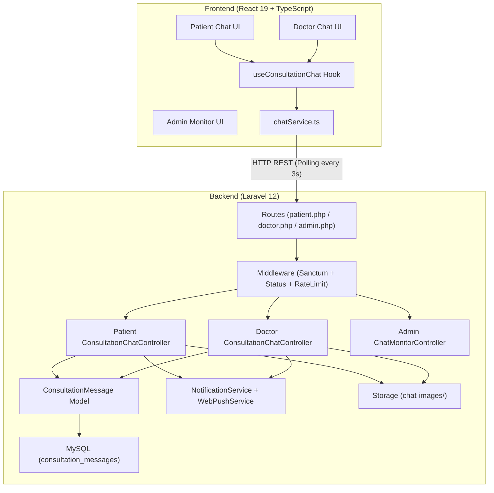

# خطة نظام شات الدكتور والمريضة — Widad-Tech

> **المشروع**: Widad-Tech — منصة صحة المرأة الشاملة
> **النظام**: شات مباشر (Real-time) بين الدكتور والمريضة
> **التقنية**: HTTP Polling (كل 3 ثوانٍ) — بدون WebSocket
> **التاريخ**: يونيو 2026

---

## 1. نظرة عامة على النظام

### الفكرة
نظام محادثة مباشرة يربط بين الدكتور والمريضة ضمن استشارة مؤكدة. يدعم إرسال نصوص وصور فقط، ويعمل بآلية HTTP Polling كل 3 ثوانٍ. الشات مرتبط بالاستشارة ويُغلق تلقائياً عند اكتمالها أو إلغائها.

### مخطط معماري



### حالات الشات
| حالة الاستشارة | حالة الشات | الإجراء |
|---|---|---|
| `confirmed` | ✅ نشط | يمكن إرسال واستقبال الرسائل |
| `in_progress` | ✅ نشط | يمكن إرسال واستقبال الرسائل |
| `completed` | 🔒 مغلق | عرض فقط — لا إرسال |
| `cancelled` | 🔒 مغلق | عرض فقط — لا إرسال |
| `pending` / `no_show` | ❌ غير متاح | لا شات |

### قواعد الوصول
| المستخدم | الصلاحية |
|---|---|
| **المريضة** | إرسال/استقبال في استشاراتها فقط |
| **الدكتور** | إرسال/استقبال في استشاراته فقط |
| **الأدمن** | قراءة فقط (إشراف طبي) — لجميع الاستشارات |

---

## 2. تحليل الكود الموجود والتكامل

### الموديلات ذات الصلة الموجودة

#### [Consultation](file:///d:/Final_Project_Implementation/Final_Project_Front_And_Back/Back-end/app/Models/Consultation.php)
- **Statuses**: `pending` → `confirmed` → `in_progress` → `completed` / `cancelled` / `no_show`
- **العلاقات**: [doctor()](file:///d:/Final_Project_Implementation/Final_Project_Front_And_Back/Back-end/app/Models/Consultation.php#43-48), [patient()](file:///d:/Final_Project_Implementation/Final_Project_Front_And_Back/Back-end/app/Models/Consultation.php#49-53) (via `user_id`), [review()](file:///d:/Final_Project_Implementation/Final_Project_Front_And_Back/Back-end/app/Models/Consultation.php#54-58), [payment()](file:///d:/Final_Project_Implementation/Final_Project_Front_And_Back/Back-end/app/Models/Consultation.php#59-63), [prescription()](file:///d:/Final_Project_Implementation/Final_Project_Front_And_Back/Back-end/app/Models/Consultation.php#64-68), [attachments()](file:///d:/Final_Project_Implementation/Final_Project_Front_And_Back/Back-end/app/Models/Consultation.php#74-78)
- **SoftDeletes**: مفعّل — يدعم استعادة البيانات
- سيُضاف relationship جديد: `messages()` → `hasMany(ConsultationMessage::class)`

#### [ConsultationAttachment](file:///d:/Final_Project_Implementation/Final_Project_Front_And_Back/Back-end/app/Models/ConsultationAttachment.php)
- يستخدم `storage/app/public/` مع [getFullUrlAttribute()](file:///d:/Final_Project_Implementation/Final_Project_Front_And_Back/Back-end/app/Models/ConsultationAttachment.php#34-39) — سنتبع نفس النمط لصور الشات
- دالة [isImage()](file:///d:/Final_Project_Implementation/Final_Project_Front_And_Back/Back-end/app/Models/ConsultationAttachment.php#40-44) — نمط مشابه سنستخدمه

#### [NotificationService](file:///d:/Final_Project_Implementation/Final_Project_Front_And_Back/Back-end/app/Services/NotificationService.php)
- دالة [create()](file:///d:/Final_Project_Implementation/Final_Project_Front_And_Back/Back-end/app/Services/NotificationService.php#18-60) تقبل: `$notifiable`, `$type`, `$title`, `$message`, `$data[]`, `$sendEmail`
- سنضيف method جديد: `notifyNewChatMessage()` يستدعي [create()](file:///d:/Final_Project_Implementation/Final_Project_Front_And_Back/Back-end/app/Services/NotificationService.php#18-60) + [WebPushService](file:///d:/Final_Project_Implementation/Final_Project_Front_And_Back/Back-end/app/Services/WebPushService.php#11-177)

#### [WebPushService](file:///d:/Final_Project_Implementation/Final_Project_Front_And_Back/Back-end/app/Services/WebPushService.php)
- [sendToUser(User $user, array $payload)](file:///d:/Final_Project_Implementation/Final_Project_Front_And_Back/Back-end/app/Services/WebPushService.php#33-92) — يدعم Patient فقط حالياً
- **ملاحظة**: PushSubscription polymorphic يدعم Patient/Doctor/Admin
- سنضيف static method: `createChatMessagePayload()`

#### [ApiResponse Trait](file:///d:/Final_Project_Implementation/Final_Project_Front_And_Back/Back-end/app/Traits/ApiResponse.php)
- [successResponse($data, $message, $code)](file:///d:/Final_Project_Implementation/Final_Project_Front_And_Back/Back-end/app/Traits/ApiResponse.php#12-57) — يدعم Pagination تلقائياً
- [errorResponse($message, $code, $errors)](file:///d:/Final_Project_Implementation/Final_Project_Front_And_Back/Back-end/app/Traits/ApiResponse.php#58-66) — سنستخدمه لكل أخطاء الشات

### مكان إضافة الملفات الجديدة

```
Back-end/app/Http/Controllers/Api/
├── Patient/ConsultationChatController.php   ← جديد
├── Doctor/ConsultationChatController.php    ← جديد
└── Admin/ChatMonitorController.php          ← جديد

Back-end/app/Http/Requests/
└── Shared/SendChatMessageRequest.php        ← جديد

Back-end/app/Http/Resources/
└── Shared/ChatMessageResource.php           ← جديد

Back-end/app/Models/
└── ConsultationMessage.php                  ← جديد

Back-end/app/Services/
└── ChatImageService.php                     ← جديد

Back-end/config/
└── chat.php                                 ← جديد

Front-End/src/
├── types/chat.ts                            ← جديد
├── services/chatService.ts                  ← جديد
├── hooks/useConsultationChat.ts             ← جديد
└── components/chat/                         ← مجلد جديد
    ├── ConsultationChat.tsx
    ├── ChatHeader.tsx
    ├── MessageList.tsx
    ├── MessageBubble.tsx
    ├── MessageInput.tsx
    ├── ImagePreview.tsx
    └── UnreadBadge.tsx
```

### التكامل مع Routes الموجودة

**في [patient.php](file:///d:/Final_Project_Implementation/Final_Project_Front_And_Back/Back-end/routes/patient.php)** — سيُضاف بعد سطر 218 (بعد Consultation Attachments):
```php
// Consultation Chat (Patient)
Route::prefix('consultations/{consultation}/chat')
    ->controller(ConsultationChatController::class)
    ->group(function () { ... });
```

**في [doctor.php](file:///d:/Final_Project_Implementation/Final_Project_Front_And_Back/Back-end/routes/doctor.php)** — سيُضاف بعد سطر 120 (بعد Doctor Attachments):
```php
// Consultation Chat (Doctor)
Route::prefix('consultations/{consultation}/chat')
    ->controller(ConsultationChatController::class)
    ->group(function () { ... });
```

**في [admin.php](file:///d:/Final_Project_Implementation/Final_Project_Front_And_Back/Back-end/routes/admin.php)** — سيُضاف بعد سطر 141 (بعد Consultations Management):
```php
// Chat Monitoring
Route::prefix('chat')->middleware('permission:' . Permission::VIEW_CONSULTATIONS)
    ->controller(ChatMonitorController::class)
    ->group(function () { ... });
```

> [!IMPORTANT]
> لا تعارض مع Routes موجودة — تستخدم prefix فرعي `/chat` تحت `/consultations/{id}`

---

## 3. هيكل قاعدة البيانات

### الجدول الجديد: `consultation_messages`

```sql
consultation_messages
├── id              (BigInt, PK, Auto Increment)
├── consultation_id (FK → consultations.id, CASCADE DELETE)
├── sender_type     (Enum: 'patient', 'doctor')
├── sender_id       (BigInt) ← user_id أو doctor_id حسب sender_type
├── message         (Text, Nullable) ← nullable إذا كانت الرسالة صورة فقط
├── image_path      (String, Nullable) ← مسار الصورة إن وجدت
├── message_type    (Enum: 'text', 'image', 'text_image') ← Default: 'text'
├── is_read         (Boolean, Default: false)
├── read_at         (Timestamp, Nullable)
├── created_at      (Timestamp)
└── updated_at      (Timestamp)
Indexes: (consultation_id), (sender_type, sender_id), (is_read)
```

### Migration الكامل

**الملف**: `database/migrations/2026_06_21_000001_create_consultation_messages_table.php`

```php
<?php

use Illuminate\Database\Migrations\Migration;
use Illuminate\Database\Schema\Blueprint;
use Illuminate\Support\Facades\Schema;

return new class extends Migration
{
    public function up(): void
    {
        Schema::create('consultation_messages', function (Blueprint $table) {
            $table->id();
            $table->foreignId('consultation_id')
                  ->constrained('consultations')
                  ->cascadeOnDelete();
            $table->enum('sender_type', ['patient', 'doctor']);
            $table->unsignedBigInteger('sender_id');
            $table->text('message')->nullable();
            $table->string('image_path')->nullable();
            $table->enum('message_type', ['text', 'image', 'text_image'])->default('text');
            $table->boolean('is_read')->default(false);
            $table->timestamp('read_at')->nullable();
            $table->timestamps();

            // Indexes
            $table->index('consultation_id');
            $table->index(['sender_type', 'sender_id']);
            $table->index('is_read');
            $table->index('created_at');
        });
    }

    public function down(): void
    {
        Schema::dropIfExists('consultation_messages');
    }
};
```

### الموديل `ConsultationMessage`

**الملف**: `app/Models/ConsultationMessage.php`

```php
<?php

namespace App\Models;

use Illuminate\Database\Eloquent\Model;
use Illuminate\Support\Facades\Storage;

class ConsultationMessage extends Model
{
    protected $fillable = [
        'consultation_id',
        'sender_type',
        'sender_id',
        'message',
        'image_path',
        'message_type',
        'is_read',
        'read_at',
    ];

    protected $casts = [
        'is_read' => 'boolean',
        'read_at' => 'datetime',
    ];

    // =========================================================================
    //  RELATIONSHIPS
    // =========================================================================

    public function consultation()
    {
        return $this->belongsTo(Consultation::class);
    }

    /**
     * Polymorphic sender — returns User (patient) or Doctor
     */
    public function sender()
    {
        if ($this->sender_type === 'patient') {
            return $this->belongsTo(User::class, 'sender_id');
        }
        return $this->belongsTo(Doctor::class, 'sender_id');
    }

    // =========================================================================
    //  SCOPES
    // =========================================================================

    public function scopeForConsultation($query, int $consultationId)
    {
        return $query->where('consultation_id', $consultationId);
    }

    public function scopeUnread($query)
    {
        return $query->where('is_read', false);
    }

    public function scopeByPatient($query)
    {
        return $query->where('sender_type', 'patient');
    }

    public function scopeByDoctor($query)
    {
        return $query->where('sender_type', 'doctor');
    }

    public function scopeAfter($query, int $messageId)
    {
        return $query->where('id', '>', $messageId);
    }

    // =========================================================================
    //  HELPERS
    // =========================================================================

    public function markAsRead(): void
    {
        if (!$this->is_read) {
            $this->update([
                'is_read' => true,
                'read_at' => now(),
            ]);
        }
    }

    public function getImageUrlAttribute(): ?string
    {
        return $this->image_path
            ? rtrim(config('app.url'), '/') . '/storage/' . ltrim($this->image_path, '/')
            : null;
    }

    /**
     * Delete associated image from storage when message is deleted
     */
    protected static function booted(): void
    {
        static::deleting(function (ConsultationMessage $message) {
            if ($message->image_path) {
                Storage::disk('public')->delete($message->image_path);
            }
        });
    }
}
```

### تحديث Consultation Model

**إضافة في** [Consultation.php](file:///d:/Final_Project_Implementation/Final_Project_Front_And_Back/Back-end/app/Models/Consultation.php) — relationship جديد:

```php
// في Consultation model — إضافة بعد attachments()
public function messages()
{
    return $this->hasMany(ConsultationMessage::class);
}

public function isChatActive(): bool
{
    return in_array($this->status, ['confirmed', 'in_progress']);
}
```

---

## 4. ملفات الإعداد (Config)

### ملف `config/chat.php`

```php
<?php

return [
    'limits' => [
        'max_message_length' => 1000,
        'max_image_size_kb'  => 5120,  // 5MB
        'allowed_image_types' => ['jpg', 'jpeg', 'png', 'webp'],
        'polling_interval_ms' => 3000,
        'messages_per_page'  => 50,
    ],
    'storage' => [
        'disk'   => 'public',
        'path'   => 'chat-images',
    ],
    'notifications' => [
        'new_message_push' => true,
        'new_message_email' => false,
    ],
];
```

---

## 5. الباك إند — الكود الكامل

### 5.1 الـ Form Request

**الملف**: `app/Http/Requests/Shared/SendChatMessageRequest.php`

```php
<?php

namespace App\Http\Requests\Shared;

use Illuminate\Foundation\Http\FormRequest;

class SendChatMessageRequest extends FormRequest
{
    public function authorize(): bool
    {
        return true; // Auth handled by middleware
    }

    public function rules(): array
    {
        $maxSize = config('chat.limits.max_image_size_kb', 5120);
        $maxLength = config('chat.limits.max_message_length', 1000);
        $allowedTypes = implode(',', config('chat.limits.allowed_image_types', ['jpg','jpeg','png','webp']));

        return [
            'message' => "nullable|string|max:{$maxLength}|required_without:image",
            'image'   => "nullable|file|image|mimes:{$allowedTypes}|max:{$maxSize}|required_without:message",
        ];
    }

    public function messages(): array
    {
        return [
            'message.required_without' => 'يجب إرسال نص أو صورة',
            'message.max'              => 'الرسالة تتجاوز الحد الأقصى (:max حرف)',
            'image.required_without'   => 'يجب إرسال نص أو صورة',
            'image.image'              => 'الملف يجب أن يكون صورة',
            'image.mimes'              => 'نوع الملف غير مدعوم، مسموح فقط: JPG, PNG, WebP',
            'image.max'                => 'حجم الصورة يتجاوز 5MB',
        ];
    }
}
```

### 5.2 الـ Resource

**الملف**: `app/Http/Resources/Shared/ChatMessageResource.php`

```php
<?php

namespace App\Http\Resources\Shared;

use Illuminate\Http\Request;
use Illuminate\Http\Resources\Json\JsonResource;

class ChatMessageResource extends JsonResource
{
    public function toArray(Request $request): array
    {
        // Determine current user type and ID
        $guard = $this->detectGuard($request);
        $currentUserId = $request->user($guard)?->id;
        $currentUserType = match($guard) {
            'doctor' => 'doctor',
            'admin'  => 'admin',
            default  => 'patient',
        };

        // Get sender info
        $senderName = $this->getSenderName();
        $senderAvatar = $this->getSenderAvatar();

        return [
            'id'            => $this->id,
            'sender_type'   => $this->sender_type,
            'sender_id'     => $this->sender_id,
            'sender_name'   => $senderName,
            'sender_avatar' => $senderAvatar,
            'message'       => $this->message,
            'image_url'     => $this->image_url, // accessor from model
            'message_type'  => $this->message_type,
            'is_read'       => $this->is_read,
            'read_at'       => $this->read_at?->toISOString(),
            'created_at'    => $this->created_at->toISOString(),
            'is_mine'       => $currentUserType !== 'admin'
                               && $this->sender_type === $currentUserType
                               && $this->sender_id === $currentUserId,
        ];
    }

    private function detectGuard(Request $request): string
    {
        if ($request->user('admin')) return 'admin';
        if ($request->user('doctor')) return 'doctor';
        return 'patient';
    }

    private function getSenderName(): string
    {
        if ($this->relationLoaded('consultation')) {
            $consultation = $this->consultation;
            if ($this->sender_type === 'patient' && $consultation->relationLoaded('patient')) {
                return $consultation->patient->name ?? 'مريضة';
            }
            if ($this->sender_type === 'doctor' && $consultation->relationLoaded('doctor')) {
                return $consultation->doctor->name ?? 'دكتور';
            }
        }

        // Fallback: query sender
        $sender = $this->sender;
        return $sender->name ?? ($this->sender_type === 'patient' ? 'مريضة' : 'دكتور');
    }

    private function getSenderAvatar(): ?string
    {
        $sender = $this->sender;
        if (!$sender) return null;

        if ($this->sender_type === 'patient') {
            $path = $sender->profile?->image ?? $sender->image ?? null;
        } else {
            $path = $sender->image ?? null;
        }

        return $path
            ? rtrim(config('app.url'), '/') . '/storage/' . ltrim($path, '/')
            : null;
    }
}
```
