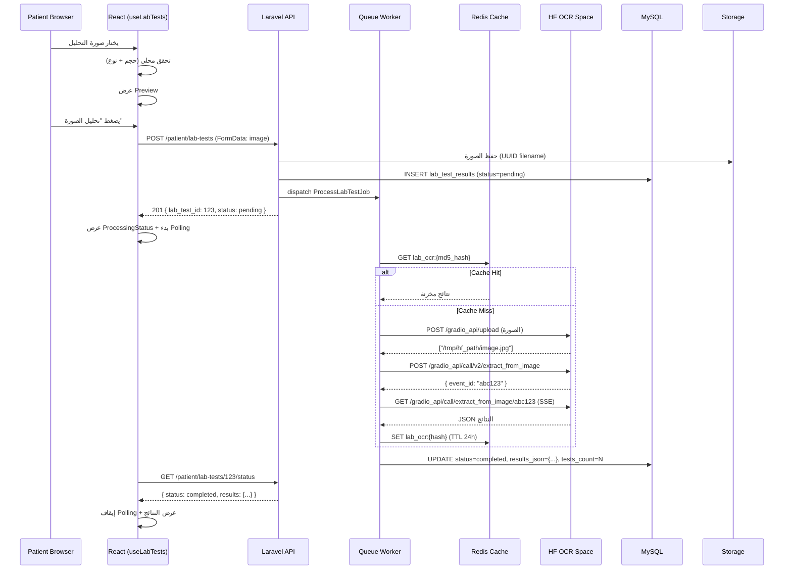

# 🤖 برومبت الإيجنت — نظام OCR التحاليل الطبية (Widad-Tech)

---

## 📌 السياق الكامل للمشروع

أنت خبير تقني متخصص في بناء أنظمة معالجة الصور الطبية ودمج نماذج الذكاء الاصطناعي الخارجية مع تطبيقات الرعاية الصحية. مهمتك هي تحليل الكود الحالي لمنصة **وداد-تك** ثم بناء خطة تفصيلية شاملة لنظام **استخراج نتائج التحاليل الطبية بالصور** باستخدام Hugging Face Gradio Space.

---

## 📂 ملف مراجعة الكود (Codebase Review)

اقرأ الملف التالي بعناية كاملة قبل أي خطوة:

```
[أدرج هنا محتوى ملف: codebase_review.md بالكامل]
```

---

## 🎯 المهمة

بعد قراءة كود المشروع، أنشئ خطة تفصيلية شاملة لنظام استخراج نتائج التحاليل الطبية من صور بنفس الأسلوب والمستوى الموجود في خطة شات الدكتور والمريضة، من حيث:

- مستوى التفصيل
- الكود الكامل (Backend + Frontend)
- تدفق البيانات
- خطة التنفيذ المرحلية

---

## ⚙️ المواصفات التقنية الثابتة

### القرارات المحددة مسبقاً:

| القرار | الاختيار | السبب |
|---|---|---|
| **نوع الخدمة** | OCR استخراج فقط — بدون تفسير أو LLM | المطلوب قراءة القيم فقط |
| **الـ Space المستخدم** | `AmrHK/ocr-lab-tests` على Hugging Face | Space مخصص ومدرب على التحاليل الطبية |
| **الـ Endpoint المستخدم** | `/extract_from_image` فقط | يستقبل صورة ويرجع JSON منظم |
| **الـ Endpoint الثاني** | `/build_from_records` — غير مستخدم في هذه المرحلة | تُحفظ للمستقبل |
| **مكان الميزة في الـ UI** | صفحة مستقلة في الملف الطبي للمريضة | `/patient/medical-file/lab-tests` |
| **حفظ البيانات** | نعم — تُحفظ في قاعدة البيانات مع تاريخ الرفع | سجل تحاليل تاريخي للمريضة |
| **المحتوى** | صور التحاليل الطبية فقط (jpg, jpeg, png, webp) | حد أقصى 10MB |
| **نوع المعالجة** | Async + Polling — نفس نمط ChatbotService | لتجنب Cold Start delays على HF |
| **قاعدة البيانات** | MySQL (نفس `widad_project`) | متسق مع البنية الموجودة |
| **الباك إند** | Laravel 12 (PHP 8.2+) | نفس إطار العمل الموجود |
| **الفرونت إند** | React 19 + TypeScript | نفس إطار العمل الموجود |
| **Auth** | Laravel Sanctum (guard: patient) | المريضة فقط — بدون دكتور أو أدمن |
| **HTTP Client** | Axios | موجود بالفعل |
| **State Management** | TanStack React Query v5 | موجود بالفعل |

---

## 🔌 مواصفات الـ API الخارجي (Hugging Face Gradio)

### الـ Space URL:
```
https://amrhk-ocr-lab-tests.hf.space
```

### الـ Endpoint المستخدم: `/extract_from_image`

**الخطوة 1 — رفع الصورة (Upload):**
```bash
POST https://amrhk-ocr-lab-tests.hf.space/gradio_api/upload
Content-Type: multipart/form-data
Body: files=@/path/to/image.jpg

# Response: ["/tmp/hf_uploaded_path/image.jpg"]
```

**الخطوة 2 — طلب الاستخراج (POST):**
```bash
POST https://amrhk-ocr-lab-tests.hf.space/gradio_api/call/v2/extract_from_image
Content-Type: application/json
Body:
{
  "image_path": {
    "path": "/tmp/hf_uploaded_path/image.jpg",
    "meta": {"_type": "gradio.FileData"}
  }
}

# Response: { "event_id": "abc123xyz" }
```

**الخطوة 3 — استلام النتيجة (GET + SSE):**
```bash
GET https://amrhk-ocr-lab-tests.hf.space/gradio_api/call/extract_from_image/{event_id}

# SSE Response:
# event: complete
# data: [{"tests": [...], "patient_info": {...}, "lab_info": {...}}]
```

**مثال على الـ JSON الناتج:**
```json
{
  "tests": [
    {
      "test_name": "Hemoglobin",
      "value": "11.2",
      "reference_range": "12-16",
      "unit": "g/dL",
      "status": "low"
    },
    {
      "test_name": "FBS",
      "value": "130",
      "reference_range": "70-110",
      "unit": "mg/dL",
      "status": "high"
    }
  ],
  "patient_info": {
    "name": null,
    "age": null,
    "date": "2026-06-15"
  },
  "lab_info": {
    "lab_name": null,
    "doctor_name": null
  }
}
```

---

## 🚫 القيود والمحاذير

### ما يجب **الالتزام به**:

1. **اتبع نفس نمط `ChatbotService.php` بالضبط** في التواصل مع HF Gradio — نفس آلية Upload → POST → GET SSE.
2. **نفس نمط `ProcessChatbotMessageJob`** للمعالجة الـ Async — أنشئ `ProcessLabTestJob` بنفس البنية (3 attempts, backoff [5,15]s).
3. **Redis Cache** — خزّن النتائج بـ TTL 24 ساعة بناءً على hash الصورة (MD5) لتجنب إعادة معالجة نفس الصورة.
4. **لا تعدّل على `ChatbotService.php`** — أنشئ `LabTestOcrService.php` منفصلاً يستخدم نفس الأنماط.
5. **التزم بـ `ApiResponse` Trait** في جميع ردود الـ API.
6. **استخدم نفس نمط Form Requests** للـ Validation.
7. **التزم بـ RTL والنصوص العربية** في كل واجهات المستخدم.
8. **الصور تُحفظ في** `storage/app/public/lab-test-images/{user_id}/` بأسماء UUID عشوائية.
9. **لا تُرسل بيانات المريضة (PII) إلى HF** — فقط الصورة تُرفع.
10. **الجدول الجديد `lab_test_results`** — لا تُعدّل على `PatientMedicalFile` Model الموجود.
11. **Rate Limiting** — 10 رفع/ساعة للمريضة الواحدة (التحاليل ليست رسائل فورية).
12. **الـ Migration بتاريخ** `2026_06_21` للتوافق مع ترتيب الـ migrations.

---

## 📋 هيكل الخطة المطلوبة

اكتب الخطة بنفس مستوى التفصيل والتنسيق الموجود في خطة شات الدكتور والمريضة، مع الأقسام التالية:

---

### 1. نظرة عامة على النظام

اشرح:

- الفكرة الكاملة لنظام OCR التحاليل في منصة وداد
- مخطط معماري (Mermaid diagram) يوضح تدفق البيانات من رفع الصورة حتى عرض النتائج
- علاقة النظام بـ `PatientMedicalFile` الموجود
- حالات المعالجة: `pending` → `processing` → `completed` / `failed`
- قواعد الوصول: المريضة فقط تعرض وترفع تحاليلها

---

### 2. تحليل الكود الموجود والتكامل

افحص الكود الحالي وحدد بدقة:

**الـ Services ذات الصلة:**
- `ChatbotService.php` — الأنماط التي سنستعيرها:
  - دالة Upload إلى HF
  - دالة POST إلى Gradio API
  - دالة استقبال SSE
  - دالة `parseSSEResponse()`
  - Redis Cache pattern
- `CacheService.php` — كيف نستخدمه للـ Cache بناءً على hash الصورة

**الـ Jobs ذات الصلة:**
- `ProcessChatbotMessageJob.php` — البنية التي سنتبعها في `ProcessLabTestJob.php`

**الـ Models ذات الصلة:**
- `PatientMedicalFile` — علاقته بالجدول الجديد (hasMany)
- `User` (patient) — الـ ownership

**الـ Controllers الموجودة:**
- `PatientMedicalFileController` — أين نضيف الـ Routes الجديدة بالضبط
- `ConsultationAttachmentController` — نمط رفع الملفات الذي نتبعه

**مكان إضافة الملفات الجديدة:**
```
Back-end/app/Http/Controllers/Api/Patient/
└── LabTestController.php                    ← جديد

Back-end/app/Http/Requests/Patient/
└── UploadLabTestRequest.php                 ← جديد

Back-end/app/Http/Resources/Patient/
└── LabTestResource.php                      ← جديد

Back-end/app/Models/
└── LabTestResult.php                        ← جديد

Back-end/app/Services/
└── LabTestOcrService.php                    ← جديد (يستعير أنماط ChatbotService)

Back-end/app/Jobs/
└── ProcessLabTestJob.php                    ← جديد (يستعير أنماط ProcessChatbotMessageJob)

Back-end/config/
└── lab_ocr.php                              ← جديد

Front-End/src/
├── types/labTest.ts                         ← جديد
├── services/labTestService.ts               ← جديد
├── hooks/useLabTests.ts                     ← جديد
└── pages/patient/medical-file/
    └── LabTestsPage.tsx                     ← جديد (صفحة مستقلة)

Front-End/src/components/lab-tests/
├── LabTestUploader.tsx                      ← جديد
├── LabTestResultCard.tsx                    ← جديد
├── LabTestHistory.tsx                       ← جديد
├── TestValueBadge.tsx                       ← جديد (low/normal/high)
└── ProcessingStatus.tsx                     ← جديد
```

---

### 3. هيكل قاعدة البيانات

#### الجدول الجديد: `lab_test_results`

```sql
lab_test_results
├── id                (BigInt, PK, Auto Increment)
├── user_id           (FK → users.id, CASCADE DELETE)
├── image_path        (String) ← مسار الصورة في Storage
├── image_hash        (String, 32) ← MD5 hash للصورة — للـ Cache
├── status            (Enum: 'pending', 'processing', 'completed', 'failed')
├── results_json      (JSON, Nullable) ← الـ JSON الكامل من HF
├── tests_count       (Integer, Default: 0) ← عدد التحاليل المستخرجة
├── error_message     (Text, Nullable) ← رسالة الخطأ إن فشل
├── processed_at      (Timestamp, Nullable) ← وقت اكتمال المعالجة
├── created_at        (Timestamp)
└── updated_at        (Timestamp)
Indexes: (user_id), (status), (image_hash), (created_at)
```

اكتب:
- Migration الكامل بتاريخ `2026_06_21_000002`
- الموديل `LabTestResult` كامل مع:
  - الـ `$fillable`
  - الـ `$casts` (تحويل `results_json` لـ array تلقائياً)
  - الـ relationships (`belongsTo User`)
  - الـ Scopes: `scopePending`, `scopeCompleted`, `scopeFailed`, `scopeForUser`
  - Helper methods: `markAsProcessing()`, `markAsCompleted(array $results)`, `markAsFailed(string $error)`
  - Boot method: حذف الصورة من Storage عند حذف السجل
  - accessor `getImageUrlAttribute()` — URL كامل للصورة

**تحديث User Model:**
```php
// في User.php — إضافة relationship:
public function labTestResults()
{
    return $this->hasMany(LabTestResult::class);
}
```

---

### 4. ملفات الإعداد (Config)

#### ملف `config/lab_ocr.php` جديد:

```php
return [
    'hugging_face' => [
        'space_url'      => env('HF_LAB_OCR_SPACE_URL', 'https://amrhk-ocr-lab-tests.hf.space'),
        'upload_path'    => '/gradio_api/upload',
        'predict_path'   => '/gradio_api/call/v2/extract_from_image',
        'result_path'    => '/gradio_api/call/extract_from_image',
        'timeout'        => 120,      // ثانية — HF cold start قد يصل لـ 60 ثانية
        'connect_timeout'=> 10,
    ],
    'storage' => [
        'disk'   => 'public',
        'path'   => 'lab-test-images',
    ],
    'limits' => [
        'max_image_size_kb'   => 10240,   // 10MB
        'allowed_types'       => ['jpg', 'jpeg', 'png', 'webp'],
        'max_uploads_per_hour'=> 10,
        'polling_interval_ms' => 2000,    // 2 ثانية
        'max_polling_attempts'=> 30,      // 60 ثانية إجمالي
    ],
    'cache' => [
        'ttl_hours' => 24,
        'prefix'    => 'lab_ocr:',
    ],
    'queue' => [
        'name'     => 'lab-ocr',
        'attempts' => 3,
        'backoff'  => [5, 15],
    ],
];
```

---

### 5. الباك إند — الكود الكامل

#### 5.1 الـ Form Request

**الملف:** `app/Http/Requests/Patient/UploadLabTestRequest.php`

اكتب الكود الكامل مع:
- `image` — required, file, image, mimes:jpg,jpeg,png,webp, max:10240
- رسائل خطأ عربية كاملة
- `authorize()` يتحقق من `auth('patient')`

#### 5.2 الـ Resource

**الملف:** `app/Http/Resources/Patient/LabTestResource.php`

```php
return [
    'id'           => $this->id,
    'status'       => $this->status,
    'image_url'    => $this->image_url,       // accessor
    'results'      => $this->when(
                          $this->status === 'completed',
                          $this->results_json  // array بعد الـ cast
                      ),
    'tests_count'  => $this->tests_count,
    'error_message'=> $this->when($this->status === 'failed', $this->error_message),
    'processed_at' => $this->processed_at?->toISOString(),
    'created_at'   => $this->created_at->toISOString(),
];
```

#### 5.3 الـ Service الأساسي

**الملف:** `app/Services/LabTestOcrService.php`

اكتب الكود الكامل لـ Service يحتوي على:

```php
class LabTestOcrService
{
    // 1. uploadImageToHuggingFace(string $localPath): string
    //    — يرفع الصورة لـ HF ويرجع الـ path المؤقت
    //    — نفس نمط ChatbotService بالضبط (Guzzle HTTP)

    // 2. extractLabResults(string $hfImagePath): array
    //    — يستدعي POST /gradio_api/call/v2/extract_from_image
    //    — يحصل على event_id
    //    — يستدعي GET SSE ويستقبل النتيجة
    //    — نفس parseSSEResponse() من ChatbotService

    // 3. processImage(LabTestResult $labTest): void
    //    — الدالة الرئيسية التي يستدعيها الـ Job
    //    — تتحقق من Redis Cache أولاً (key: lab_ocr:{image_hash})
    //    — إذا Cache Hit: تستخدم النتيجة مباشرة
    //    — إذا Cache Miss: ترفع الصورة وتستدعي extractLabResults()
    //    — تُخزن النتيجة في Redis (TTL 24h)
    //    — تحدّث LabTestResult في DB

    // 4. parseSSEResponse(string $sseContent): array
    //    — نفس دالة ChatbotService تماماً مع تعديل على بنية الـ output
    //    — تستخرج JSON من SSE stream
    //    — تتجاهل heartbeats والبيانات الفارغة
}
```

**مهم:** أظهر الكود الكامل لكل دالة — لا pseudocode.

#### 5.4 الـ Job

**الملف:** `app/Jobs/ProcessLabTestJob.php`

اكتب الكود الكامل بنفس بنية `ProcessChatbotMessageJob`:
- `implements ShouldQueue`
- `$tries = 3`
- `$backoff = [5, 15]`
- Constructor يستقبل `LabTestResult $labTest`
- `handle(LabTestOcrService $service)` يستدعي `$service->processImage($labTest)`
- `failed(Throwable $exception)` يحدث الحالة لـ `failed` ويحفظ رسالة الخطأ

#### 5.5 الـ Controller

**الملف:** `app/Http/Controllers/Api/Patient/LabTestController.php`

اكتب الكود الكامل لـ:

```php
class LabTestController extends Controller
{
    use ApiResponse;

    // POST /patient/lab-tests
    // — يستقبل الصورة من UploadLabTestRequest
    // — يحسب MD5 hash للصورة
    // — يحفظ الصورة في Storage (UUID filename)
    // — ينشئ سجل LabTestResult بحالة 'pending'
    // — يُرسل ProcessLabTestJob للـ Queue
    // — يعيد { lab_test_id, status: 'pending' } فوراً
    public function upload(UploadLabTestRequest $request): JsonResponse

    // GET /patient/lab-tests/{id}/status
    // — Polling endpoint: يرجع الحالة الحالية + النتائج إن اكتملت
    // — يتحقق من الـ ownership (user_id = auth patient)
    public function checkStatus(int $id): JsonResponse

    // GET /patient/lab-tests
    // — يرجع كل تحاليل المريضة مرتبة بالأحدث أولاً
    // — Pagination (15 per page)
    public function index(): JsonResponse

    // GET /patient/lab-tests/{id}
    // — تفاصيل تحليل واحد كامل
    public function show(int $id): JsonResponse

    // DELETE /patient/lab-tests/{id}
    // — حذف التحليل + الصورة من Storage
    // — يتحقق من الـ ownership
    public function destroy(int $id): JsonResponse
}
```

لكل method التحقق من:
1. الـ ownership (`user_id = auth('patient')->id()`)
2. Rate Limiting للـ upload (10/ساعة)

#### 5.6 الـ Routes

**في `routes/patient.php`** — يُضاف في القسم المخصص للـ Medical File:

```php
// ═══════════════════════════════════════
//  Lab Test OCR
// ═══════════════════════════════════════
Route::prefix('lab-tests')
     ->middleware('throttle:lab_ocr')
     ->controller(LabTestController::class)
     ->group(function () {
         Route::get('/',            'index');
         Route::post('/',           'upload');
         Route::get('/{id}',        'show');
         Route::get('/{id}/status', 'checkStatus');
         Route::delete('/{id}',     'destroy');
     });
```

**في `app/Http/Kernel.php`** (أو RouteServiceProvider حسب البنية الموجودة):
```php
'throttle:lab_ocr' => \Illuminate\Routing\Middleware\ThrottleRequests::class.':10,60',
// 10 طلبات كل 60 دقيقة
```

**في `config/queue.php`** — إضافة الـ queue الجديد:
```php
// أضف 'lab-ocr' لقائمة الـ queues المُشغَّلة
php artisan queue:work --queue=lab-ocr,chatbot,default
```

---

### 6. الفرونت إند — الكود الكامل

#### 6.1 الـ Types

**الملف:** `src/types/labTest.ts`

```typescript
export interface TestResult {
  test_name: string;
  value: string;
  reference_range: string;
  unit: string;
  status: 'low' | 'normal' | 'high' | null;
}

export interface LabTestResults {
  tests: TestResult[];
  patient_info: {
    name: string | null;
    age: string | null;
    date: string | null;
  };
  lab_info: {
    lab_name: string | null;
    doctor_name: string | null;
  };
}

export type LabTestStatus = 'pending' | 'processing' | 'completed' | 'failed';

export interface LabTest {
  id: number;
  status: LabTestStatus;
  image_url: string;
  results: LabTestResults | null;
  tests_count: number;
  error_message: string | null;
  processed_at: string | null;
  created_at: string;
}

export interface UploadLabTestResponse {
  lab_test_id: number;
  status: 'pending';
}

export interface LabTestStatusResponse {
  id: number;
  status: LabTestStatus;
  results: LabTestResults | null;
  error_message: string | null;
}
```

#### 6.2 الـ Service

**الملف:** `src/services/labTestService.ts`

اكتب الكود الكامل لـ:

```typescript
// upload(image: File): Promise<UploadLabTestResponse>
// — FormData مع الـ image
// — POST /api/v1/patient/lab-tests

// checkStatus(id: number): Promise<LabTestStatusResponse>
// — GET /api/v1/patient/lab-tests/{id}/status

// getAll(page?: number): Promise<PaginatedResponse<LabTest>>
// — GET /api/v1/patient/lab-tests?page={page}

// getOne(id: number): Promise<LabTest>
// — GET /api/v1/patient/lab-tests/{id}

// deleteTest(id: number): Promise<void>
// — DELETE /api/v1/patient/lab-tests/{id}
```

استخدم `api` (Axios instance) الموجود في `src/services/api.ts`.

#### 6.3 الـ Hook

**الملف:** `src/hooks/useLabTests.ts`

اكتب الكود الكامل لـ Custom Hook يحتوي على:

```typescript
export function useLabTests() {
  // TanStack Query v5

  // 1. useQuery: جلب كل التحاليل (history)
  const labTestsQuery = useQuery({
    queryKey: ['lab-tests'],
    queryFn: () => labTestService.getAll(),
  });

  // 2. useMutation: رفع صورة جديدة
  //    — عند النجاح: تبدأ Polling على الـ id الجديد
  const uploadMutation = useMutation({...});

  // 3. Polling state
  //    — pendingLabTestId: number | null
  //    — useEffect + setInterval كل 2 ثانية (max 30 محاولة = 60 ثانية)
  //    — عند الـ status === 'completed' أو 'failed': تُوقف الـ Polling
  //    — تُحدّث الـ cache عبر queryClient.setQueryData

  // 4. isPolling: boolean — لعرض loading state

  return {
    labTests,
    isLoading,
    upload,           // (file: File) => Promise<void>
    isUploading,
    isPolling,
    currentPollingId, // null أو id التحليل الجاري معالجته
    deleteTest,       // (id: number) => Promise<void>
    error,
  };
}
```

#### 6.4 الـ Components

##### `LabTestUploader.tsx`

Component لرفع الصورة يحتوي على:
- منطقة Drag & Drop (`onDragOver`, `onDrop`)
- أيقونة رفع كبيرة + نص عربي "اسحب صورة التحليل هنا أو اضغط لاختيار ملف"
- Preview مصغر للصورة قبل الرفع
- تحقق محلي: الحجم ≤ 10MB، النوع مسموح (jpg/png/webp)
- زر "تحليل الصورة" مع loading state أثناء الرفع
- رسائل خطأ عربية واضحة

##### `ProcessingStatus.tsx`

Component لعرض حالة المعالجة:
- `pending`: "جاري رفع الصورة..." + spinner
- `processing`: "جاري قراءة التحليل..." + spinner + progress bar متحرك
- `completed`: "تم استخراج النتائج بنجاح ✓" + اللون الأخضر
- `failed`: "فشل في قراءة الصورة — حاول مرة أخرى" + اللون الأحمر + زر "إعادة المحاولة"

##### `TestValueBadge.tsx`

Badge صغيرة لعرض حالة كل تحليل:
```tsx
// low  → خلفية حمراء فاتحة + أيقونة سهم لأسفل ↓ + نص "منخفض"
// high → خلفية برتقالية فاتحة + أيقونة سهم لأعلى ↑ + نص "مرتفع"
// normal → خلفية خضراء فاتحة + أيقونة ✓ + نص "طبيعي"
// null → خلفية رمادية + نص "—"
```

##### `LabTestResultCard.tsx`

Card عرض نتائج تحليل واحد:
- اسم التحليل (كبير، bold)
- القيمة المستخرجة (كبيرة جداً، ملونة حسب الحالة)
- النطاق الطبيعي (صغير، رمادي): "النطاق الطبيعي: 12-16 g/dL"
- `TestValueBadge` في الزاوية

##### `LabTestHistory.tsx`

قائمة كل التحاليل السابقة:
- كل سجل يظهر: صورة مصغرة + تاريخ الرفع + عدد التحاليل المستخرجة + Badge الحالة
- زر "عرض التفاصيل" لفتح النتائج الكاملة
- زر حذف مع Confirm Dialog

##### `LabTestsPage.tsx`

الصفحة الكاملة `/patient/medical-file/lab-tests`:
```
┌─────────────────────────────────────┐
│  🔬 تحليل التحاليل الطبية           │
│  ارفع صورة تحليلك واحصل على القيم  │
├─────────────────────────────────────┤
│  [LabTestUploader]                  │
│                                     │
│  [ProcessingStatus] ← يظهر أثناء   │
│                       المعالجة فقط │
├─────────────────────────────────────┤
│  📋 سجل التحاليل السابقة           │
│  [LabTestHistory]                   │
└─────────────────────────────────────┘
```

---

### 7. آلية العمل وتدفق البيانات

ارسم تدفق Mermaid لكل السيناريوهات:

#### 7.1 تدفق رفع صورة جديدة (Happy Path)

```
[المريضة تختار/تسحب صورة] →
[تحقق محلي: الحجم والنوع] →
[POST /patient/lab-tests {image}] →
[Laravel: حفظ الصورة في Storage] →
[Laravel: حساب MD5 hash] →
[Laravel: إنشاء LabTestResult (status=pending)] →
[Laravel: إرسال ProcessLabTestJob للـ Queue] →
[Laravel: رجوع { lab_test_id: 123 } فوراً] →
[Frontend: بدء Polling كل 2 ثانية] →

[Queue Worker: استدعاء LabTestOcrService.processImage()] →
[Service: تحقق من Redis Cache بالـ hash] →
  [إذا Cache Hit] → استخدام النتيجة المخزنة
  [إذا Cache Miss] →
    [رفع الصورة على HF /gradio_api/upload] →
    [POST /gradio_api/call/v2/extract_from_image] →
    [الحصول على event_id] →
    [GET SSE /gradio_api/call/extract_from_image/{event_id}] →
    [استقبال JSON النتائج] →
    [تخزين في Redis (24h)] →
[تحديث LabTestResult (status=completed, results_json=...)] →

[Polling: GET /patient/lab-tests/123/status → {status: 'completed', results: {...}}] →
[Frontend: إيقاف Polling] →
[Frontend: عرض النتائج في LabTestResultCards]
```

#### 7.2 تدفق Cache Hit

```
[ProcessLabTestJob يعمل] →
[LabTestOcrService: Redis.get('lab_ocr:{md5_hash}')] →
[Cache Hit: نتيجة موجودة] →
[تحديث DB مباشرة — بدون اتصال HF] →
[استجابة فورية للمريضة]
```

#### 7.3 تدفق الفشل والـ Retry

```
[ProcessLabTestJob يفشل (HF timeout/error)] →
[Job: retry بعد 5 ثوانٍ] →
[فشل مرة ثانية: retry بعد 15 ثانية] →
[فشل 3 مرات: failed() → status='failed', error_message='...'] →
[Polling: يكتشف status='failed'] →
[Frontend: Toast خطأ + زر "إعادة المحاولة"]
```

#### 7.4 Mermaid Sequence الكامل



---

### 8. الأمان وحدود الاستخدام

| الحماية | التفاصيل |
|---|---|
| **Auth Guard** | `patient` Sanctum فقط — الدكتور والأدمن لا يملكان وصولاً |
| **Ownership Check** | كل طلب يتحقق `user_id = auth('patient')->id()` |
| **Rate Limiting** | 10 رفع/ساعة للمريضة الواحدة (`throttle:lab_ocr`) |
| **File Validation** | مسموح فقط: jpg, jpeg, png, webp — حد أقصى 10MB |
| **UUID Filenames** | أسماء عشوائية — لا يمكن تخمين مسار الصورة |
| **لا PII لـ HF** | فقط الصورة تُرسل — لا اسم ولا ID للمريضة |
| **MD5 Cache** | لا يُكشف عن محتوى الصورة — فقط hash للـ caching |
| **Cascade Delete** | حذف المريضة → حذف تحاليلها + صورها من Storage |
| **XSS Protection** | النصوص تُعرض كـ text وليس HTML |
| **HTTPS** | إلزامي في Production لحماية الصور الطبية |

---

### 9. معالجة الأخطاء

#### 9.1 أخطاء الباك إند

| الحالة | الكود | الرسالة العربية |
|---|---|---|
| نوع ملف غير مسموح | 422 | "نوع الملف غير مدعوم، مسموح فقط: JPG, PNG, WebP" |
| الصورة كبيرة | 422 | "حجم الصورة يتجاوز 10MB" |
| Rate Limit (10/ساعة) | 429 | "تجاوزت الحد المسموح لرفع التحاليل، حاول بعد ساعة" |
| تحليل غير موجود | 404 | "التحليل غير موجود" |
| ليس تحليلك | 403 | "غير مصرح لك بالوصول لهذا التحليل" |
| فشل رفع لـ HF | Job Failed | يُحفظ في `error_message` + status=failed |
| HF timeout | Job Retry | يُعاد المحاولة 3 مرات |

#### 9.2 أخطاء الفرونت إند

- **صورة كبيرة (محلياً):** رسالة فورية قبل الرفع — "الصورة تتجاوز 10MB"
- **نوع غير مدعوم:** رسالة فورية — "يجب أن يكون الملف صورة JPG أو PNG أو WebP"
- **Polling فشل شبكياً:** Retry بعد 5 ثوانٍ — بعد 3 فشل متتالي: "تحقق من اتصالك بالإنترنت"
- **Polling وصل 30 محاولة (60 ثانية) بدون نتيجة:** "استغرق التحليل وقتاً طويلاً — يمكنك مراجعة التحاليل لاحقاً"
- **status = failed:** Toast خطأ + زر "إعادة المحاولة" يفتح الـ Uploader مرة أخرى
- **Rate Limit:** Toast — "تجاوزت الحد المسموح، حاول بعد ساعة"

---

### 10. خطة التنفيذ المرحلية

قسّم التنفيذ لمراحل واضحة مع Checklist:

#### المرحلة 1 — قاعدة البيانات والـ Config (~1 ساعة)
- [ ] إنشاء Migration `lab_test_results`
- [ ] إنشاء `config/lab_ocr.php`
- [ ] إضافة `HF_LAB_OCR_SPACE_URL` لـ `.env`
- [ ] إضافة `lab-ocr` queue لـ `queue.php`
- [ ] **معيار النجاح:** `php artisan migrate` بدون أخطاء

#### المرحلة 2 — الـ Model + Resource + Form Request (~1 ساعة)
- [ ] `app/Models/LabTestResult.php` كامل
- [ ] تحديث `User.php` بإضافة `labTestResults()` relationship
- [ ] `LabTestResource.php`
- [ ] `UploadLabTestRequest.php`
- [ ] **معيار النجاح:** `php artisan model:show LabTestResult` يظهر كل الـ attributes

#### المرحلة 3 — الـ Service + Job (~2 ساعة)
- [ ] `LabTestOcrService.php` كامل (upload + extract + parseSSE + cache)
- [ ] اختبار يدوي للـ Service ضد HF Space الحقيقي
- [ ] `ProcessLabTestJob.php` كامل
- [ ] **معيار النجاح:** اختبار يدوي `php artisan tinker` يستخرج نتائج من صورة تحليل حقيقية

#### المرحلة 4 — الـ Controller + Routes (~1 ساعة)
- [ ] `LabTestController.php` كامل (upload, checkStatus, index, show, destroy)
- [ ] إضافة Routes لـ `patient.php`
- [ ] إضافة throttle للـ `RouteServiceProvider`
- [ ] **معيار النجاح:** `php artisan route:list | grep lab-test` يظهر الـ 5 routes

#### المرحلة 5 — الفرونت إند: Types + Service + Hook (~1.5 ساعة)
- [ ] `src/types/labTest.ts`
- [ ] `src/services/labTestService.ts`
- [ ] `src/hooks/useLabTests.ts` مع Polling logic كامل
- [ ] **معيار النجاح:** Polling يعمل ويتوقف صح في الـ DevTools

#### المرحلة 6 — الـ Components (~2.5 ساعة)
- [ ] `TestValueBadge.tsx`
- [ ] `ProcessingStatus.tsx`
- [ ] `LabTestResultCard.tsx`
- [ ] `LabTestUploader.tsx` مع Drag & Drop
- [ ] `LabTestHistory.tsx`
- [ ] **معيار النجاح:** Storybook أو رسم يدوي للـ components

#### المرحلة 7 — الصفحة الكاملة + التوجيه (~1 ساعة)
- [ ] `LabTestsPage.tsx` كامل
- [ ] إضافة Route في `App.tsx`: `/patient/medical-file/lab-tests`
- [ ] رابط في الـ Sidebar أو Medical File navigation
- [ ] **معيار النجاح:** الدخول على الصفحة يعمل والـ UI يظهر صح

#### المرحلة 8 — الاختبارات + Edge Cases (~2 ساعة)
- [ ] Pest PHP Feature Tests
- [ ] Vitest Unit Tests
- [ ] اختبار Cascade Delete
- [ ] اختبار Rate Limiting
- [ ] **معيار النجاح:** كل الـ Tests تعدي

**الإجمالي: ~12 ساعة**

---

### 11. الـ Seeder

```php
// database/seeders/LabTestResultSeeder.php
// أنشئ 5 سجلات تجريبية لكل مريضة في قاعدة البيانات:
// - 3 سجلات بحالة 'completed' مع results_json حقيقي
// - 1 سجل بحالة 'pending'
// - 1 سجل بحالة 'failed'
// استخدم results_json وهمي ولكن واقعي (CBC, liver, kidney tests)
```

---

### 12. الاختبارات

#### Backend (Pest PHP)

```php
it('patient can upload a valid lab test image', function () { ... });
it('patient cannot upload file larger than 10MB', function () { ... });
it('patient cannot upload non-image file', function () { ... });
it('patient cannot access another patient lab test', function () { ... });
it('status polling returns completed when job finishes', function () { ... });
it('patient can delete their own lab test', function () { ... });
it('deleting lab test removes image from storage', function () { ... });
it('rate limiting blocks more than 10 uploads per hour', function () { ... });
it('job retries on HF timeout and marks as failed after 3 attempts', function () { ... });
it('cache hit skips HF call and returns cached results', function () { ... });
```

#### Frontend (Vitest)

```typescript
it('useLabTests starts polling after successful upload');
it('useLabTests stops polling when status is completed');
it('useLabTests stops polling when status is failed');
it('useLabTests stops polling after 30 failed attempts');
it('LabTestUploader rejects files larger than 10MB locally');
it('LabTestUploader rejects non-image file types locally');
it('TestValueBadge shows correct color for low/high/normal');
it('LabTestResultCard shows all test values correctly');
it('ProcessingStatus shows correct message for each status');
```

---

### 13. الخصوصية والبيانات الطبية

> **تنبيه:** صور التحاليل الطبية تُعتبر بيانات حساسة للغاية.

| الضابط | التفاصيل |
|---|---|
| **التخزين** | `lab-test-images/{user_id}/` بأسماء UUID غير قابلة للتخمين |
| **Cascade Delete** | حذف المريضة أو التحليل → حذف الصورة من Storage تلقائياً |
| **Ownership** | كل طلب `user_id = auth('patient')->id()` |
| **لا PII لـ HF** | فقط الصورة تُرسل — بدون أي بيانات شخصية |
| **لا Logs للمحتوى** | لا تُسجَّل نتائج التحاليل في الـ logs |
| **HTTPS** | إلزامي في Production |
| **UUID Filenames** | أسماء عشوائية — لا يمكن تخمين مسار صورة مريضة أخرى |

---

### 14. دعم RTL والواجهة العربية

| العنصر | الإعداد |
|---|---|
| الصفحة | `dir="rtl"` |
| أسماء التحاليل | إذا كانت إنجليزية تُعرض كما هي (طبي standard) |
| الوقت | `date-fns` مع `locale: ar` — "منذ 3 ساعات" |
| عناوين الصفحة | "🔬 تحليل التحاليل الطبية" |
| رسائل الحالة | كل الرسائل بالعربية (pending/processing/completed/failed) |
| الـ Uploader | "اسحب صورة التحليل هنا أو **اضغط للاختيار**" |
| Badge الحالات | "منخفض" / "طبيعي" / "مرتفع" |

---

### 15. ملاحظات إضافية للإيجنت

1. **تأكد من `parseSSEResponse()`** — راجع التنفيذ الموجود في `ChatbotService.php` بالضبط وأعِد استخدامه مع تعديل بسيط على بنية الـ output (HF Chatbot يرجع نصاً، بينما OCR يرجع JSON).

2. **اختبر HF Space يدوياً أولاً** — قبل كتابة الـ Service، جرب الـ API بالـ curl للتأكد من صحة الـ endpoints وبنية الرد.

3. **MD5 Hash للـ Cache** — استخدم `md5_file($localPath)` في PHP لحساب الـ hash من محتوى الصورة (وليس الاسم) — هكذا نتجنب إعادة معالجة نفس الصورة حتى لو اختلف الاسم.

4. **تأكد من Queue Worker** — أضف `lab-ocr` لأمر الـ Queue في `console.php`:
   ```bash
   php artisan queue:work --queue=lab-ocr,chatbot,default
   ```

5. **Storage Symlink** — تأكد من `php artisan storage:link` موجود وشغّال لعرض الصور.

6. **Naming Convention** — اتبع نفس أسلوب المشروع: snake_case في PHP، camelCase في TypeScript.

7. **لا تنسَ الـ Seeder** — أضف `LabTestResultSeeder` في `DatabaseSeeder.php`.

---

## ✅ معيار نجاح الخطة

الخطة ناجحة إذا:

- [ ] المريضة ترفع صورة تحليل وتحصل على النتائج خلال 60 ثانية أو أقل
- [ ] Redis Cache يمنع إعادة معالجة نفس الصورة مرتين
- [ ] كل الـ Tests تعدي
- [ ] Rate Limiting يمنع رفع أكثر من 10 تحاليل في الساعة
- [ ] حذف التحليل يحذف الصورة من Storage
- [ ] RTL كامل وتجربة مستخدم سلسة
- [ ] Job يُعيد المحاولة 3 مرات قبل الـ failure
- [ ] لا PII يذهب لـ Hugging Face
- [ ] كل ملف مكتوب بالكامل وجاهز للنسخ
- [ ] مطور واحد يقدر يطبقها من البداية للنهاية بدون أسئلة إضافية

---

*هذا البرومبت مبني على تحليل كامل لكود مشروع وداد-تك وتوثيق Gradio API الخاص بـ `AmrHK/ocr-lab-tests` Space — نسخة يونيو 2026*
