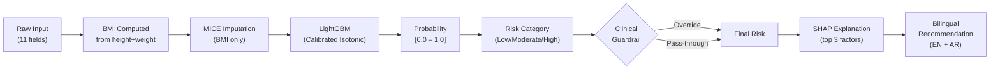
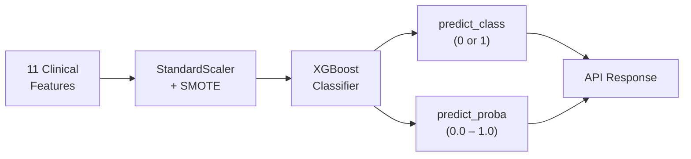
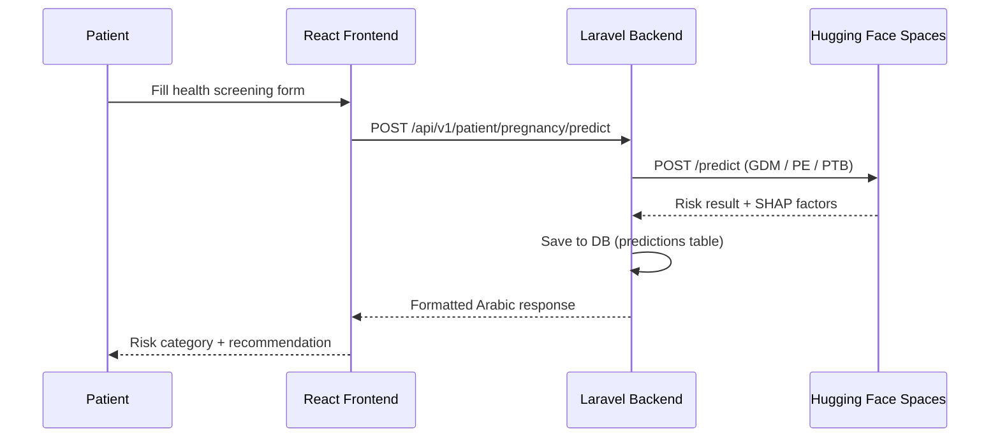

# Widad-Tech — AI Models Technical Report

> **Scope**: Detailed analysis of the three predictive ML models deployed on Hugging Face Spaces
> **Domain**: Women's Health (Obstetrics & Pregnancy Complications)
> **Report Date**: June 2026
> **Source Folders**:
> - `Gestational diabetes screen model GDM/`
> - `Preeclampsia screen model/`
> - `Premature birth screen model/`

---

## Table of Contents

1. [GDM Early Screening Model](#1-gdm-gestational-diabetes-mellitus-early-screening)
2. [Preeclampsia Prediction Model](#2-preeclampsia-prediction-model)
3. [Preterm Birth Risk Screening Model](#3-preterm-birth-risk-screening-model)
4. [Cross-Model Comparison](#4-cross-model-comparison)
5. [Integration with Widad-Tech Backend](#5-integration-with-widad-tech-backend)

---

## 1. GDM (Gestational Diabetes Mellitus) Early Screening

> **🏥 Clinical Purpose**: Screen for gestational diabetes risk using **only self-reportable features** — no blood tests, no lab work, no clinical measurements beyond height and weight. Enables earlier and more accessible screening, particularly in resource-limited settings.

### 1.1 Deployment

| Property | Value |
|---|---|
| **API URL** | `https://abdo16s-stage1gdm.hf.space` |
| **API Spec** | OAS 3.1 (`/openapi.json`) |
| **SDK** | Docker (Hugging Face Spaces) |
| **Version** | 1.0.0 |
| **CORS** | Enabled (all origins) |
| **Source Folder** | `Gestational diabetes screen model GDM/` |

### 1.2 Dataset

| Property | Value |
|---|---|
| **Source** | Techscience CSSE v40n1 + CMC v69n3 |
| **File** | `Gestational Diabetic Dat Set.xlsx` |
| **Total Rows** | 3,525 |
| **GDM Prevalence** | 38.92% (positive class) |
| **Missing Data** | BMI missing for 1,081 rows (all GDM=0) — handled via MICE |
| **Split** | 70% train / 15% validation / 15% test (stratified) |

### 1.3 Algorithm & Pipeline



| Component | Detail |
|---|---|
| **Algorithm** | `LightGBMClassifier` |
| **Hyperparameters** | n_estimators=300, learning_rate=0.05, max_depth=4, num_leaves=15, min_child_samples=20 |
| **Calibration** | `CalibratedClassifierCV` — isotonic method, 5-fold |
| **Imbalance** | `scale_pos_weight = n_negative / n_positive` |
| **Missing Data** | MICE (`IterativeImputer`, max_iter=10) — BMI only |
| **Threshold Search** | Grid [0.05–0.95, step 0.005] on validation set |
| **Threshold Criteria** | Maximize F1, Recall ≥ 90%, Precision ≥ 60% |
| **Explainability** | SHAP `TreeExplainer` — top-3 per patient |
| **Validation** | 5-Fold Stratified CV + Bootstrap 95% CI (1,000 resamples) |
| **Brier Score** | < 0.10 (well calibrated) |
| **ECE** | 0.0180 (clinically reliable probabilities) |

### 1.4 Input Schema (11 user fields → 10 model features)

> **المستخدم يُرسل 11 حقلاً** ولكن النموذج يستقبل **10 features فعلياً** — حيث يُحتسب BMI تلقائياً من `height_cm` و`weight_kg` ثم يُمرر كـ feature بدلاً منهما.

| Field | Type | Range | Description |
|---|---|---|---|
| `age` | `int` | [15, 55] | Age in years |
| `height_cm` | `float` | [130, 210] | Height in cm — used to compute BMI |
| `weight_kg` | `float` | [35, 200] | Weight in kg — used to compute BMI |
| `no_of_pregnancy` | `int` | [0, 15] | Total number of pregnancies |
| `family_history` | `int` | {0, 1} | Family history of diabetes |
| `pcos` | `int` | {0, 1} | Polycystic Ovary Syndrome |
| `sedentary_lifestyle` | `int` | {0, 1} | Sedentary lifestyle |
| `prediabetes` | `int` | {0, 1} | Prediabetes diagnosis |
| `unexplained_prenatal_loss` | `int` | {0, 1} | Unexplained prenatal loss |
| `large_child_or_birth_default` | `int` | {0, 1} | Large child or birth defect in prior pregnancy |
| `gestation_in_previous_pregnancy` | `int` | {0, 1} | GDM in a previous pregnancy |

**10 Internal Model Features** (exact order passed to LightGBM):
```
Age, No of Pregnancy, BMI, Family History, PCOS,
Sedentary Lifestyle, Prediabetes, unexplained prenetal loss,
Large Child or Birth Default, Gestation in previous Pregnancy
```

> **Note**: `height_cm` and `weight_kg` are never model features — they exist solely to compute BMI server-side via `weight_kg / (height_cm/100)²`.

### 1.5 Output Schema

```json
{
  "bmi_computed": 33.2,
  "risk_probability": 0.8721,
  "risk_category": "High Risk",
  "final_risk": "High Risk",
  "guardrail_applied": false,
  "recommendation_en": "Your profile indicates a high risk...",
  "recommendation_ar": "يشير ملفك الصحي إلى ارتفاع خطر...",
  "top_factors": [
    {"feature": "BMI", "direction": "increases risk", "impact": 3.2145},
    {"feature": "Family History", "direction": "increases risk", "impact": 1.8432},
    {"feature": "GDM in Previous Pregnancy", "direction": "increases risk", "impact": 1.1203}
  ]
}
```

### 1.6 Risk Categories

| Category | Probability Range | Clinical Action |
|---|---|---|
| **Low Risk** | < 25% | Routine antenatal care; maintain healthy lifestyle |
| **Moderate Risk** | 25% – 60% | Discuss with doctor; OGTT may be recommended |
| **High Risk** | > 60% | Contact doctor immediately; OGTT urgently required |

### 1.7 Clinical Guardrail Rules

> [!IMPORTANT]
> These rules **override** model output when established medical knowledge demands it.

| Rule | Trigger Condition | Override |
|---|---|---|
| **Rule 1 — High Risk Override** | `age > 35` AND `BMI > 30` AND `PCOS = 1` | Forces **High Risk** regardless of probability |
| **Rule 2 — Moderate Risk Floor** | `BMI < 25` AND `≥ 2 of {prediabetes, family_history, PCOS, prior GDM}` AND model = Low | Upgrades to **Moderate Risk** |

*Rule 2 rationale: Normal-weight women with multiple metabolic risk factors are systematically underdetected by BMI-dominant models.*

### 1.8 API Endpoints

| Method | Endpoint | Purpose |
|---|---|---|
| `GET` | `/` | Root info + status |
| `GET` | `/health` | Health check + model version + UTC timestamp |
| `POST` | `/predict` | Main prediction (returns full `PredictionOutput`) |
| `GET` | `/model-info` | Metadata, benchmarks, training dataset info |

### 1.9 Performance Metrics (Test Set)

| Metric | **This Model** *(No Lab Tests)* | Paper 1 *(Lab Tests)* | Paper 2 *(Lab Tests)* |
|---|---|---|---|
| **Accuracy** | **95.84%** | 94.24% | 96.18% |
| **Recall** | **94.17%** | 94.00% | 98.69% |
| **Precision** | **95.10%** | 94.00% | — |
| **F1 Score** | **94.63%** | 94.00% | — |
| **ROC-AUC** | **98.83%** | — | — |
| **ECE** | **0.0180** | — | — |
| **Lab Tests** | ❌ None | ✅ Required | ✅ Required |

### 1.10 SHAP Feature Importance

| Rank | Feature | Clinical Significance |
|---|---|---|
| 1 | **BMI** | Strongest predictor — obesity is the primary GDM driver |
| 2 | **Age** | Advanced maternal age increases metabolic risk |
| 3 | **Family History** | Genetic predisposition |
| 4 | **GDM in Previous Pregnancy** | Strongest history-based predictor |
| 5 | **PCOS** | Metabolic syndrome marker |
| 6 | **Prediabetes** | Pre-existing glucose metabolism impairment |
| 7 | **Number of Pregnancies** | Multiparity risk |
| 8 | **Sedentary Lifestyle** | Modifiable risk factor |
| 9 | **Large Child/Birth Defect** | Macrosomia history |
| 10 | **Unexplained Prenatal Loss** | Associated with metabolic disorders |

### 1.11 Fairness Analysis

| Group | Recall | Notes |
|---|---|---|
| **Age < 30** | Maintained | Lower prevalence, guardrails assist |
| **Age 30–35** | Best | Core population |
| **Age > 35** | Guardrail R1 | Override compensates edge cases |
| **Normal BMI (< 25)** | **⚠️ 0%** | Guardrail R2 critical for this group |
| **Overweight (25–30)** | Good | Moderate BMI well-detected |
| **Obese (≥ 30)** | Highest | BMI dominates prediction |

### 1.12 Artifacts

| File | Description |
|---|---|
| `gdm_model.pkl` | Bundled: `{model, explainer, threshold, features, version}` |
| `gdm_model_final.py` | Full training pipeline (840 lines, 12 steps) |
| `app.py` | FastAPI server (349 lines) |
| `save_model.py` | Model serialization script |
| `test_gdm_model.py` | Unit tests |
| `gdm_confusion_matrix.png` | Test set confusion matrix |
| `gdm_calibration_curve.png` | Calibration reliability plot |
| `gdm_shap_importance.png` | SHAP feature importance bar chart |
| `Dockerfile` | Docker deployment config |
| `requirements.txt` | Python dependencies |

### 1.13 Limitations

> [!WARNING]
> - **Recall for normal-weight GDM patients is 0%** — these lack distinguishing self-reportable features. Guardrail 2 partially compensates.
> - **Single-source dataset** — external validation on diverse geographies/ethnicities required before broad clinical deployment.
> - **Screening tool only** — OGTT remains gold standard for diagnosis. Model identifies *who to prioritize* for testing.

---

## 2. Preeclampsia Prediction Model

> **🏥 Clinical Purpose**: Predict the risk of preeclampsia (serious hypertensive disorder of pregnancy) using **routine clinical features** from standard antenatal visits.

### 2.1 Deployment

| Property | Value |
|---|---|
| **API URL** | `https://amrhassank-preeclampsia-prediction-api.hf.space` |
| **API Spec** | OAS 3.1 (`/openapi.json`) |
| **SDK** | Docker (Hugging Face Spaces, port 7860) |
| **Version** | 1.0 |
| **Source Folder** | `Preeclampsia screen model/` |

### 2.2 Dataset

| Property | Value |
|---|---|
| **Source** | Hospital routine antenatal records (D2 dataset) |
| **Files** | `data/D2.xlsx`, `D3.xlsx`, `D5.csv` |
| **Processed Records** | **203 rows** (from `D2_stage1_output.csv`) |
| **PE Prevalence** | **12.8%** — 26 PE cases, 177 Controls |
| **Missing Values** | 0 (after Stage 1 preprocessing) |
| **Target** | `label_binary` — 0 = Control, 1 = PE |

### 2.3 Algorithm & Pipeline



| Component | Detail |
|---|---|
| **Algorithm** | `XGBoostClassifier` (chosen over RF for higher Recall) |
| **Model File** | `FastAPI/d2_xgb_model.pkl` |
| **Preprocessing** | StandardScaler + SMOTE (class imbalance) |
| **Best XGB Params** | n_estimators=100, max_depth=5, lr=0.01, subsample=0.8, colsample_bytree=0.8 |
| **Threshold** | Default 0.5 |
| **Tuning Method** | GridSearchCV (5-Fold CV, scoring=roc_auc) |
| **Compared Models** | LR (0.963), SVM (0.966), RF (0.986), XGBoost (0.979), MLP (0.936) |
| **SHAP** | RF-based TreeExplainer — top feature: `proteinuria` (|SHAP|=0.1922) |
| **Model Loading** | Tries `FastAPI/d2_xgb_model.pkl` → fallback `NoteBook/img/d2_xgb_model.pkl` |

### 2.4 Input Schema (11 fields)

| Field | Type | Description | Clinical Meaning |
|---|---|---|---|
| `gravida` | `float` | Number of pregnancies | Obstetric history |
| `parity` | `float` | Number of births | Birth history |
| `gest_age` | `float` | Gestational age (weeks) | Pregnancy timeline |
| `age` | `float` | Patient age | Maternal age risk |
| `bmi` | `float` | Body Mass Index | Weight status |
| `diabetes` | `int` {0,1} | Diabetes history | Metabolic comorbidity |
| `htn` | `int` {0,1} | Hypertension history | Cardiovascular risk |
| `sysbp` | `float` | Systolic blood pressure | Hemodynamic status |
| `diabp` | `float` | Diastolic blood pressure | Hemodynamic status |
| `hb` | `float` | Hemoglobin levels | Anemia indicator |
| `proteinuria` | `int` {0,1} | Proteinuria | **Key PE diagnostic marker** |

**Example Input:**
```json
{
  "gravida": 2, "parity": 1, "gest_age": 37, "age": 28,
  "bmi": 30.2, "diabetes": 0, "htn": 1,
  "sysbp": 140, "diabp": 90, "hb": 11.5, "proteinuria": 1
}
```

### 2.5 Output Schema

```json
{
  "prediction": 1,
  "probability": 0.82,
  "risk_status": "High Risk",
  "features_used": { ...input echo... }
}
```

| Field | Type | Description |
|---|---|---|
| `prediction` | `int` (0 or 1) | Binary result |
| `probability` | `float` [0.0, 1.0] | Probability of PE (class 1) |
| `risk_status` | `string` | `"High Risk"` or `"Low Risk"` |
| `features_used` | `object` | Echo of input for traceability |

### 2.6 API Endpoints

| Method | Endpoint | Purpose |
|---|---|---|
| `GET` | `/` | Welcome message |
| `POST` | `/predict` | Main risk prediction |

### 2.7 Tuning Results (from Notebooks)

**Baseline CV (before tuning):**
| Model | Accuracy | AUC | F1 | Recall | Precision |
|---|---|---|---|---|---|
| LR | 93.1% | 96.3% | 73.7% | 76.7% | 75.0% |
| SVM | 92.1% | 96.6% | 70.3% | 73.3% | 71.9% |
| **RF** | 93.6% | **97.4%** | 73.9% | 69.3% | 83.4% |
| **XGBoost** | 91.6% | 96.9% | 69.4% | 72.7% | 70.7% |
| MLP | 88.2% | 93.6% | 65.5% | 85.3% | 54.2% |

**After GridSearchCV Tuning:**
| Model | AUC | Recall | Precision | F1 |
|---|---|---|---|---|
| RF (Tuned) | **98.6%** | 73.3% | 82.5% | 73.7% |
| XGBoost (Tuned) | 97.9% | **81.3%** | 73.9% | **75.2%** |

> **Decision**: XGBoost Tuned deployed for its superior Recall (81.3%) — more clinically critical for PE screening.

### 2.8 Key Clinical Features

> [!NOTE]
> `proteinuria` is the #1 SHAP feature (mean |SHAP| = 0.1922) — confirms clinical primacy.

| Feature | Clinical Relevance |
|---|---|
| **proteinuria** | #1 SHAP feature — protein in urine + hypertension = PE diagnosis criterion |
| **sysbp / diabp** | ≥ 140/90 mmHg = hypertension threshold for PE |
| **htn** | Pre-existing hypertension = major risk factor |
| **bmi** | Obesity amplifies PE risk |
| **gest_age** | Early gestational age increases severity |
| **gravida/parity** | Nulliparity is a known PE risk factor |

### 2.8 SHAP Visualization Artifacts

| File | Content |
|---|---|
| `d2_shap_beeswarm.png` | Feature impact distribution across all samples |
| `d2_shap_summary_bar.png` | Global feature importance bar chart |
| `d2_shap_dependence.png` | Dependence plots for key features |
| `d2_shap_force.png` | Force plot for individual predictions |
| `d2_confusion_metrics.png` | Confusion matrix |
| `d2_roc_curves.png` | ROC curve comparison |
| `fig1_auc_comparison.png` | AUC comparison across model variants |
| `fig2_metrics_heatmap.png` | Multi-metric comparison heatmap |

### 2.9 Artifacts

| File | Description |
|---|---|
| `FastAPI/d2_xgb_model.pkl` | Trained XGBoost model (production copy) |
| `FastAPI/app.py` | FastAPI server (80 lines) |
| `FastAPI/Dockerfile` | Docker config (port 7860) |
| `FastAPI/deployment_guide.md` | Arabic step-by-step HF deployment guide |
| `NoteBook/D2_stage1_analysis.ipynb` | EDA + preprocessing notebook |
| `NoteBook/D2_stage2_tuning_shap.ipynb` | Hyperparameter tuning + SHAP notebook |
| `NoteBook/img/*.png` | 15+ visualization outputs |
| `data/D2.xlsx`, `D3.xlsx`, `D5.csv` | Dataset files |
| `input_output.md` | IO template (Arabic) |

### 2.10 Limitations

> [!WARNING]
> - **Binary output only** — no severity stratification (mild vs. severe PE)
> - **No guardrail rules** — unlike GDM, no clinical override logic
> - **No bilingual recommendations** — output is purely numerical
> - **Proteinuria as input** — this is also a PE *diagnostic criterion*, creating potential data leakage concern (patient may not know their proteinuria status without a prior test)
> - **No SHAP per-patient output** — explainability only available as batch visualizations in notebooks

---

## 3. Preterm Birth Risk Screening Model

> **🏥 Clinical Purpose**: Identify patients at risk of preterm birth (< 37 weeks gestation) using binary risk classification.

### 3.1 Deployment

| Property | Value |
|---|---|
| **API URL** | `https://amrhassank-preterm-birth-screen-api.hf.space` |
| **API Spec** | OAS 3.1 (`/openapi.json`) |
| **SDK** | Docker (Hugging Face Spaces, port 7860) |
| **Version** | 1.0.0 |
| **CORS** | Enabled (all origins) |
| **Model File (Deployed)** | `models/stage1_screening_model_no_temp.pkl` |
| **Source Folder** | `Premature birth screen model/` |

### 3.2 Algorithm & Pipeline

| Component | Detail |
|---|---|
| **Algorithm** | Trained screening model (`stage1_screening_model_no_temp.pkl`) |
| **Features** | **10 clinical features** |
| **Threshold** | Model-internal (not exposed via API) |
| **Scalability** | Single + batch prediction |
| **Note** | Named `no_temp` — indicating it is a base, uncalibrated model without temperature scaling. |

### 3.3 Input Schema (10 Features)

| Field (Alias) | Python Name | Type | Example |
|---|---|---|---|
| `Age` | `age` | `float` | 32 |
| `Systolic BP` | `systolic_bp` | `float` | 135 |
| `Diastolic` | `diastolic` | `float` | 88 |
| `BS` | `bs` | `float` | 8.8 |
| `BMI` | `bmi` | `float` | 29.5 |
| `Previous Complications` | `previous_complications` | `float` | 0 or 1 |
| `Preexisting Diabetes` | `preexisting_diabetes` | `float` | 0 or 1 |
| `Gestational Diabetes` | `gestational_diabetes` | `float` | 0 or 1 |
| `Mental Health` | `mental_health` | `float` | 0 or 1 |
| `Heart Rate` | `heart_rate` | `float` | 86 |

> Pydantic uses `populate_by_name=True` — both alias and Python name accepted.

**Example Input:**
```json
{
  "Age": 32, "Systolic BP": 135, "Diastolic": 88,
  "BS": 8.8, "BMI": 29.5, "Previous Complications": 0,
  "Preexisting Diabetes": 0, "Gestational Diabetes": 1,
  "Mental Health": 0, "Heart Rate": 86
}
```

### 3.4 Output Schema

```json
{
  "prediction": 1,
  "risk_label": "High",
  "probability_high": 0.73,
  "features": { ...input echo... },
  "note": "Screening result only. This API is not a medical diagnosis."
}
```

| Field | Type | Description |
|---|---|---|
| `prediction` | `int` (0 or 1) | 0 = Low Risk, 1 = High Risk |
| `risk_label` | `string` | `"Low"` or `"High"` |
| `probability_high` | `float` or `null` | Probability of high risk (class 1) |
| `features` | `object` | Echo of input for traceability |
| `note` | `string` | Medical disclaimer |

### 3.5 API Endpoints

| Method | Endpoint | Purpose |
|---|---|---|
| `GET` | `/` | Root — API info + docs link |
| `GET` | `/health` | Health check + model filename |
| `GET` | `/features` | Returns list of expected features |
| `POST` | `/predict` | Single patient prediction |
| `POST` | `/predict-batch` | **Batch** — `{"rows": [...]}` — unique among 3 models |

### 3.6 Key Clinical Features

| Feature | Clinical Relevance |
|---|---|
| **Gestational Diabetes** | Placental dysfunction → preterm labor |
| **Previous Complications** | Strong obstetric history predictor |
| **Systolic/Diastolic BP** | Hypertension triggers early delivery |
| **BMI** | Obesity amplifies placental stress |
| **Blood Sugar (BS)** | Metabolic instability |
| **Mental Health** | Psychological stress linked to preterm |
| **Heart Rate** | Cardiovascular stress indicator |

### 3.7 FastAPI Server Details

- **File**: `hf_space_preterm_birth_risk_api/app.py` (139 lines)
- **CORS**: All origins enabled
- **Model loading**: `joblib.load()` at startup, raises `RuntimeError` if missing
- **Pydantic v2**: `ConfigDict(populate_by_name=True)`
- **Disclaimer**: Every response includes `"note": "Screening result only. This API is not a medical diagnosis."`

### 3.8 Artifacts

| File | Location | Description |
|---|---|---|
| `stage1_screening_model_no_temp.pkl` | `hf_space_preterm_birth_risk_api/models/` | **Deployed model** |
| `app.py` | `hf_space_preterm_birth_risk_api/` | FastAPI server (139 lines) |
| `Dockerfile` | `hf_space_preterm_birth_risk_api/` | Docker config (port 7860) |
| `README.md` | `hf_space_preterm_birth_risk_api/` | HF Space docs |
| `UPLOAD_STEPS.md` | `hf_space_preterm_birth_risk_api/` | Arabic HF deployment guide |
| `first_model_PTP (2).ipynb` | Root | Training notebook |
| `cleaned_dataset (1).csv` | Root | Cleaned training data |
| `main.pdf` | Root | Model documentation PDF |

### 3.9 Limitations

> [!WARNING]
> - **Input Suitability** — 10 clinical features are appropriate for patient-facing logic but may lack the raw predictive strength of complex EHR interaction variables.
> - **No per-patient SHAP** — The API response does not explain *why* a patient was flagged.
> - **No bilingual recommendations** — Generic English disclaimer only.
> - **Precision/Alert Fatigue** — Simplified models often sacrifice precision for recall. Validating false-positive rates on clinical usage is highly recommended.

---

| Dimension | GDM Screening | Preeclampsia | Preterm Birth |
|---|---|---|---|
| **Algorithm** | LightGBM + Isotonic Cal. | XGBoost + GridSearch | Unknown (`stage1_no_temp`) |
| **User Input Fields** | 11 (incl. height+weight) | 11 (clinical vitals) | 10 (clinical) |
| **Model Features** | **10** (BMI computed) | 11 | 10 |
| **Lab Tests Required** | ❌ None | ⚠️ Partial (BP, Hb) | ⚠️ Partial (BP, BS, HR) |
| **Input Type** | Self-reported | Clinical measurement | Clinical measurement |
| **Output Type** | 3-level + SHAP | Binary + probability | Binary + probability |
| **Accuracy** | **95.84%** | 93.1% (CV) | — |
| **Recall** | **94.17%** | 81.3% (XGB tuned CV) | — |
| **ROC-AUC** | **98.83%** | 97.9% (XGB tuned CV) | — |
| **Bilingual Output** | ✅ EN + AR | ❌ No | ❌ No |
| **SHAP Per-Patient** | ✅ Yes (top 3) | ❌ Batch only (RF) | ❌ No |
| **Clinical Guardrails** | ✅ 2 rules | ❌ None | ❌ None |
| **Batch Prediction** | ❌ No | ❌ No | ✅ Yes |
| **Medical Disclaimer** | ❌ Not in response | ❌ Not in response | ✅ `note` field |
| **Dataset Size** | 3,525 rows | **203 rows** | Unknown |
| **Deployed?** | ✅ Yes | ✅ Yes | ✅ Yes |
| **Maturity** | ⭐⭐⭐⭐⭐ High | ⭐⭐⭐ Medium | ⭐⭐ Low |

### Production Readiness Assessment

| Model | Rating | Reason |
|---|---|---|
| **GDM** | ✅ Production-Ready | Calibrated probabilities, 2 guardrails, bilingual, SHAP per-patient, well-tested |
| **Preeclampsia** | ⚠️ Near-Ready | Solid XGBoost core; missing guardrails, bilingual output, per-patient SHAP |
| **Preterm** | ⚠️ Limited | 10-feature simplified model; suitable for patient-facing only; no SHAP, no bilingual |

---

## 5. Integration with Widad-Tech Backend

### 5.1 Integration Architecture



### 5.2 Backend Tables

| Table | Model Class | Stores |
|---|---|---|
| `gestational_diabetes_predictions` | `GestationalDiabetesPrediction` | GDM results |
| `preeclampsia_predictions` | `PreeclampsiaPrediction` | PE results |
| `preterm_birth_predictions` | `PretermBirthPrediction` | PTB results |
| `ml_predictions_history` | `MlPredictionsHistory` | Unified cross-model history |

### 5.3 PII Safety

> [!TIP]
> The GDM model receives no personally identifiable information — all inputs are anonymized clinical measurements. The `ChatbotService::sanitizeForExternalAi()` method handles PII removal before any external AI call.

### 5.4 Recommended Improvements

| Priority | Improvement | Applies To |
|---|---|---|
| 🔴 High | Add Arabic bilingual recommendations to PE and PTB models | PE, PTB |
| 🔴 High | Add clinical guardrail rules to PTB model (e.g., multiple pregnancy + hypertension = High Risk override) | PTB |
| 🟡 Medium | Add per-patient SHAP to PE and PTB API responses | PE, PTB |
| 🟡 Medium | Add clinical guardrails to PE model (e.g., proteinuria + sysbp ≥ 140 = override) | PE |
| 🟡 Medium | External validation of all 3 models on Arabic/Middle Eastern population datasets | All |
| 🟢 Low | Implement Redis response caching for identical input profiles | All |
| 🟢 Low | Add severity stratification to PE model (mild/severe/HELLP) | PE |
| 🟢 Low | Add `note` medical disclaimer to GDM and PE API responses | GDM, PE |
| 🟢 Low | Implement Redis response caching for identical input profiles | All |
| 🟢 Low | Add severity stratification to PE model (mild/severe/HELLP) | PE |
| 🟢 Low | Add `note` medical disclaimer to GDM and PE API responses | GDM, PE |

---

*Report compiled from source code (`gdm_model_final.py`, `app.py` × 3), config files (`config.json`), documentation (`README.md`, `UPLOAD_STEPS.md`, `deployment_guide.md`, `input_output.md`, `V2 S2.md`), and live API specifications (OAS 3.1).*

*Source folders (after restructuring):*
- `d:\Final_Project_Implementation\Final_Project_Artificial_Intelligence_Ideas\Gestational diabetes screen model GDM\`
- `d:\Final_Project_Implementation\Final_Project_Artificial_Intelligence_Ideas\Preeclampsia screen model\`
- `d:\Final_Project_Implementation\Final_Project_Artificial_Intelligence_Ideas\Premature birth screen model\`
