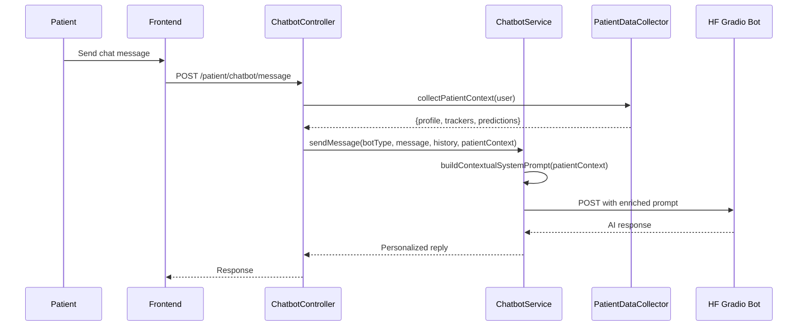

# 🔮 Future Plan: Chatbot ↔ Patient Data Integration

> **Status**: Future Enhancement — Not part of current AI Center implementation
> **Prerequisite**: AI Center (prediction models) must be fully deployed first
> **Estimated Effort**: 3-5 days

---

## Goal

Enable the chatbot to access the authenticated patient's health data (profile, trackers, AI prediction results) and use it as context in responses, delivering **personalized medical guidance**.

**Example**: _"بناءً على نتائج فحص سكري الحمل الأخير (خطورة عالية 87%)، أنصحكِ بمراجعة طبيبكِ لإجراء اختبار OGTT في أقرب وقت."_

---

## Architecture



---

## Implementation Steps

### 1. Extend `PatientDataCollectorService`

Add a method `collectChatbotContext(User $user): array` that returns:

```php
[
    'profile' => [
        'age' => 28,
        'bmi' => 30.2,
        'blood_type' => 'A+',
        'chronic_diseases' => ['PCOS'],
    ],
    'pregnancy' => [
        'is_active' => true,
        'current_week' => 24,
        'due_date' => '2026-09-15',
        'trimester' => 2,
    ],
    'latest_predictions' => [
        'gdm' => ['risk_level' => 'high', 'risk_probability' => 0.87, 'date' => '2026-06-15'],
        'preeclampsia' => ['risk_level' => 'low', 'probability' => 0.12, 'date' => '2026-06-10'],
    ],
    'trackers' => [
        'latest_mood' => 'anxious',
        'weight_trend' => 'increasing',
        'last_period' => null, // pregnant
    ],
]
```

### 2. Modify `ChatbotService::sendMessage()`

Inject patient context into the Gradio chat history as a **system-level context message** (first message in history):

```php
// Build context prefix
$contextPrefix = $this->buildPatientContext($patientData);
// Prepend to history as system context
array_unshift($chatHistory, [
    'role' => 'user',
    'message' => "[PATIENT_CONTEXT]\n" . $contextPrefix
]);
array_unshift($chatHistory, [
    'role' => 'assistant', 
    'message' => 'فهمت سياق المريضة. سأراعي هذه البيانات في ردودي.'
]);
```

### 3. Update System Prompts

Add a section to each bot's system prompt (in `prompts/prompt/` files):

```
## Patient Context Integration
When you receive a [PATIENT_CONTEXT] block, use it to personalize your responses:
- Reference specific risk levels from AI predictions
- Consider the current pregnancy week when giving advice
- Factor in chronic diseases and medical history
- NEVER reveal raw probability numbers to the patient — use descriptive language instead
- Always recommend doctor consultation for high-risk results
```

### 4. Privacy Safeguards

- **PII Redaction**: The existing `ChatbotService::sanitizeForExternalAi()` already handles this
- **Opt-in**: Add a user preference toggle: `notification_settings.chatbot_data_access`
- **Data Minimization**: Only send relevant data (e.g., pregnancy data only for pregnancy bot)
- **Audit Log**: Log when patient data is sent to external AI

### 5. Frontend Changes

- Add a toggle in chatbot settings: "السماح للمساعد الذكي بالوصول لبياناتي الصحية"
- Show a small badge when the chatbot is using patient data context
- Add a privacy notice on first use

---

## Phased Rollout

| Phase | Scope | Description |
|---|---|---|
| **A** | Profile only | Basic info (age, BMI, blood type) |
| **B** | + Predictions | Latest AI prediction results |
| **C** | + Trackers | Mood, weight trends, pregnancy week |
| **D** | + Full context | Medical history, medications, doctor notes |
