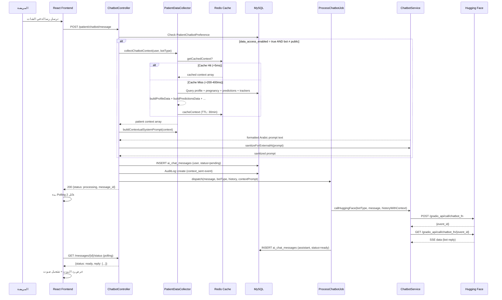
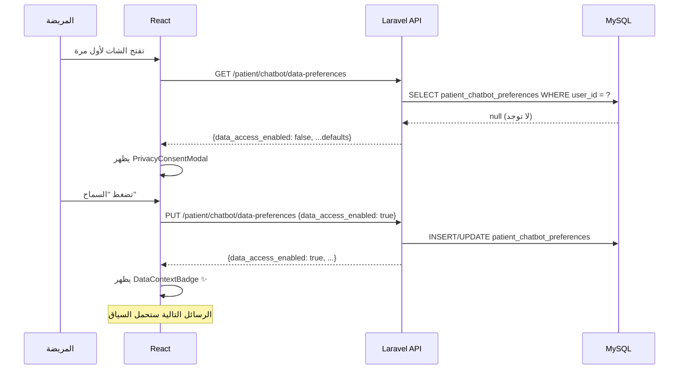
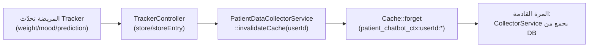

# خطة دمج بيانات المريضة مع الشات بوت — الجزء الأول (Backend Foundation)

> **المشروع**: Widad-Tech — منصة صحة المرأة الشاملة
> **الميزة**: دمج بيانات المريضة مع الشات بوت لتخصيص الردود
> **التقنية**: Laravel 12 + Redis Cache + Hugging Face Gradio SSE
> **المرجع**: [CHATBOT_PATIENT_DATA_PROMPT.md](file:///d:/Final_Project_Implementation/Final_Project_Front_And_Back/CHATBOT_PATIENT_DATA_PROMPT.md)

---

## 1. نظرة عامة (Executive Summary)

### الفكرة
تحويل الشات بوت من مساعد عام إلى مساعد **مخصص** يعرف الحالة الصحية للمريضة ويستخدمها لتقديم ردود دقيقة ومخصصة.

### مثال عملي حقيقي

**بدون بيانات (حالياً):**
> المريضة: "هل أحتاج فحص سكر الحمل؟"
> البوت: "ننصح جميع الحوامل بإجراء فحص OGTT بين الأسبوع 24-28."

**مع بيانات (بعد التنفيذ):**
> المريضة: "هل أحتاج فحص سكر الحمل؟"
> البوت: "بناءً على بياناتك — أنتِ في الأسبوع 24 مع مؤشر كتلة جسم مرتفع وتاريخ عائلي للسكري — تقييم الذكاء الاصطناعي يشير لخطورة عالية لسكري الحمل. أنصحك بإجراء فحص OGTT عاجلاً ومراجعة طبيبتك."

### البيانات المتاحة لكل بوت

| البوت | `bot_type` | البيانات المتاحة |
|---|---|---|
| وداد العام | `public` | ❌ لا بيانات شخصية — يبقى عاماً |
| ما قبل الزواج | `pre_marriage` | Profile (age, BMI, blood_type, chronic_diseases, allergies) |
| الحمل | `pregnancy` | Profile + Pregnancy (week, trimester, due_date) + GDM/PE/PTB predictions + Weight trend + Medications |
| الأمومة | `motherhood` | Profile + Post-pregnancy data + Mood tracker + Medical file categories |

---

## 2. تحليل الكود الموجود والتكامل

### 2.1 الموديلات ذات الصلة (تم تحليلها من الكود الفعلي)

| Model | الحقول المستخدمة للسياق | الملف |
|---|---|---|
| [User](file:///D:/Final_Project_Implementation/Final_Project_Front_And_Back/Back-end/app/Models/User.php) | `name`, `age`, `life_stage_id` + 20+ relationships | L15-206 |
| [UserProfile](file:///D:/Final_Project_Implementation/Final_Project_Front_And_Back/Back-end/app/Models/UserProfile.php) | `height`, `weight`, `blood_type`, `chronic_diseases` (array), `allergies` (array), `current_medications` (array), `bmi` accessor, `date_of_birth` | L8-82 |
| [Pregnancy](file:///D:/Final_Project_Implementation/Final_Project_Front_And_Back/Back-end/app/Models/Pregnancy.php) | `current_week`, `due_date`, `is_active`, `last_menstrual_period`, `delivery_date` | L7-67 |
| [PregnancyMedication](file:///D:/Final_Project_Implementation/Final_Project_Front_And_Back/Back-end/app/Models/PregnancyMedication.php) | `name`, `dosage`, `frequency`, `is_active` | L8-38 |
| [GestationalDiabetesPrediction](file:///D:/Final_Project_Implementation/Final_Project_Front_And_Back/Back-end/app/Models/GestationalDiabetesPrediction.php) | `risk_level`, `risk_category`, `guardrail_applied`, `recommendation_ar`, `top_factors` (array), `risk_badge` accessor | L7-137 |
| [PreeclampsiaPrediction](file:///D:/Final_Project_Implementation/Final_Project_Front_And_Back/Back-end/app/Models/PreeclampsiaPrediction.php) | `risk_status`, `prediction_class`, `risk_badge` accessor | L7-131 |
| [PretermBirthPrediction](file:///D:/Final_Project_Implementation/Final_Project_Front_And_Back/Back-end/app/Models/PretermBirthPrediction.php) | `risk_label`, `prediction_class`, `risk_badge` accessor | L7-144 |
| [MoodEntry](file:///D:/Final_Project_Implementation/Final_Project_Front_And_Back/Back-end/app/Models/MoodEntry.php) | `mood`, `factors` (array), `entry_date` | L8-30 |
| [WeightEntry](file:///D:/Final_Project_Implementation/Final_Project_Front_And_Back/Back-end/app/Models/WeightEntry.php) | `weight`, `bmi`, `entry_date` | L8-49 |
| [Prescription](file:///D:/Final_Project_Implementation/Final_Project_Front_And_Back/Back-end/app/Models/Prescription.php) | `medications` (array), `diagnosis` | L8-40 |

### 2.2 نقاط التعديل في الكود الموجود

#### [ChatbotService::sendMessage()](file:///D:/Final_Project_Implementation/Final_Project_Front_And_Back/Back-end/app/Services/ChatbotService.php#46-125)
- السياق يُحقن في `$chatHistory` **قبل** استدعاء `callHuggingFace()` (L99)
- `sanitizeForExternalAi()` (L474-487) تُطبَّق على السياق النصي المبني
- نُضيف parameter اختياري: `?string $contextPrompt = null`

#### [ProcessChatbotMessageJob::handle()](file:///D:/Final_Project_Implementation/Final_Project_Front_And_Back/Back-end/app/Jobs/ProcessChatbotMessageJob.php#28-78)
- يستدعي `callHuggingFace()` مباشرة في L37 — **لا يمر بـ sendMessage()**
- نُضيف parameter في constructor: `private readonly ?string $contextPrompt = null`
- عند بناء history نضيف الـ contextPrompt كأول عنصر

#### [ChatbotController::sendMessage()](file:///D:/Final_Project_Implementation/Final_Project_Front_And_Back/Back-end/app/Http/Controllers/Api/Patient/ChatbotController.php#79-174)
- نقطة injection الرئيسية: جلب preferences → collect context → تمرير للـ Job/Service

### 2.3 مكان إضافة الملفات الجديدة

```
Back-end/
├── app/
│   ├── Models/
│   │   └── PatientChatbotPreference.php              ← جديد
│   ├── Services/
│   │   └── Patient/
│   │       └── PatientDataCollectorService.php        ← جديد
│   ├── Http/
│   │   ├── Requests/
│   │   │   └── Patient/
│   │   │       └── UpdateChatbotPreferencesRequest.php ← جديد
│   │   └── Resources/
│   │       └── Patient/
│   │           └── ChatbotPreferenceResource.php       ← جديد
│   └── config/
│       └── chatbot.php                                ← تعديل (إضافة feature flag)
├── database/
│   └── migrations/
│       └── 2026_06_21_000004_create_patient_chatbot_preferences_table.php ← جديد

Front-End/src/
├── types/chatbot.ts                          ← تعديل (إضافة types)
├── services/chatbotService.ts                ← تعديل (إضافة endpoints)
├── hooks/useChatbotPreferences.ts            ← جديد
└── components/chatbot/
    ├── PrivacyConsentModal.tsx                ← جديد
    ├── DataContextBadge.tsx                   ← جديد
    └── ChatbotPrivacySettings.tsx             ← جديد
```

---

## 3. هيكل قاعدة البيانات

### الجدول الجديد: `patient_chatbot_preferences`

```sql
patient_chatbot_preferences
├── id                    (BigInt, PK, Auto Increment)
├── user_id               (FK → users.id, CASCADE DELETE, UNIQUE)
├── data_access_enabled   (Boolean, Default: false)  ← الـ Opt-in الرئيسي
├── share_predictions     (Boolean, Default: true)   ← مشاركة نتائج ML
├── share_trackers        (Boolean, Default: true)   ← مشاركة Health Trackers
├── share_medical_file    (Boolean, Default: false)  ← مشاركة الملف الطبي (حساس)
├── share_consultations   (Boolean, Default: false)  ← مشاركة تاريخ الاستشارات
├── created_at            (Timestamp)
└── updated_at            (Timestamp)
Indexes: (user_id UNIQUE)
```

### Migration الكامل

**الملف**: `database/migrations/2026_06_21_000004_create_patient_chatbot_preferences_table.php`

```php
<?php

use Illuminate\Database\Migrations\Migration;
use Illuminate\Database\Schema\Blueprint;
use Illuminate\Support\Facades\Schema;

return new class extends Migration
{
    public function up(): void
    {
        Schema::create('patient_chatbot_preferences', function (Blueprint $table) {
            $table->id();
            $table->foreignId('user_id')
                  ->unique()
                  ->constrained('users')
                  ->cascadeOnDelete();
            $table->boolean('data_access_enabled')->default(false);
            $table->boolean('share_predictions')->default(true);
            $table->boolean('share_trackers')->default(true);
            $table->boolean('share_medical_file')->default(false);
            $table->boolean('share_consultations')->default(false);
            $table->timestamps();
        });
    }

    public function down(): void
    {
        Schema::dropIfExists('patient_chatbot_preferences');
    }
};
```

### الموديل `PatientChatbotPreference`

**الملف**: `app/Models/PatientChatbotPreference.php`

```php
<?php

namespace App\Models;

use Illuminate\Database\Eloquent\Model;

class PatientChatbotPreference extends Model
{
    protected $fillable = [
        'user_id',
        'data_access_enabled',
        'share_predictions',
        'share_trackers',
        'share_medical_file',
        'share_consultations',
    ];

    protected $casts = [
        'data_access_enabled' => 'boolean',
        'share_predictions'   => 'boolean',
        'share_trackers'      => 'boolean',
        'share_medical_file'  => 'boolean',
        'share_consultations' => 'boolean',
    ];

    // =========================================================================
    //  RELATIONSHIPS
    // =========================================================================

    public function patient()
    {
        return $this->belongsTo(User::class, 'user_id');
    }

    // =========================================================================
    //  HELPERS
    // =========================================================================

    /**
     * هل الميزة مفعّلة لهذه المريضة؟
     */
    public function isDataAccessEnabled(): bool
    {
        return $this->data_access_enabled === true;
    }

    /**
     * إرجاع القيم الافتراضية لمريضة جديدة
     */
    public static function getDefaultsFor(User $user): array
    {
        return [
            'user_id'              => $user->id,
            'data_access_enabled'  => false,
            'share_predictions'    => true,
            'share_trackers'       => true,
            'share_medical_file'   => false,
            'share_consultations'  => false,
        ];
    }
}
```

### تحديث User Model

**إضافة في** [User.php](file:///D:/Final_Project_Implementation/Final_Project_Front_And_Back/Back-end/app/Models/User.php) — relationship جديد بعد `stepRecords()`:

```php
// في User model — إضافة بعد stepRecords() (سطر 199)
public function chatbotPreference()
{
    return $this->hasOne(PatientChatbotPreference::class);
}
```

---

## 4. ملفات الإعداد (Config)

### تعديل `config/chatbot.php`

**إضافة** في [chatbot.php](file:///D:/Final_Project_Implementation/Final_Project_Front_And_Back/Back-end/config/chatbot.php) — بعد `admin_api_key` (سطر 124):

```php
// إضافة بعد 'admin_api_key' => ...

/*
|--------------------------------------------------------------------------
| Patient Context Feature Flag
|--------------------------------------------------------------------------
| تفعيل/إيقاف ميزة دمج بيانات المريضة مع الشات بوت
| يمكن تغييرها في .env للتراجع الفوري
*/
'patient_context_enabled' => env('CHATBOT_PATIENT_CONTEXT_ENABLED', false),

'patient_context' => [
    'cache_ttl_minutes' => (int) env('CHATBOT_CONTEXT_CACHE_TTL', 30),
    'cache_prefix'      => 'patient_chatbot_ctx',
],
```

---

## 5. الـ Service الجديد: `PatientDataCollectorService`

**الملف**: `app/Services/Patient/PatientDataCollectorService.php`

```php
<?php

namespace App\Services\Patient;

use App\Models\User;
use App\Models\PatientChatbotPreference;
use Illuminate\Support\Facades\Cache;
use Illuminate\Support\Facades\Log;

/**
 * PatientDataCollectorService
 * يجمع بيانات المريضة ويبني السياق المخصص للشات بوت
 * يدعم Redis Cache لتقليل DB queries
 */
class PatientDataCollectorService
{
    // =========================================================================
    //  MAIN METHOD
    // =========================================================================

    /**
     * جمع سياق المريضة حسب نوع البوت
     * يُرجع array فارغ إذا: البوت عام، الميزة معطلة، أو لا بيانات
     */
    public function collectChatbotContext(User $user, string $botType): array
    {
        // القاعدة: البوت العام لا يستقبل أي بيانات شخصية
        if ($botType === 'public') {
            return [];
        }

        // Feature Flag check
        if (!config('chatbot.patient_context_enabled', false)) {
            return [];
        }

        // Opt-in check
        $preference = $user->chatbotPreference;
        if (!$preference || !$preference->isDataAccessEnabled()) {
            return [];
        }

        // Cache check
        $cached = $this->getCachedContext($user, $botType);
        if ($cached !== null) {
            return $cached;
        }

        try {
            // جمع البيانات من DB
            $context = [
                'context_version' => '1.0',
                'generated_at'    => now()->toISOString(),
                'profile'         => $this->buildProfileData($user),
            ];

            // بيانات إضافية حسب نوع البوت والـ Preferences
            if ($preference->share_predictions) {
                $predictions = $this->buildPredictionsData($user, $botType);
                if (!empty($predictions)) {
                    $context['latest_predictions'] = $predictions;
                }
            }

            if ($preference->share_trackers) {
                $trackers = $this->buildTrackersData($user, $botType);
                if (!empty($trackers)) {
                    $context['trackers'] = $trackers;
                }
            }

            // بيانات خاصة بالحمل
            if ($botType === 'pregnancy') {
                $pregnancy = $this->buildPregnancyData($user);
                if ($pregnancy) {
                    $context['pregnancy'] = $pregnancy;
                }
                $meds = $this->buildMedicationsData($user);
                if (!empty($meds)) {
                    $context['recent_medications'] = $meds;
                }
            }

            // بيانات ما بعد الولادة
            if ($botType === 'motherhood') {
                $pregnancy = $this->buildPostPregnancyData($user);
                if ($pregnancy) {
                    $context['last_pregnancy'] = $pregnancy;
                }
            }

            // تطبيق Data Minimization
            $context = $this->filterByBotType($context, $botType);

            // Cache النتيجة
            $this->cacheContext($user, $botType, $context);

            return $context;

        } catch (\Throwable $e) {
            // Graceful Degradation — لا يفشل الطلب
            Log::warning('patient_context_collection_failed', [
                'user_id'  => $user->id,
                'bot_type' => $botType,
                'error'    => $e->getMessage(),
            ]);
            return [];
        }
    }

    // =========================================================================
    //  SYSTEM PROMPT BUILDER
    // =========================================================================

    /**
     * بناء System Prompt مخصص بناءً على بيانات المريضة
     * يُضاف كأول رسالة في chat_history
     */
    public function buildContextualSystemPrompt(array $patientContext): string
    {
        if (empty($patientContext)) {
            return '';
        }

        $lines = [];
        $lines[] = '=== بيانات المريضة (سرية — للسياق فقط) ===';

        if (!empty($patientContext['profile'])) {
            $p = $patientContext['profile'];
            $lines[] = '';
            $lines[] = '📋 الملف الشخصي:';
            if (isset($p['age'])) {
                $lines[] = "- العمر: {$p['age']} سنة";
            }
            if (isset($p['bmi'])) {
                $lines[] = "- مؤشر كتلة الجسم (BMI): {$p['bmi']}";
            }
            if (isset($p['blood_type'])) {
                $lines[] = "- فصيلة الدم: {$p['blood_type']}";
            }
            if (!empty($p['chronic_diseases'])) {
                $lines[] = '- الأمراض المزمنة: ' . implode('، ', $p['chronic_diseases']);
            }
            if (!empty($p['allergies'])) {
                $lines[] = '- الحساسية: ' . implode('، ', $p['allergies']);
            }
        }

        if (!empty($patientContext['pregnancy'])) {
            $preg = $patientContext['pregnancy'];
            $lines[] = '';
            $lines[] = '🤰 الحمل الحالي:';
            if (isset($preg['current_week'])) {
                $lines[] = "- الأسبوع الحالي: {$preg['current_week']}";
            }
            if (isset($preg['trimester_label'])) {
                $lines[] = "- المرحلة: {$preg['trimester_label']}";
            }
            if (isset($preg['due_date'])) {
                $lines[] = "- تاريخ الولادة المتوقع: {$preg['due_date']}";
            }
        }

        if (!empty($patientContext['latest_predictions'])) {
            $lines[] = '';
            $lines[] = '🔬 تقييمات الذكاء الاصطناعي:';

            $predLabels = [
                'gdm'           => 'سكري الحمل (GDM)',
                'preeclampsia'  => 'تسمم الحمل (Preeclampsia)',
                'preterm_birth' => 'الولادة المبكرة (Preterm Birth)',
            ];

            foreach ($patientContext['latest_predictions'] as $key => $pred) {
                $label = $predLabels[$key] ?? $key;
                $risk = $pred['risk_label'] ?? $pred['risk_level'] ?? 'غير محدد';
                $lines[] = "- {$label}: {$risk} (آخر تقييم: {$pred['date']})";
            }
        }

        if (!empty($patientContext['trackers'])) {
            $t = $patientContext['trackers'];
            $lines[] = '';
            $lines[] = '📊 المتتبعات الصحية:';

            if (isset($t['weight_current'])) {
                $lines[] = "- الوزن الحالي: {$t['weight_current']} كجم";
            }
            if (isset($t['weight_trend'])) {
                $trend = $t['weight_trend'] === 'increasing' ? 'متزايد ⬆' : 'متناقص ⬇';
                $lines[] = "- اتجاه الوزن: {$trend}";
            }
            if (isset($t['latest_mood'])) {
                $lines[] = "- المزاج الأخير: {$t['latest_mood']}";
            }
        }

        if (!empty($patientContext['recent_medications'])) {
            $lines[] = '';
            $lines[] = '💊 الأدوية/المكملات الحالية:';
            $lines[] = '- ' . implode('، ', $patientContext['recent_medications']);
        }

        if (!empty($patientContext['last_pregnancy'])) {
            $lp = $patientContext['last_pregnancy'];
            $lines[] = '';
            $lines[] = '👶 آخر حمل:';
            if (isset($lp['delivery_date'])) {
                $lines[] = "- تاريخ الولادة: {$lp['delivery_date']}";
            }
            if (isset($lp['delivery_type'])) {
                $lines[] = "- نوع الولادة: {$lp['delivery_type']}";
            }
            if (isset($lp['weeks_since'])) {
                $lines[] = "- مضى: {$lp['weeks_since']} أسبوع";
            }
        }

        $lines[] = '';
        $lines[] = '⚠ تعليمات: استخدم هذه البيانات لتخصيص ردودك. لا تذكر بيانات لم تُسأل عنها. هذه البيانات للسياق فقط — لا تشخيص.';
        $lines[] = '=== نهاية بيانات المريضة ===';

        return implode("\n", $lines);
    }

    // =========================================================================
    //  DATA BUILDERS
    // =========================================================================

    /**
     * بيانات الملف الشخصي — متاحة لجميع البوتات المتخصصة
     */
    private function buildProfileData(User $user): array
    {
        $user->load('profile');
        $profile = $user->profile;

        $data = [
            'age' => $profile?->age_calculated ?? $user->age,
        ];

        if ($profile) {
            if ($profile->bmi) {
                $data['bmi'] = $profile->bmi;
            }
            if ($profile->blood_type) {
                $data['blood_type'] = $profile->blood_type;
            }
            if (!empty($profile->chronic_diseases)) {
                $data['chronic_diseases'] = $profile->chronic_diseases;
            }
            if (!empty($profile->allergies)) {
                $data['allergies'] = $profile->allergies;
            }
        }

        return $data;
    }

    /**
     * بيانات الحمل النشط — لبوت pregnancy فقط
     */
    private function buildPregnancyData(User $user): ?array
    {
        $pregnancy = $user->activePregnancy;
        if (!$pregnancy) {
            return null;
        }

        $week = $pregnancy->current_week ?? now()->diffInWeeks($pregnancy->last_menstrual_period);
        $trimester = match(true) {
            $week <= 13 => 1,
            $week <= 27 => 2,
            default     => 3,
        };
        $trimesterLabels = [1 => 'الثلث الأول', 2 => 'الثلث الثاني', 3 => 'الثلث الثالث'];

        return [
            'is_active'       => true,
            'current_week'    => $week,
            'due_date'        => $pregnancy->due_date?->format('Y-m-d'),
            'trimester'       => $trimester,
            'trimester_label' => $trimesterLabels[$trimester],
        ];
    }

    /**
     * بيانات آخر حمل — لبوت motherhood
     */
    private function buildPostPregnancyData(User $user): ?array
    {
        $pregnancy = $user->pregnancies()
            ->where('is_active', false)
            ->latest('delivery_date')
            ->first();

        if (!$pregnancy || !$pregnancy->delivery_date) {
            return null;
        }

        return [
            'delivery_date' => $pregnancy->delivery_date->format('Y-m-d'),
            'delivery_type' => $pregnancy->delivery_type,
            'weeks_since'   => now()->diffInWeeks($pregnancy->delivery_date),
        ];
    }

    /**
     * نتائج تنبؤات ML — لا أرقام خام، وصف فقط
     * يستخدم risk_badge accessor الموجود في كل Model
     */
    private function buildPredictionsData(User $user, string $botType): array
    {
        // فقط بوت الحمل يرى التنبؤات
        if ($botType !== 'pregnancy') {
            return [];
        }

        $predictions = [];

        // GDM — سكري الحمل
        $gdm = $user->gestationalDiabetesPredictions()->latest()->first();
        if ($gdm) {
            $predictions['gdm'] = [
                'risk_level' => strtolower($gdm->risk_level ?? $gdm->risk_category ?? 'unknown'),
                'risk_label' => $gdm->risk_badge, // accessor: خطورة عالية/متوسطة/منخفضة
                'date'       => $gdm->created_at->format('Y-m-d'),
                // لا probability خام هنا — القاعدة #2
            ];
        }

        // Preeclampsia — تسمم الحمل
        $pe = $user->preeclampsiaPredictions()->latest()->first();
        if ($pe) {
            $predictions['preeclampsia'] = [
                'risk_level' => strtolower($pe->risk_status ?? $pe->risk_level ?? 'unknown'),
                'risk_label' => $pe->risk_badge,
                'date'       => $pe->created_at->format('Y-m-d'),
            ];
        }

        // Preterm Birth — الولادة المبكرة
        $ptb = $user->pretermBirthPredictions()->latest()->first();
        if ($ptb) {
            $predictions['preterm_birth'] = [
                'risk_level' => strtolower($ptb->risk_label ?? $ptb->risk_level ?? 'unknown'),
                'risk_label' => $ptb->risk_badge,
                'date'       => $ptb->created_at->format('Y-m-d'),
            ];
        }

        return $predictions;
    }

    /**
     * بيانات المتتبعات الصحية
     */
    private function buildTrackersData(User $user, string $botType): array
    {
        $trackers = [];

        // Mood — لبوت motherhood فقط
        if ($botType === 'motherhood') {
            $mood = $user->moodEntries()->latest('entry_date')->first();
            if ($mood) {
                $trackers['latest_mood'] = $mood->mood;
                if (!empty($mood->factors)) {
                    $trackers['mood_factors'] = $mood->factors;
                }
            }
        }

        // Weight — لبوت pregnancy و motherhood
        if (in_array($botType, ['pregnancy', 'motherhood'])) {
            $latestWeight = $user->weightEntries()->latest('entry_date')->first();
            if ($latestWeight) {
                $trackers['weight_current'] = $latestWeight->weight;
            }

            // اتجاه الوزن (آخر 3 إدخالات)
            $recentWeights = $user->weightEntries()
                ->latest('entry_date')
                ->take(3)
                ->pluck('weight')
                ->toArray();

            if (count($recentWeights) >= 2) {
                $trackers['weight_trend'] = $recentWeights[0] > $recentWeights[count($recentWeights) - 1]
                    ? 'increasing' : 'decreasing';
            }
        }

        return $trackers;
    }

    /**
     * الأدوية/المكملات الحالية — لبوت pregnancy فقط
     */
    private function buildMedicationsData(User $user): array
    {
        $pregnancy = $user->activePregnancy;
        if (!$pregnancy) {
            return [];
        }

        return PregnancyMedication::where('pregnancy_id', $pregnancy->id)
            ->where('is_active', true)
            ->pluck('name')
            ->toArray();
    }

    // =========================================================================
    //  DATA MINIMIZATION
    // =========================================================================

    /**
     * تصفية البيانات حسب نوع البوت — كل بوت يرى فقط ما يحتاجه
     */
    private function filterByBotType(array $context, string $botType): array
    {
        $allowed = match($botType) {
            'pre_marriage' => ['context_version', 'generated_at', 'profile'],
            'pregnancy'    => ['context_version', 'generated_at', 'profile', 'pregnancy', 'latest_predictions', 'trackers', 'recent_medications'],
            'motherhood'   => ['context_version', 'generated_at', 'profile', 'last_pregnancy', 'trackers'],
            default        => [],
        };

        return array_intersect_key($context, array_flip($allowed));
    }

    // =========================================================================
    //  CACHE STRATEGY
    // =========================================================================

    /**
     * Cache key: patient_chatbot_ctx:{user_id}:{botType}
     * TTL: 30 دقيقة
     */
    private function getCacheKey(User $user, string $botType): string
    {
        $prefix = config('chatbot.patient_context.cache_prefix', 'patient_chatbot_ctx');
        return "{$prefix}:{$user->id}:{$botType}";
    }

    public function getCachedContext(User $user, string $botType): ?array
    {
        return Cache::get($this->getCacheKey($user, $botType));
    }

    public function cacheContext(User $user, string $botType, array $context): void
    {
        $ttl = config('chatbot.patient_context.cache_ttl_minutes', 30);
        Cache::put($this->getCacheKey($user, $botType), $context, now()->addMinutes($ttl));
    }

    /**
     * إلغاء Cache — يُستدعى من controllers الـ Trackers والـ Predictions
     */
    public static function invalidateCache(int $userId): void
    {
        $prefix = config('chatbot.patient_context.cache_prefix', 'patient_chatbot_ctx');
        $botTypes = ['pre_marriage', 'pregnancy', 'motherhood'];

        foreach ($botTypes as $type) {
            Cache::forget("{$prefix}:{$userId}:{$type}");
        }
    }
}
```

---

## 6. تدفق البيانات الكامل

### 6.1 رسالة مع سياق مخصص (Async + Queue)



### 6.2 تفعيل الميزة للمرة الأولى



### 6.3 إلغاء صلاحية الـ Cache



---

*تابع في [الجزء الثاني](file:///d:/Final_Project_Implementation/Final_Project_Front_And_Back/chatbot_patient_data_plan_part2.md) — تعديلات ChatbotService + Controller + Routes + Frontend*
