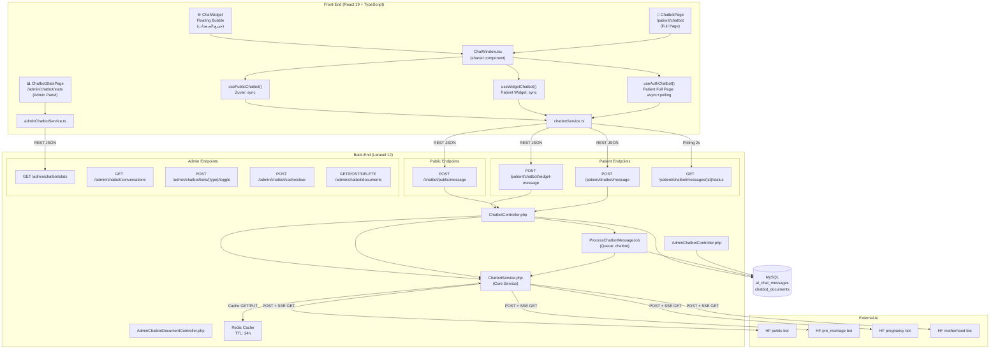
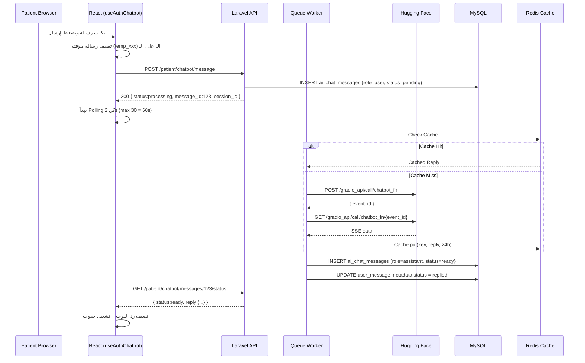
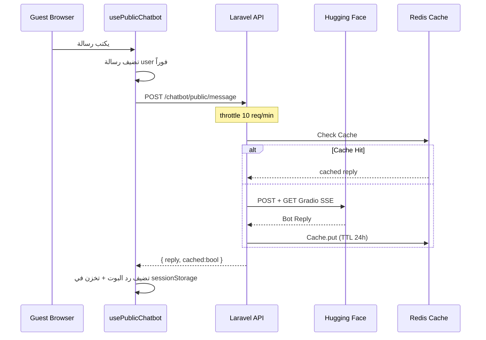
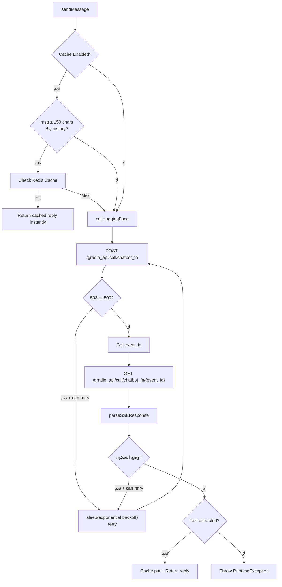
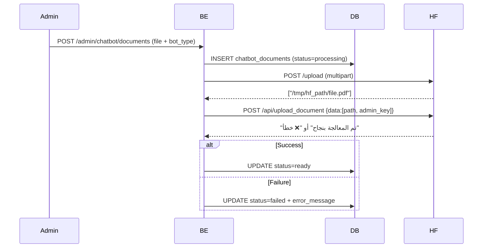

# 🤖 تقرير شامل: نظام الشات بوت — منصة وداد الصحية
**تاريخ المراجعة:** 2026-06-06  
**المراجِع:** نظام المراجعة الاحترافية (Antigravity)  
**الحالة:** ✅ مكتمل ومُفعَّل

---

## 1. نظرة عامة (Executive Summary)

يعتمد مشروع **وداد** على نظام شات بوت متعدد الطبقات والأدوار (Multi-Tier, Multi-Bot Chatbot), مصمّم لتقديم مساعدة صحية ذكية لثلاث فئات من المستخدمين:

| الفئة | طريقة الدخول | نوع الرد | عدد البوتات المتاحة |
|---|---|---|---|
| 🌐 الزوار (Guests) | بدون تسجيل | فوري (Sync) | 1 (public) |
| 🧑‍⚕️ المريض (Patient) | Sanctum Token | Async + Polling | 4 بوتات حسب المرحلة |
| 🔐 الأدمن (Admin) | Sanctum Token | إدارة واستعراض فقط | يدير الـ 4 بوتات |

### البوتات الأربعة (Hugging Face Gradio Spaces)

| اسم البوت | `bot_type` | الـ URL | `life_stage_id` |
|---|---|---|---|
| وداد - المساعد العام | `public` | `widad-health-widad-public-health-chatbot.hf.space` | `null` |
| وداد - ما قبل الزواج | `pre_marriage` | `widad-health-widad-premarital-chatbot.hf.space` | `1` |
| وداد - مرحلة الحمل | `pregnancy` | `widad-health-wedad-pregnancy-chatbot.hf.space` | `2` |
| وداد - مرحلة الأمومة | `motherhood` | `widad-health-widad-postpartum-chatbot.hf.space` | `3` |

---

## 2. البنية التقنية (Technical Architecture)

### 2.1 رسم بياني شامل: تدفق البيانات



### 2.2 تدفق رسالة المريض (المسار الكامل)



### 2.3 تدفق رسالة الزائر (Sync)



---

## 3. الملفات الأساسية (File Inventory)

### 3.1 Back-End — جرد شامل

| الملف | المسار | الدور | الأسطر |
|---|---|---|---|
| [ChatbotService.php](file:///d:/final-project-front-back/Final_Project_Front_And_Back/Back-end/app/Services/ChatbotService.php) | `app/Services/` | الخدمة المركزية: إرسال/استقبال Gradio, Cache, PII Sanitization | 574 |
| [ChatbotController.php](file:///d:/final-project-front-back/Final_Project_Front_And_Back/Back-end/app/Http/Controllers/Api/Patient/ChatbotController.php) | `Controllers/Api/Patient/` | واجهة API للمريض والزوار (12 method) | 468 |
| [AdminChatbotController.php](file:///d:/final-project-front-back/Final_Project_Front_And_Back/Back-end/app/Http/Controllers/Api/Admin/AdminChatbotController.php) | `Controllers/Api/Admin/` | Stats, Conversations, Toggle, Cache Clear | 207 |
| [AdminChatbotDocumentController.php](file:///d:/final-project-front-back/Final_Project_Front_And_Back/Back-end/app/Http/Controllers/Api/Admin/AdminChatbotDocumentController.php) | `Controllers/Api/Admin/` | RAG: رفع/حذف ملفات قاعدة المعرفة | 99 |
| [ProcessChatbotMessageJob.php](file:///d:/final-project-front-back/Final_Project_Front_And_Back/Back-end/app/Jobs/ProcessChatbotMessageJob.php) | `app/Jobs/` | Job معالجة async — 3 attempts, backoff [5,15]s | 80 |
| [CleanupOldChatMessagesJob.php](file:///d:/final-project-front-back/Final_Project_Front_And_Back/Back-end/app/Jobs/CleanupOldChatMessagesJob.php) | `app/Jobs/` | Job تنظيف دوري: 90 يوم Retention | 46 |
| [ClearChatbotCacheCommand.php](file:///d:/final-project-front-back/Final_Project_Front_And_Back/Back-end/app/Console/Commands/ClearChatbotCacheCommand.php) | `Console/Commands/` | Artisan: `chatbot:clear-cache {bot_type?}` | 38 |
| [AiChatMessage.php](file:///d:/final-project-front-back/Final_Project_Front_And_Back/Back-end/app/Models/AiChatMessage.php) | `app/Models/` | Eloquent Model + `forBot()` + `forSession()` Scopes | 49 |
| [ChatbotDocument.php](file:///d:/final-project-front-back/Final_Project_Front_And_Back/Back-end/app/Models/ChatbotDocument.php) | `app/Models/` | Eloquent Model + `formatted_size` accessor | 44 |
| [SendChatMessageRequest.php](file:///d:/final-project-front-back/Final_Project_Front_And_Back/Back-end/app/Http/Requests/Patient/SendChatMessageRequest.php) | `Requests/Patient/` | Form Request Validation — رسائل الشات | 31 |
| [ChatMessageResource.php](file:///d:/final-project-front-back/Final_Project_Front_And_Back/Back-end/app/Http/Resources/Patient/ChatMessageResource.php) | `Resources/Patient/` | API Resource لتحويل AiChatMessage → JSON | 22 |
| [chatbot.php](file:///d:/final-project-front-back/Final_Project_Front_And_Back/Back-end/config/chatbot.php) | `config/` | ملف الإعدادات: URLs, Rate Limits, Cache, Stage Mapping | 127 |

### 3.2 Front-End — جرد شامل

| الملف | المسار | الدور | الأسطر |
|---|---|---|---|
| [useChatbot.ts](file:///d:/final-project-front-back/Final_Project_Front_And_Back/Front-End/src/hooks/useChatbot.ts) | `hooks/` | 3 Hooks: Public + Widget + Auth | 438 |
| [chatbotService.ts](file:///d:/final-project-front-back/Final_Project_Front_And_Back/Front-End/src/services/chatbotService.ts) | `services/` | كل API calls (axios instance خاص timeout=65s, retry on 503) | 151 |
| [adminChatbotService.ts](file:///d:/final-project-front-back/Final_Project_Front_And_Back/Front-End/src/services/adminChatbotService.ts) | `services/` | Admin API calls (stats, docs, toggle, cache) | 82 |
| [ChatWindow.tsx](file:///d:/final-project-front-back/Final_Project_Front_And_Back/Front-End/src/components/chatbot/ChatWindow.tsx) | `components/chatbot/` | المكوّن الرئيسي: Widget + Full Page | 225 |
| [ChatWidget.tsx](file:///d:/final-project-front-back/Final_Project_Front_And_Back/Front-End/src/components/chatbot/ChatWidget.tsx) | `components/chatbot/` | Floating Bubble + Toggle + ESC key | 124 |
| [ChatbotPage.tsx](file:///d:/final-project-front-back/Final_Project_Front_And_Back/Front-End/src/pages/patient/ChatbotPage.tsx) | `pages/patient/` | `/patient/chatbot` Full Page | 111 |
| [ChatbotStatsPage.tsx](file:///d:/final-project-front-back/Final_Project_Front_And_Back/Front-End/src/pages/admin/ChatbotStatsPage.tsx) | `pages/admin/` | Admin Panel: إحصاءات + Toggle + Cache | 187 |
| [chatbot.ts](file:///d:/final-project-front-back/Final_Project_Front_And_Back/Front-End/src/types/chatbot.ts) | `types/` | TypeScript Types: BotType, ChatMessage, ChatSession... | 55 |
| [ChatSidebar.tsx](file:///d:/final-project-front-back/Final_Project_Front_And_Back/Front-End/src/components/chatbot/ChatSidebar.tsx) | `components/chatbot/` | قائمة الجلسات — Full Page فقط | — |
| [ChatHeader.tsx](file:///d:/final-project-front-back/Final_Project_Front_And_Back/Front-End/src/components/chatbot/ChatHeader.tsx) | `components/chatbot/` | رأس نافذة الشات | — |
| `MessageList.tsx` | `components/chatbot/` | عرض قائمة الرسائل | — |
| `MessageInput.tsx` | `components/chatbot/` | حقل إدخال الرسالة | — |
| `WelcomeScreen.tsx` | `components/chatbot/` | شاشة الترحيب + الأسئلة المقترحة | — |
| `EmergencyCard.tsx` | `components/chatbot/` | بطاقة الطوارئ (كلمات طبية خطرة) | — |
| `SessionDialog.tsx` | `components/chatbot/` | حوار تعديل/حذف الجلسة | — |
| [chatbot-strings.ts](file:///d:/final-project-front-back/Final_Project_Front_And_Back/Front-End/src/constants/chatbot-strings.ts) | `constants/` | ثوابت النصوص العربية + كلمات الطوارئ | — |

---

## 4. API المتاحة — التوثيق الكامل

### 4.1 مسارات الزوار (بدون Auth)

| Method | Endpoint | الـ Middleware | الوصف |
|---|---|---|---|
| `POST` | `/api/v1/chatbot/public/message` | `throttle:chatbot_public` (10/min) | إرسال رسالة للبوت العام |

### 4.2 مسارات المريض (`auth:patient + PatientStatus`)

| Method | Endpoint | الوصف |
|---|---|---|
| `POST` | `/patient/chatbot/widget-message` | رد فوري sync للويدجت (throttle 30/min) |
| `POST` | `/patient/chatbot/message` | إرسال async عبر Queue (throttle 30/min) |
| `GET` | `/patient/chatbot/config` | إعدادات البوت بناءً على المرحلة |
| `GET` | `/patient/chatbot/sessions` | قائمة جلسات المستخدمة |
| `GET` | `/patient/chatbot/sessions/{id}/messages` | رسائل جلسة محددة |
| `PATCH` | `/patient/chatbot/sessions/{id}/rename` | تغيير اسم الجلسة |
| `DELETE` | `/patient/chatbot/sessions/{id}` | حذف جلسة كاملة |
| `POST` | `/patient/chatbot/sessions/{id}/reset` | إعادة تعيين جلسة |
| `GET` | `/patient/chatbot/messages/{id}/status` | Polling: حالة الرسالة |
| `DELETE` | `/patient/chatbot/messages` | حذف جميع المحادثات (Right to Erasure) |

> [!NOTE]
> مسارات الشات بوت تعمل بمجرد `auth:patient + PatientStatus` **بدون** اشتراط تأكيد البريد الإلكتروني، مما يتيح استخدام الشات حتى قبل التحقق من الإيميل.

### 4.3 مسارات الأدمن (`auth:admin + permission:MANAGE_CHATBOT`)

| Method | Endpoint | الوصف |
|---|---|---|
| `GET` | `/admin/chatbot/stats` | إحصاءات كاملة + per_bot |
| `GET` | `/admin/chatbot/conversations` | جميع المحادثات (paginated) |
| `GET` | `/admin/chatbot/conversations/{sessionId}` | رسائل محادثة محددة |
| `DELETE` | `/admin/chatbot/conversations/{sessionId}` | حذف محادثة |
| `POST` | `/admin/chatbot/bots/{type}/toggle` | تشغيل/إيقاف بوت |
| `GET` | `/admin/chatbot/bots/{type}/admin-data` | بيانات Admin من HF |
| `POST` | `/admin/chatbot/cache/clear` | مسح Cache |
| `GET` | `/admin/chatbot/documents` | قائمة ملفات قاعدة المعرفة |
| `POST` | `/admin/chatbot/documents` | رفع ملف جديد (RAG) |
| `DELETE` | `/admin/chatbot/documents/{id}` | حذف ملف |

---

## 5. بنية قاعدة البيانات

### جدول `ai_chat_messages`

| العمود | النوع | الوصف |
|---|---|---|
| [id](file:///d:/final-project-front-back/Final_Project_Front_And_Back/Front-End/src/components/chatbot/ChatWidget.tsx#10-124) | bigInt (unsigned) | Primary Key |
| `user_id` | bigInt (FK → users) | صاحب الرسالة |
| `session_id` | string | `{botType}_{UUID}` |
| `bot_type` | string | `public / pre_marriage / pregnancy / motherhood` |
| `role` | string | `user` أو `assistant` |
| [message](file:///d:/final-project-front-back/Final_Project_Front_And_Back/Back-end/app/Http/Requests/Patient/SendChatMessageRequest.php#23-30) | text | محتوى الرسالة |
| `metadata` | JSON | `{status, bot_type, parent_id?, reply_id?, session_title?}` |
| `created_at` | timestamp | وقت الإنشاء |

**Indexes مُضافة** (migration `2026_04_04`):
```sql
INDEX ai_chat_user_bot_created_idx     (user_id, bot_type, created_at)
INDEX ai_chat_user_session_created_idx (user_id, session_id, created_at)
```

### جدول `chatbot_documents` (RAG Knowledge Base)

| العمود | الوصف |
|---|---|
| [id](file:///d:/final-project-front-back/Final_Project_Front_And_Back/Front-End/src/components/chatbot/ChatWidget.tsx#10-124) | Primary Key |
| `bot_type` | البوت المستهدف |
| `file_name` | اسم الملف الأصلي |
| `file_size` | الحجم بالبايت (accessor: `formatted_size`) |
| `status` | `processing / ready / failed` |
| `error_message` | رسالة الخطأ عند الفشل |

---

## 6. منطق أعمال الخدمة (ChatbotService)

### 6.1 خوارزمية الإرسال



### 6.2 معالجة SSE

رد Gradio بتنسيق:
```
data: [{"role":"assistant","content":[{"type":"text","text":"..."}]}, {...state}]
```

[parseSSEResponse()](file:///d:/final-project-front-back/Final_Project_Front_And_Back/Back-end/app/Services/ChatbotService.php#343-408) تعمل:
1. استخراج كل سطر `data:` من الجسم
2. المسح من **الأحدث للأقدم** لتجاهل heartbeat `null`
3. [extractAssistantTextFromDecoded()](file:///d:/final-project-front-back/Final_Project_Front_And_Back/Back-end/app/Services/ChatbotService.php#409-460) تبحث عن `role=assistant` → `content[*].type=text`

### 6.3 تحديد البوت بناءً على المرحلة

```php
ChatbotService::getBotTypeFromStage(?int $lifeStageId): string
// null → "public"
// 1    → "pre_marriage"
// 2    → "pregnancy"
// 3    → "motherhood"
```

### 6.4 PII Sanitization

```php
// قبل الإرسال لـ Hugging Face:
Email   → [REDACTED_EMAIL]
Phone   → [REDACTED_PHONE]   (01xxxxxxxxx)
Natl ID → [REDACTED_NATIONAL_ID] (14 رقم)
```

### 6.5 Exponential Backoff

```php
retryDelaySeconds(attempt): min(20, baseDelay * 2^(attempt-1))
// مثال (base=4s): [4, 8, 16, 20, 20] seconds
// Production: 5 attempts | Local: 2 attempts
```

---

## 7. الـ 3 Hooks وحالات الاستخدام

### [usePublicChatbot()](file:///d:/final-project-front-back/Final_Project_Front_And_Back/Front-End/src/hooks/useChatbot.ts#23-99) — للزوار
- **المنطق:** Sync
- **التخزين:** `sessionStorage` (تبقى طوال الزيارة)
- **Error:** [classifyError()](file:///d:/final-project-front-back/Final_Project_Front_And_Back/Front-End/src/hooks/useChatbot.ts#8-22) يصنف الخطأ ويضيفه كرسالة بوت

### [useWidgetChatbot()](file:///d:/final-project-front-back/Final_Project_Front_And_Back/Front-End/src/hooks/useChatbot.ts#354-438) — للمريض المسجل في الـ Widget
- **المنطق:** Sync عبر `widget-message` endpoint
- **Fallback:** إذا فشل → يجرب [sendPublicMessage](file:///d:/final-project-front-back/Final_Project_Front_And_Back/Back-end/app/Http/Controllers/Api/Patient/ChatbotController.php#54-74) تلقائياً
- **ملاحظة مهمة:** Fallback ذكي يضمن استمرار الشات دائماً

### [useAuthChatbot()](file:///d:/final-project-front-back/Final_Project_Front_And_Back/Front-End/src/hooks/useChatbot.ts#105-353) — للمريض في الصفحة الكاملة
- **المنطق:** Async (Queue) + Polling كل 2s
- **Polling:** Max 30 محاولة = 60 ثانية timeout
- **TanStack Query:** لجلب Config + Sessions + Messages
- **Session Management:** load / rename / delete / newConversation
- **عند إيقاف المكوّن:** `useEffect cleanup` يوقف الـ Timer تلقائياً

---

## 8. الميزات المتقدمة

### 8.1 نظام الطوارئ (Emergency Detection)

```typescript
// في ChatWindow.tsx
EMERGENCY_KEYWORDS.some(kw => msg.message.includes(kw))
// عند اكتشاف كلمة خطرة → يظهر EmergencyCard تلقائياً
```

### 8.2 إدارة الجلسات

- **جلسة تلقائية:** آخر رسالة < ساعة → نفس الجلسة
- **format:** `{botType}_{UUID}`
- **عنوان الجلسة:** أول رسالة user (auto) أو `metadata.session_title` (مخصص)
- **حد العرض:** 50 جلسة

### 8.3 Local Dev Sync Mode

```php
// في ChatbotController::sendMessage()
if (app()->environment('local') && config('chatbot.process_sync_in_local', true)) {
    // بدون Queue — يعالج مباشرة
}
// Production → ProcessChatbotMessageJob::dispatch()->onQueue('chatbot')
```

> لا يلزم تشغيل Queue Worker أثناء التطوير المحلي.

### 8.4 Axios Instance مخصص للشات

```typescript
const chatbotApi = axios.create({
    timeout: 65000, // 65s لاستيعاب Gradio cold-start (30-60s)
});
// retry interceptor: مرة واحدة عند 503 أو timeout (wait 3s)
```

---

## 9. إدارة الأدمن

### 9.1 إحصاءات الشات بوت

| الإحصاء | النطاق |
|---|---|
| `total_messages` | كل الرسائل |
| `total_sessions` | الجلسات الفريدة |
| `total_users` | المستخدمون الفريدون |
| `messages_today` | رسائل اليوم |
| `messages_this_week` | رسائل الأسبوع |
| `per_bot.{type}.*` | إحصاء لكل بوت منفرداً |

### 9.2 Toggle البوت

```php
// يخزّن flag في Redis:
Cache::put("chatbot_disabled:{$type}", true, now()->addDays(30));
// لإعادة التشغيل:
Cache::forget("chatbot_disabled:{$type}");
```

> [!WARNING]
> الـ Toggle يُخزَّن في Redis فقط، لكن لا يوجد check فعلي في [sendMessage()](file:///d:/final-project-front-back/Final_Project_Front_And_Back/Back-end/app/Http/Controllers/Api/Patient/ChatbotController.php#79-175) حتى الآن — راجع قسم التوصيات.

### 9.3 RAG Upload Flow



---

## 10. Rate Limiting

| النوع | المعدل |
|---|---|
| الزوار `chatbot_public` | 10 req/min |
| المرضى `chatbot_auth` | 30 req/min |
| Chat Login | `throttle:5,1` |

---

## 11. تحليل الأمان

### ✅ نقاط القوة

| الميزة | التفاصيل |
|---|---|
| **PII Redaction** | يحذف Email + Phone + National ID قبل HF |
| **Multi-Guard Auth** | 3 guards مستقلة |
| **RBAC** | `MANAGE_CHATBOT` permission لمسارات الأدمن |
| **Rate Limiting** | throttle منفصل للزوار والمرضى |
| **User Ownership** | كل query: `user_id = auth()->id()` |
| **Right to Erasure** | `DELETE /patient/chatbot/messages` |
| **Audit Log** | `admin.audit` يسجل كل mutations |

### ⚠️ ثغرات محتملة

| الثغرة | الخطورة | التوصية |
|---|---|---|
| Bot Toggle لا check فعلي في [sendMessage](file:///d:/final-project-front-back/Final_Project_Front_And_Back/Back-end/app/Http/Controllers/Api/Patient/ChatbotController.php#79-175) | 🔴 عالية | أضف `if (Cache::get("chatbot_disabled:{$botType}")) return error()` |
| `verify=false` في Guzzle (RAG upload) | 🟡 متوسطة | تمكين SSL في Production |
| RAG Sync (120s timeout) قد يبطئ UI | 🟡 متوسطة | تحويله لـ Queue Job |
| `admin_api_key` في env بدون تشفير | 🟢 منخفضة | مقبول إذا .env خارج VCS |

---

## 12. التنظيف التلقائي

```bash
# أمر يدوي
php artisan chatbot:clear-cache {public|pre_marriage|pregnancy|motherhood}

# Job يومي مُجدَّل في console.php
CleanupOldChatMessagesJob → يحذف رسائل أقدم من 90 يوم
```

| الـ Job | الجدولة | الحالة |
|---|---|---|
| [CleanupOldChatMessagesJob](file:///d:/final-project-front-back/Final_Project_Front_And_Back/Back-end/app/Jobs/CleanupOldChatMessagesJob.php#20-46) | يومياً | ✅ مُجدَّل في [console.php](file:///d:/final-project-front-back/Final_Project_Front_And_Back/Back-end/routes/console.php) |
| [ClearChatbotCacheCommand](file:///d:/final-project-front-back/Final_Project_Front_And_Back/Back-end/app/Console/Commands/ClearChatbotCacheCommand.php#9-38) | يدوي | ❌ لا يوجد جدولة تلقائية |

---

## 13. الاختبارات

| الملف | النوع | ما يختبره |
|---|---|---|
| [ChatbotServiceTest.php](file:///d:/final-project-front-back/Final_Project_Front_And_Back/Back-end/tests/Unit/ChatbotServiceTest.php) | Unit | PII Sanitization, SSE Parsing, Cache logic |
| [ChatbotTest.php](file:///d:/final-project-front-back/Final_Project_Front_And_Back/Back-end/tests/Feature/ChatbotTest.php) | Feature | Patient API (sendMessage, sessions, deleteAll) |
| [AdminChatbotTest.php](file:///d:/final-project-front-back/Final_Project_Front_And_Back/Back-end/tests/Feature/Chatbot/AdminChatbotTest.php) | Feature | Admin stats, conversations, toggle, docs |
| [chatbotService.test.ts](file:///d:/final-project-front-back/Final_Project_Front_And_Back/Front-End/src/services/__tests__/chatbotService.test.ts) | Frontend Unit | API service functions |
| [useChatbot.test.ts](file:///d:/final-project-front-back/Final_Project_Front_And_Back/Front-End/src/hooks/__tests__/useChatbot.test.ts) | Frontend Unit | Hook behaviors |
| [ChatWindow.test.tsx](file:///d:/final-project-front-back/Final_Project_Front_And_Back/Front-End/src/components/chatbot/__tests__/ChatWindow.test.tsx) | Component | Rendering + interaction |
| [ChatWidget.test.tsx](file:///d:/final-project-front-back/Final_Project_Front_And_Back/Front-End/src/components/chatbot/__tests__/ChatWidget.test.tsx) | Component | Toggle + navigation |

---

## 14. تحليل المخاطر والتوصيات

### ✅ نقاط القوة

- 4 بوتات متخصصة تتكيف أوتوماتيكياً مع مرحلة المستخدمة
- Redis Cache يقلل التكلفة والوقت للأسئلة المتكررة
- Queue-based async للـ Gradio Cold-Start
- Fallback Pattern في الـ Widget
- PII Redaction قبل الإرسال للـ AI الخارجي
- Emergency Detection المدمج
- Session Management كامل (إنشاء/تعديل/حذف)
- Right to Erasure للخصوصية
- Exponential Backoff للـ retry

### ⚠️ نقاط تستحق الانتباه

| الملاحظة | الأولوية | التوصية |
|---|---|---|
| **Bot Toggle لا يُطبَّق فعلياً** | 🔴 عالية | أضف check في `ChatbotService::sendMessage()` |
| **Polling كل 2s** يُنشئ طلبات كثيرة | 🟡 متوسطة | مستقبلاً: Laravel Reverb (WebSocket) |
| **RAG Upload متزامن** (قد يُبطئ UI) | 🟡 متوسطة | تحويله لـ Queue Job |
| **ClearChatbotCacheCommand** غير مجدول | 🟢 منخفضة | إضافة `->weekly()` في [console.php](file:///d:/final-project-front-back/Final_Project_Front_And_Back/Back-end/routes/console.php) |
| **`process_sync_in_local`** يتجاهل Queue | 🟢 منخفضة | تأكد من `false` في Production |

---

## 15. خلاصة وتقييم

```
╔══════════════════════════════════════════════════════╗
║  تقييم نظام الشات بوت — منصة وداد                    ║
╠══════════════════════════════════════════════════════╣
║  الاكتمال الكلي              :  94%  ✅               ║
║  تعدد البوتات (4 bots)       :  100% ✅               ║
║  صحة API (patient+admin)     :  100% ✅               ║
║  التكامل مع الفرونت-إيند     :  96%  ✅               ║
║  الأمان والحماية              :  88%  ✅               ║
║  الأداء والـ Cache            :  90%  ✅               ║
║  Session Management          :  95%  ✅               ║
║  نظام الـ Queue               :  90%  ✅               ║
║  RAG / Knowledge Base        :  80%  🟡               ║
║  Real-Time (Polling vs WS)   :  70%  🟡               ║
║  الاختبارات (Tests)           :  85%  ✅               ║
╚══════════════════════════════════════════════════════╝
```

> **النظام جاهز للإنتاج (Production-Ready)** مع أهمية تطبيق التوصية الحرجة: تفعيل **Bot Toggle Check** فعلياً في `ChatbotService::sendMessage()`.

---

## 16. ملاحق — الأوامر المفيدة

```bash
# مسح Cache بوت محدد
php artisan chatbot:clear-cache public
php artisan chatbot:clear-cache pregnancy

# تشغيل Queue Worker للـ chatbot queue
php artisan queue:work --queue=chatbot

# عرض إحصاءات Queue
php artisan queue:monitor chatbot
```
