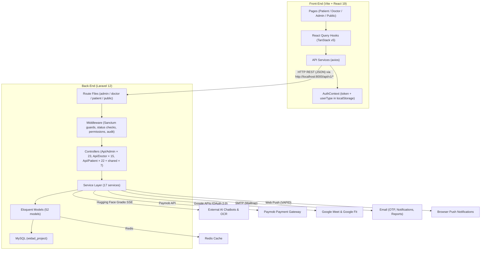

# Widad-Tech — Full Codebase Review (Updated)

> **Project**: Widad-Tech — منصة صحة المرأة الشاملة  
> **Application Domain**: Digital health (telehealth, health tracking, AI-powered chatbot, article CMS, push notifications)  
> **Target Audience**: Arabic-speaking women (RTL-ready UI, Arabic validation messages & UX copy)  
> **Last Reviewed**: June 28, 2026

---

## 1. Architecture Overview

### Communication Pattern
- **REST API**: Front-end communicates with back-end via `axios` through `http://localhost:8000/api/v1/`
- **Authentication**: Laravel Sanctum (token-based). 3 separate guards: `patient`, `doctor`, `admin`
- **Token storage**: `localStorage` (`token` + `userType`)
- **CORS**: Configured to allow `localhost:8080`, `localhost:5173`, `localhost:3000`

---

## 2. Tech Stack

### Back-End
| Technology | Version / Details |
|---|---|
| **Framework** | Laravel 12 (PHP 8.2+) |
| **Auth** | Laravel Sanctum 4.0 (3 guards: patient, doctor, admin) |
| **Database** | MySQL (`widad_project`) |
| **Cache** | Redis (via `predis/predis`) |
| **Queue** | Database driver |
| **OTP** | `ichtrojan/laravel-otp` |
| **Payment** | Paymob (custom PaymobService) |
| **Video Calls** | Google Meet (custom GoogleMeetService, OAuth 2.0) |
| **Push Notifications** | Web Push via `minishlink/web-push` + VAPID keys (polymorphic PushSubscription) |
| **Email** | SMTP via Mailtrap — 3 Mailable classes |
| **AI/Chatbot/OCR** | Hugging Face Gradio Spaces (4 specialized bots + 1 Lab OCR service) |
| **Testing** | Pest PHP 4 |

### Front-End
| Technology | Version / Details |
|---|---|
| **Framework** | React 19 + TypeScript |
| **Bundler** | Vite 7 (with SWC plugin) |
| **Styling** | Tailwind CSS 3 + `tailwindcss-animate` |
| **UI Components** | Radix UI (full suite: Dialog, Dropdown, Select, Tabs, Toast, etc.) |
| **Forms** | React Hook Form 7 + Zod + Yup validation |
| **Data Fetching** | TanStack React Query 5 |
| **HTTP Client** | Axios |
| **Routing** | React Router DOM 7 |
| **Charts** | Recharts 3 |
| **Rich Text** | TipTap (starter-kit + image, link, placeholder, text-align) |
| **Animations** | Framer Motion |
| **Icons** | Lucide React + React Icons |
| **Markdown** | react-markdown |
| **Date** | date-fns |
| **Toasts** | Sonner |
| **Testing** | Vitest + @testing-library/react |

---

## 🏗️ 3. الخريطة البرمجية التفصيلية لمجلد الباك-إند (Back-End)

### 👤 3.1 الموديلات (Models) — 52 موديل قاعدة بيانات
يستخدم المشروع نمط Eloquent ORM.

* **مستخدمو النظام (User Types / Auth):** `User.php` (المريضة)، `Doctor.php` (مع معلومات Google)، `Admin.php` (إدارة)، `Role.php`، `UserProfile.php`.
* **المتتبعات الحيوية وصحة المرأة (Health Trackers):** `PeriodCycle.php`، `FertilityEntry.php`، `MoodEntry.php`، `WeightEntry.php`.
* **تتبع الحمل والأمومة (Pregnancy Trackers):** `Pregnancy.php`، `PregnancyEntry.php`، `PregnancyKickSession.php`، `PregnancyMedication.php`.
* **الذكاء الاصطناعي والتنبؤات (AI Models):** `PreeclampsiaPrediction.php`، `GestationalDiabetesPrediction.php`، `PretermBirthPrediction.php`، `ScbuAdmissionPrediction.php`، `MlPredictionsHistory.php`، `AiChatMessage.php`، `ChatbotDocument.php`، `PatientChatbotPreference.php`.
* **العيادة الإلكترونية والاستشارات (Telehealth):** `Consultation.php`، `ConsultationAttachment.php`، `ConsultationMessage.php`، `ConsultationReview.php`، `Prescription.php`، `DoctorWorkingHour.php`، `AppointmentReminder.php`، `PatientNote.php`.
* **الربط بالأجهزة الذكية والتحاليل (IoT & Labs):** `PatientGoogleFit.php`، `PatientHeartRate.php`، `PatientOxygen.php`، `PatientSleep.php`، `PatientStep.php`، `LabTestResult.php`، `PatientMedicalFile.php`، `HealthSync.php`.
* **الأموال وأنظمة الدفع (Finance):** `Payment.php`، `PayoutRequest.php`.
* **المحتوى والواجهة العامة (CMS):** `Article.php`، `Faq.php`، `AboutUs.php`، `SuccessStory.php`، `Testimonial.php`، `ContactUs.php`، `JoinUs.php`، `DoctorJoinRequest.php`، `LifeStage.php`، `SettingsSite.php`.
* **الإدارة والنظام (System Core):** `Notification.php`، `PushSubscription.php`، `AuditLog.php`.

### 🔌 3.2 متحكمات الـ API (Controllers) — 67 متحكم
يتوزع الـ Routing على ثلاث أنواع رئيسية بحسب طبقة الحماية:

**أولاً: لوحة تحكم الإدارة (Admin / 23 Controllers)**
- `DashboardController.php`, `AnalyticsController.php`, `AdminAiAnalyticsController.php` (تحليلات وإحصائيات عامة وذكاء اصطناعي).
- `AdminChatbotController.php`, `AdminChatbotDocumentController.php` (إدارة إعدادات ورسائل الروبوت).
- `AdminManagementController.php`, `DoctorController.php`, `PatientController.php` (التحكم بالصلاحيات والمستخدمين وحالات الموافقة).
- `ConsultationController.php`, `ChatMonitorController.php` (مراقبة المواضبة والحجوزات والأمان).
- `FinancialController.php`, `PayoutController.php` (الإدارة المالية وسحوبات الأطباء).
- بالإضافة إلى متحكمات مقالات وإشعارات وتواصل.

**ثانياً: شاشات وعيادة الطبيبة (Doctor / 15 Controllers)**
- `DoctorDashboardController.php` (رئيسية الطبيب).
- `ConsultationController.php`, `ConsultationChatController.php` (غرفة الجلسات والدردشة الداخلية).
- `DoctorPatientController.php` (عرض التاريخ الطبي لمن لديهم حجز مسبق).
- `DoctorAiPredictionController.php` (تمكين الطبيب من استخدام موديلات الكشف المبكر).
- متحكمات للمالية، المواصفات الطبية (`PrescriptionController`)، وإدارة مواقيت العمل (`GoogleAuthController`).

**ثالثاً: تطبيق وبوابة المريضة (Patient / 22 Controllers)**
- **الاستشارات:** `ConsultationController`, `DoctorController`، `ConsultationChatController`، `PatientMedicalFileController`.
- **الذكاء الاصطناعي (أهم العناصر):** `ChatbotController.php` (الاستدعاء لـ HF)، `AiPredictionController.php` (فحص تسمم الحمل)، `LabTestController.php` (OCR الروشتات).
- **التحليلات والمتابعات:** `PregnancyController`، `PeriodController`، `FertilityController`، `WeightController`، `MoodController`.
- **(IoT):** `IotController.php` للربط القوي مع خدمات Google Fit.

**رابعاً: البوابات الأساسية والتوثيق (Shared & Auth / 7+ Controllers)**
- مسارات الـ Auth بجميع الحمايات الثلاثة. ومسارات الـ `PaymentController.php` لاستقبال الإشعارات التلقائية. ومحركات بحث ومدونات.

### ⚙️ 3.3 طبقة الخدمات المتقدمة (Service Layer) — 17 Service Class
لتجنب الـ *Fat Controllers*:
1. `ChatbotService.php`: معالجة (SSE) والردود لـ 4 بوتات مخصصة بمهام الـ PII Redaction.
2. `AiPredictionService.php`: استدعاء ومصادقة نماذج التشخيص من Hugging Face.
3. `LabTestOcrService.php`: إكمال عمليات سحب الـ JSON واستخراج الأرقام الطبية من صور التحاليل.
4. `PatientDataCollectorService.php` (في مسار المريض): تجميع ضخم وذكي لنص الـ Context قبل إلقاءه للـ AI.
5. `GoogleMeetService.php`، `PaymobService.php`، `ConsultationService.php`: تدير الاتصالات الخارجية (الأموال والكاميرا).
6. خدمات داعمة مثل: `NotificationService`, `ArticleService`, `GoogleFitService` (لتزامن بيانات الـ Smart Watches) وغيرها.

### ⏰ 3.4 الجدولة والوظائف المؤجلة (Jobs & Commands) — 9 Jobs
- `ProcessLabTestJob.php`: لإتمام الـ OCR بالخلفية.
- `UploadChatbotDocumentJob.php`: لرفع البيانات לـ Vector DB دون قطع الواجهة.
- `ProcessChatbotMessageJob.php` و `SyncGoogleFitData.php`.
- بالإضافة لتنظيف واسترجاع المدفوعات من الحجوزات المهملة عبر الـ Schedules.

---

## 💻 4. تفاصيل مكونات الواجهة الأمامية (Front-End) — 105 صفحة و 143 مكوّن

مبني على React 19 باستخدام TypeScript و Vite، ويعتمد على فصل (UI) عن (State) بـ TanStack Query.

### 🧩 4.1. المكونات (Components) — 143 مكوّن في 16 مجلد
* `ui/`: 49 ملف. الطبقة الأساسية المبنية بـ `shadcn/ui` و `Radix UI` بنسق الـ Glassmorphism.
* `chatbot/`: 15 ملفاً. معدّة للشات (فقاعات الرسال، علامات الكتابة، الرغبات).
* `chat/`: 8 ملفات. لغرفة المحادثة الخاصة المباشرة بين الطبيبة والمريضة بداخل الجلسة والمرفقات.
* `lab-tests/`: 5 ملفات. قراءة التحاليل الطبية وعرض النتائج على مقياس (عالي/طبيعي/منخفض).
* `profile/`: 12 ملفاً. بطاقات الملف الشخصي والطوارئ.
* `consultations/`: 7 ملفات. لعرض الحجوزات، والأجندة وفتح الفيديو.
* `landing/`: 14 ملفاً. المكونات المرئية للصفحة الرئيسية، وأراء المستخدمين وإحصائيات المنصة المركزية.

### 🌐 4.2. الصفحات (Pages) — 105 صفحة
الدخول للنظام يوجه المستخدم لثلات بوابات رئيسية، مع صفحة عامة:

**أ. بوابة المرضى (`pages/patient/`): (41 صفحة)**
* **المتتبعات (`trackers/`):** حاسبة نمو الجنين، متتبع ركلات الجنين، تتبع دورتي، حساب التبويض، مخطط الوزن، يوميات المزاج.
* **الاستشارات (`consultations/`):** دليل الأطباء، جدولة المواعيد، غرفة الفيديو والمحادثة، تقييم الطبيب، والروشتة الإلكترونية.
* **إضافات الذكاء الاصطناعي (`ai-center/`):** اكتشاف الأمراض (تسمم الحمل، GDM، صفحة השات بوت الأساسية).
* بالإضافة لصفحة لوحة التحكم `PatientDashboard` والمزامنة اللاسلكية `GoogleFit`.

**ب. لوحة الإدارة (`pages/admin/`): (25 صفحة)**
* `FinancialsPage`, `AnalyticsPage`, `ConsultationsPage`.
* مراقبة محتوى الشات وتدريبه `ChatbotStatsPage` و `KnowledgeBasePage`.
* إدارة مستخدمي النظام و `AuditLogsPage`.

**ج. بوابة الأطباء (`pages/doctor/`): (24 صفحة)**
* `DoctorDashboard.tsx`، `consultations/` للدخول وتفعيل الكاميرا و الموافقة على الحجوزات.
* `patients/` لمسح الملف الطبي. `financials/` للتمويل.

**د. الصفحات العامة والأساسية (`pages/public/`, `pages/auth/`)**
* `Life Stages Hub` للوصول لمقالات محددة بناء على عمُر المرأة والفئة.

### 🪝 4.3. الـ Hooks والإدارة الذكية (Custom Hooks) — 19 Hook
* `usePatientQueries.ts`: تجميع الاستدعاءات الخاصة بلوحة الـ Patient لضمان تحديث كاش متزامن.
* `useChatbot.ts` و `useChatbotPreferences.ts`: إدارة تدفق الشات مع HF، والاحتفاظ بالمحادثة محلياً وعن بعد.
* `useAiCenter.ts`, `useAdminAi.ts`, `useDoctorAi.ts`: للتحكم وتشغيل أدوات الكشف الذكي في كل مسار مخصص له.
* `usePermissions.ts`: ربط الصلاحيات بالـ Admin لإخفاء العناصر من الشاشة استباقيا.

### 🛠️ 4.4. طبقة الخدمات (Services Layer) — 27 Module
* `api.ts`: القلب النابض الذي يرفق ה־ `Bearer token` ويعترض أخطاء 401 و 403.
* `aiCenterService.ts`, `chatbotService.ts`, `adminChatbotService.ts`: دوال الربط ومزامنة الشات والنوافذ التنبؤية بالخلفية.
* `consultationService.ts`: خدمات الحجز (Payment Callback Handlers) وغيرها.

---

## 5. Patterns & Conventions

### Back-End
- **Service Layer Pattern**: Business logic extracted into `Services/`.
- **API Resources**: Eloquent API Resources for response transformation.
- **Form Requests**: Dedicated validation rule classes.
- **Polymorphic PushSubscription**: Single table handles push subscriptions for all user types.
- **Hybrid Chatbot Context**: `PatientDataCollectorService` gathers complex context, injected gracefully via Jobs caching.

### Front-End
- **TanStack Query**: Data fetching state is exclusively managed here.
- **Component organization**: `components/` categorized broadly by domains (`chat`, `lab-tests`, etc.).
- **Dual Form Validation**: Yup for legacy forms, Zod for modern forms.

---

## 6. Important Observations & Flags

> [!WARNING]
> ### Duplicate Class Names Confirmed
> `PatientDataCollectorService.php` exists identically in BOTH `app/Services/` and `app/Services/Patient/` but performs entirely different duties (GDM forms pre-filling vs Chatbot Context injection). This is an architectural naming clash and should be refactored to distinguish intent (e.g. `ChatbotContextService`).

> [!WARNING]
> ### Sensitive Data in `.env`
> The `.env` file contains real credentials (DB password, Paymob API keys, VAPID keys). Keep this secure!

> [!IMPORTANT]
> ### Lab Tests OCR Feature
> `LabTestOcrService` is integrated properly through HF Spaces using graceful degradation and SSE streams, with proper mappings (status handling has been verified and patched).

> [!NOTE]
> ### Legacy Validation
> Dual validation libraries (`yup` and `zod`) exist. Consolidating into Zod is recommended. 
> ZoomService is a lingering legacy file and could be removed.

---

## 7. Summary Table

| Dimension | Back-End | Front-End |
|---|---|---|
| **Language** | PHP 8.2 | TypeScript |
| **Framework** | Laravel 12 | React 19 |
| **Models/Pages** | 52 Eloquent models | 105 page components |
| **Controllers** | 67 API controllers | — |
| **Services** | 17 service classes | 27 service modules |
| **Hooks** | — | 19 custom hooks |
| **UI Components** | — | 143 (49 in shadcn/ui) |
| **Auth** | Sanctum (3 guards) | AuthContext + ProtectedRoute |
| **State** | Redis cache | TanStack Query cache |
| **DB Migrations** | 81 | — |
| **Testing** | 18 Feature + 3 Unit files | Vitest |

---

## 8. Recent Changes Summary (Since Last Review)

| Area | Change |
|---|---|
| **Models** | +9 models (`PatientGoogleFit`, `ScbuAdmissionPrediction`, `LabTestResult`, `PatientChatbotPreference`, `ConsultationMessage` etc.) |
| **Services** | +6 services (`AiPredictionService`, `LabTestOcrService`, `GoogleFitService`, `PatientDataCollectorService` x2, `ChatImageService`) |
| **Jobs** | +2 async jobs (`ProcessLabTestJob`, `SyncGoogleFitData`) |
| **Controllers** | +13 controllers heavily expanding doctor and patient operations (`Api/Admin` reached 23, `Patient` reached 22). |
| **Migrations** | +12 schema updates for Lab Results, SCBU models, Google Fit syncing |
| **Front-End Components** | Expanded to 143 components (+5) and 105 pages (+1) including dedicated `chat/` and `lab-tests/` directories |
| **Front-End Services/Hooks**| Added 5 new API integration modules and 7 new hooks for new workflows |

---

**Ready for your modification requests.** Full context available on both layers: auth flow, permission system, service layer patterns, component architecture, DB schema, and AI chatbot integration.
