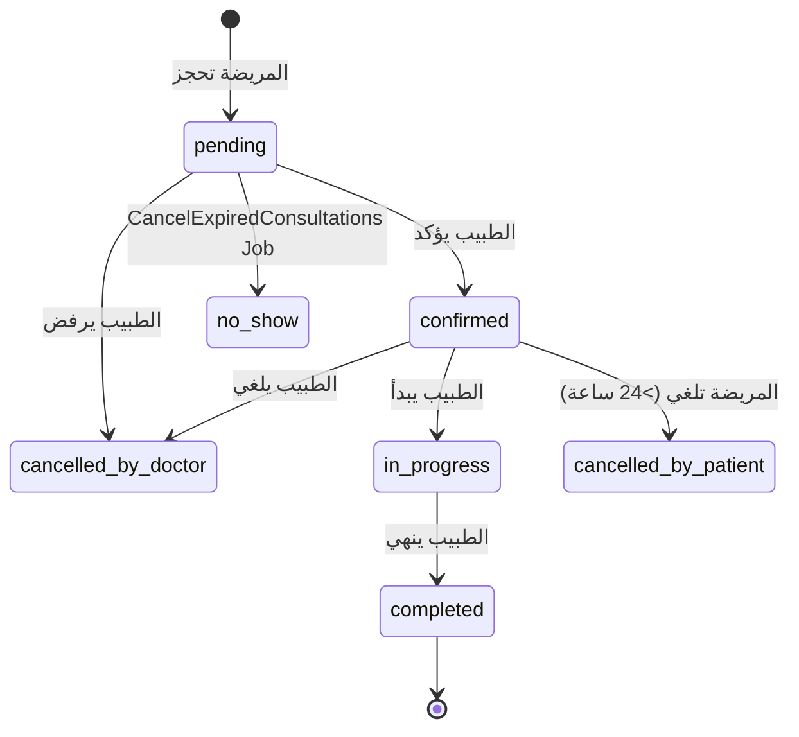
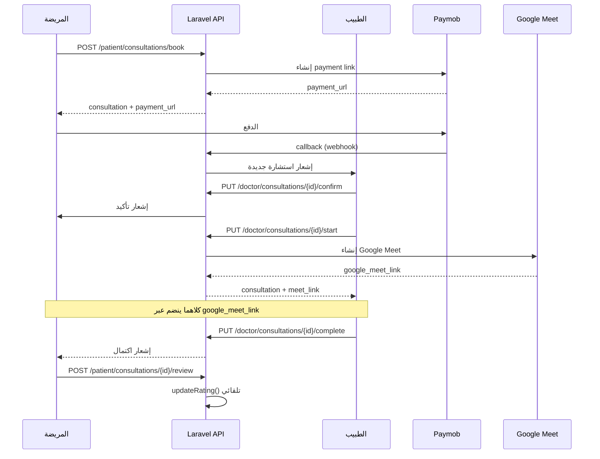

# 🏥 تقرير نظام مواعيد الاستشارات — Widad-Tech

> **تاريخ المراجعة:** 2026-06-02  
> **النطاق:** نظام الاستشارات كاملاً — Backand + Frontend — المريض + الطبيب

---

## 1. نظرة عامة على دورة حياة الاستشارة



---

## 2. Back-End — Routes الكاملة

### 📌 جانب المريضة (`api/v1/patient/`)

| Method | Route | Controller | Action |
|---|---|---|---|
| `POST` | `/patient/consultations/book` | `Patient\ConsultationController@book` | حجز استشارة جديدة |
| `GET` | `/patient/consultations` | `Patient\ConsultationController@index` | قائمة استشاراتي |
| `GET` | `/patient/consultations/{id}` | `Patient\ConsultationController@show` | تفاصيل استشارة |
| `PUT` | `/patient/consultations/{id}/cancel` | `Patient\ConsultationController@cancel` | إلغاء استشارة |
| `PUT` | `/patient/consultations/{id}/reschedule` | `Patient\ConsultationController@reschedule` | إعادة جدولة |
| `POST` | `/patient/consultations/{id}/review` | `Patient\ConsultationController@review` | إضافة تقييم |
| `GET` | `/patient/consultations/{id}/zoom-signature` | `Patient\ConsultationController@getZoomSignature` | ⚠️ Legacy Zoom |
| `GET` | `/patient/doctors/search` | `DoctorController@search` | بحث عن طبيب |
| `GET` | `/patient/doctors/{id}` | `DoctorController@show` | تفاصيل طبيب |
| `GET` | `/patient/doctors/{id}/available-slots` | `DoctorController@availableSlots` | المواعيد المتاحة |
| `GET` | `/patient/doctors/{id}/reviews` | `DoctorController@reviews` | تقييمات الطبيب |
| `GET` | `/patient/doctors/recommended` | `DoctorController@recommended` | أطباء مقترحون |

### 📌 جانب الطبيب (`api/v1/doctor/`)

| Method | Route | Controller | Action |
|---|---|---|---|
| `GET` | `/doctor/consultations` | `Doctor\ConsultationController@index` | قائمة استشاراتي |
| `GET` | `/doctor/consultations/calendar` | `Doctor\ConsultationController@calendar` | تقويم الشهر |
| `GET` | `/doctor/consultations/{id}` | `Doctor\ConsultationController@show` | تفاصيل استشارة |
| `PUT` | `/doctor/consultations/{id}/confirm` | `Doctor\ConsultationController@confirm` | تأكيد استشارة |
| `PUT` | `/doctor/consultations/{id}/start` | `Doctor\ConsultationController@start` | بدء الاستشارة |
| `PUT` | `/doctor/consultations/{id}/complete` | `Doctor\ConsultationController@complete` | إنهاء الاستشارة |
| `PUT` | `/doctor/consultations/{id}/cancel` | `Doctor\ConsultationController@cancel` | إلغاء من الطبيب |
| `PUT` | `/doctor/consultations/{id}/update-notes` | `Doctor\ConsultationController@updateNotes` | تحديث الملاحظات + وصفة |
| `GET` | `/doctor/consultations/{id}/patient-history` | `Doctor\ConsultationController@patientHistory` | سجل المريضة |
| `GET` | `/doctor/consultations/{id}/meeting-info` | `Doctor\ConsultationController@getMeetingInfo` | بيانات Google Meet |
| `GET` | `/doctor/working-hours` | `Doctor\ConsultationController@getWorkingHours` | ساعات العمل |
| `PUT` | `/doctor/working-hours` | `Doctor\ConsultationController@updateWorkingHours` | تحديث ساعات العمل |
| `GET` | `/doctor/dashboard` | `Doctor\ConsultationController@dashboard` | لوحة التحكم |

---

## 3. Back-End — التحليل التفصيلي

### 3.1 ConsultationService — قلب النظام

الملف: `app/Services/ConsultationService.php` (632 سطر)

**المهام الرئيسية:**
| Method | الوظيفة |
|---|---|
| [bookConsultation()](file:///d:/Final_Project_Implementation/Final_Project_Front_And_Back/Front-End/src/services/consultationService.ts#196-201) | التحقق من التعارض + إنشاء الحجز + Paymob payment link |
| [cancelConsultation()](file:///d:/Final_Project_Implementation/Final_Project_Front_And_Back/Front-End/src/services/consultationService.ts#212-218) | إلغاء + حساب الاسترداد + إشعار الطرفين |
| [rescheduleConsultation()](file:///d:/Final_Project_Implementation/Final_Project_Front_And_Back/Front-End/src/services/consultationService.ts#219-223) | التحقق من المتاحية + تغيير الموعد |
| [startConsultation()](file:///d:/Final_Project_Implementation/Final_Project_Front_And_Back/Front-End/src/services/doctorService.ts#71-75) | تغيير الحالة إلى `in_progress` + Google Meet link |
| [completeConsultation()](file:///d:/Final_Project_Implementation/Final_Project_Front_And_Back/Front-End/src/services/consultationService.ts#255-268) | تغيير الحالة إلى `completed` + حفظ الملاحظات + وصفة |
| `getDoctorStats()` | إحصاءات الطبيب (إجمالي، اليوم، معلّق، مكتمل) |

### 3.2 ConsultationResource — Patient Side

**الحقول المُرجعة:**
```json
{
  "id": 1,
  "doctor": { "id", "name", "specialization", "specialization_ar", "image_url", "rating" },
  "date": "2026-06-05",
  "time": "10:00",
  "type": "video",
  "type_ar": "فيديو",
  "status": "confirmed",
  "status_ar": "مؤكدة",
  "price": 250.0,
  "patient_notes": "...",
  "doctor_notes": "...",
  "duration_minutes": 30,
  "started_at": null,
  "ended_at": null,
  "cancellation_reason": null,
  "google_meet_link": "https://...",  ← فقط لـ video + confirmed/in_progress
  "can_join": true,    ← video + ≤15 دقيقة قبل الموعد
  "can_cancel": true,  ← pending/confirmed + >24 ساعة
  "can_reschedule": true, ← نفس شرط can_cancel
  "can_review": false, ← completed + لا يوجد تقييم مسبق
  "has_review": false,
  "time_until": "بعد يومين",
  "payment": { "id", "amount", "status", "payment_method", "paid_at" },
  "prescription": { "id", "medications", "diagnosis", "notes", "file_path" },
  "created_at": "..."
}
```

### 3.3 Calendar API

يرجع استشارات الشهر مجمّعة حسب التاريخ:
```json
{
  "month": "2026-06",
  "consultations_by_date": {
    "2026-06-05": [{ "id", "time", "patient", "type", "status" }]
  },
  "stats": { "total_this_month": 12, "busy_days": 8, "available_slots": 0 }
}
```

> [!WARNING]
> `available_slots` يُرجع `0` دائماً — قيمة placeholder غير محسوبة

### 3.4 Patient History API

يرجع للطبيب عند فتح استشارة:
- بيانات المريضة الأساسية (اسم، عمر، هاتف، المرحلة الحياتية)
- الاستشارات السابقة معها (آخر 10)
- الملف الطبي (فصيلة الدم، أمراض مزمنة، حساسية، أدوية، طول، وزن)
- معلومات الحمل إن كانت حاملاً

---

## 4. Front-End — الصفحات والمكونات

### 📱 جانب المريضة

| الملف | الوظيفة |
|---|---|
| [DoctorSearch.tsx](file:///d:/Final_Project_Implementation/Final_Project_Front_And_Back/Front-End/src/pages/patient/consultations/DoctorSearch.tsx) | البحث والفلترة عن الأطباء |
| [DoctorDetails.tsx](file:///d:/Final_Project_Implementation/Final_Project_Front_And_Back/Front-End/src/pages/patient/consultations/DoctorDetails.tsx) | ملف الطبيب العام + حجز |
| [BookConsultation.tsx](file:///d:/Final_Project_Implementation/Final_Project_Front_And_Back/Front-End/src/pages/patient/consultations/BookConsultation.tsx) | نموذج الحجز (تاريخ، وقت، نوع، ملاحظات، دفع) |
| [MyConsultations.tsx](file:///d:/Final_Project_Implementation/Final_Project_Front_And_Back/Front-End/src/pages/patient/consultations/MyConsultations.tsx) | قائمة الاستشارات مع Tabs (قادمة/سابقة/ملغاة) |
| [ConsultationDetails.tsx](file:///d:/Final_Project_Implementation/Final_Project_Front_And_Back/Front-End/src/pages/doctor/consultations/ConsultationDetails.tsx) | تفاصيل استشارة واحدة + إلغاء + تقييم |
| [ReviewDoctor.tsx](file:///d:/Final_Project_Implementation/Final_Project_Front_And_Back/Front-End/src/pages/patient/consultations/ReviewDoctor.tsx) | نموذج التقييم (نجوم + تعليق + مجهول) |
| [VideoCall.tsx](file:///d:/Final_Project_Implementation/Final_Project_Front_And_Back/Front-End/src/pages/patient/consultations/VideoCall.tsx) | المكالمة المرئية (Google Meet) |
| [PrescriptionPage.tsx](file:///d:/Final_Project_Implementation/Final_Project_Front_And_Back/Front-End/src/pages/patient/consultations/PrescriptionPage.tsx) | عرض الوصفة الطبية |
| [PaymentCallback.tsx](file:///d:/Final_Project_Implementation/Final_Project_Front_And_Back/Front-End/src/pages/patient/consultations/PaymentCallback.tsx) | نتيجة الدفع من Paymob |

### 🩺 جانب الطبيب

| الملف | الوظيفة |
|---|---|
| [DoctorConsultations.tsx](file:///d:/Final_Project_Implementation/Final_Project_Front_And_Back/Front-End/src/pages/doctor/consultations/DoctorConsultations.tsx) | قائمة الاستشارات مع فلترة وبحث |
| [ConsultationCalendar.tsx](file:///d:/Final_Project_Implementation/Final_Project_Front_And_Back/Front-End/src/pages/doctor/consultations/ConsultationCalendar.tsx) | تقويم الاستشارات الشهري |
| [ConsultationDetails.tsx](file:///d:/Final_Project_Implementation/Final_Project_Front_And_Back/Front-End/src/pages/doctor/consultations/ConsultationDetails.tsx) | تفاصيل + تأكيد + بدء + إلغاء + ملاحظات |
| [CompleteConsultation.tsx](file:///d:/Final_Project_Implementation/Final_Project_Front_And_Back/Front-End/src/pages/doctor/consultations/CompleteConsultation.tsx) | نموذج إنهاء الاستشارة + وصفة |
| [DoctorVideoCall.tsx](file:///d:/Final_Project_Implementation/Final_Project_Front_And_Back/Front-End/src/pages/doctor/consultations/DoctorVideoCall.tsx) | المكالمة المرئية من جانب الطبيب |
| [WorkingHours.tsx](file:///d:/Final_Project_Implementation/Final_Project_Front_And_Back/Front-End/src/pages/doctor/consultations/WorkingHours.tsx) | إدارة ساعات العمل |

### 🔗 Service Layer

كل استدعاءات API في [consultationService.ts](file:///d:/Final_Project_Implementation/Final_Project_Front_And_Back/Front-End/src/services/consultationService.ts) (314 سطر):

**من جانب المريضة:**
- [searchDoctors(filters)](file:///d:/Final_Project_Implementation/Final_Project_Front_And_Back/Front-End/src/services/consultationService.ts#158-173) → GET `/patient/doctors/search`
- [getDoctorDetails(id)](file:///d:/Final_Project_Implementation/Final_Project_Front_And_Back/Front-End/src/services/consultationService.ts#174-178) → GET `/patient/doctors/{id}`
- [getAvailableSlots(doctorId, date, duration)](file:///d:/Final_Project_Implementation/Final_Project_Front_And_Back/Front-End/src/services/consultationService.ts#179-185) → GET `/patient/doctors/{id}/available-slots`
- [bookConsultation(data)](file:///d:/Final_Project_Implementation/Final_Project_Front_And_Back/Front-End/src/services/consultationService.ts#196-201) → POST `/patient/consultations/book`
- [getMyConsultations(params)](file:///d:/Final_Project_Implementation/Final_Project_Front_And_Back/Front-End/src/services/consultationService.ts#202-206) → GET `/patient/consultations`
- [getConsultationDetails(id)](file:///d:/Final_Project_Implementation/Final_Project_Front_And_Back/Front-End/src/services/consultationService.ts#207-211) → GET `/patient/consultations/{id}`
- [cancelConsultation(id, reason)](file:///d:/Final_Project_Implementation/Final_Project_Front_And_Back/Front-End/src/services/consultationService.ts#212-218) → PUT `/patient/consultations/{id}/cancel`
- [rescheduleConsultation(id, data)](file:///d:/Final_Project_Implementation/Final_Project_Front_And_Back/Front-End/src/services/consultationService.ts#219-223) → PUT `/patient/consultations/{id}/reschedule`
- [reviewConsultation(id, data)](file:///d:/Final_Project_Implementation/Final_Project_Front_And_Back/Front-End/src/services/consultationService.ts#224-228) → POST `/patient/consultations/{id}/review`

**من جانب الطبيب:**
- [getDoctorConsultations(params)](file:///d:/Final_Project_Implementation/Final_Project_Front_And_Back/Front-End/src/services/consultationService.ts#234-239) → GET `/doctor/consultations`
- [getDoctorConsultationDetails(id)](file:///d:/Final_Project_Implementation/Final_Project_Front_And_Back/Front-End/src/services/consultationService.ts#240-244) → GET `/doctor/consultations/{id}`
- [confirmConsultation(id)](file:///d:/Final_Project_Implementation/Final_Project_Front_And_Back/Front-End/src/services/consultationService.ts#245-249) → PUT `/doctor/consultations/{id}/confirm`
- [startConsultation(id)](file:///d:/Final_Project_Implementation/Final_Project_Front_And_Back/Front-End/src/services/doctorService.ts#71-75) → PUT `/doctor/consultations/{id}/start`
- [completeConsultation(id, data)](file:///d:/Final_Project_Implementation/Final_Project_Front_And_Back/Front-End/src/services/consultationService.ts#255-268) → PUT `/doctor/consultations/{id}/complete`
- [cancelDoctorConsultation(id, reason)](file:///d:/Final_Project_Implementation/Final_Project_Front_And_Back/Front-End/src/services/consultationService.ts#269-275) → PUT `/doctor/consultations/{id}/cancel`
- [getPatientHistory(consultationId)](file:///d:/Final_Project_Implementation/Final_Project_Front_And_Back/Front-End/src/services/consultationService.ts#276-280) → GET `/doctor/consultations/{id}/patient-history`

---

## 5. تحليل المنطق — ما يعمل بشكل صحيح ✅

| الميزة | التحقق |
|---|---|
| **الحجز** — التحقق من التعارض مع مواعيد موجودة | ✅ في ConsultationService |
| **الحجز** — إنشاء payment link عبر Paymob | ✅ |
| **الإلغاء** — التحقق من >24 ساعة قبل الموعد | ✅ في [canCancel()](file:///d:/Final_Project_Implementation/Final_Project_Front_And_Back/Back-end/app/Http/Resources/Patient/ConsultationResource.php#90-99) |
| **إعادة الجدولة** — نفس شروط الإلغاء | ✅ |
| **التأكيد** — الطبيب فقط + status = pending | ✅ |
| **البدء** — عبر ConsultationService + Google Meet | ✅ |
| **الإنهاء** — يحفظ الملاحظات والوصفة | ✅ |
| **التقييم** — مرة واحدة فقط + استشارة مكتملة | ✅ |
| **الإشعارات** — عند التأكيد يُرسل للمريضة | ✅ |
| **Google Meet** — لاستشارات الفيديو | ✅ |
| **can_join** — نافذة 15 دقيقة قبل + 60 دقيقة بعد | ✅ |
| **إلغاء تلقائي** — Job `CancelExpiredConsultations` | ✅ |
| **تذكير** — Job `SendAppointmentReminders` | ✅ |

---

## 6. الملاحظات والثغرات ⚠️

### 🔴 مشاكل وظيفية

| # | المشكلة | الموقع | الأثر |
|---|---|---|---|
| 1 | `available_slots` يُرجع `0` دائماً في الـ Calendar | `DoctorConsultationController@calendar` سطر 75 | معلومة ناقصة في التقويم |
| 2 | [getMeetingInfo](file:///d:/Final_Project_Implementation/Final_Project_Front_And_Back/Front-End/src/services/consultationService.ts#229-233) في consultationService يستدعي `/patient/consultations/{id}/meeting-info` لكن الـ route غير موجود في patient routes — فقط موجود في doctor | [consultationService.ts](file:///d:/Final_Project_Implementation/Final_Project_Front_And_Back/Front-End/src/services/consultationService.ts) سطر 229 | ❌ المريضة لا تستطيع جلب رابط Meet عبر هذا الـ function |
| 3 | [getZoomSignature](file:///d:/Final_Project_Implementation/Final_Project_Front_And_Back/Back-end/app/Http/Controllers/Api/Patient/ConsultationController.php#238-272) لا يزال موجوداً في Patient Controller رغم أن Google Meet هو الحل الحالي | `Patient\ConsultationController@getZoomSignature` | كود legacy غير مستخدم |

### 🟡 ملاحظات تحسين

| # | الملاحظة | التوصية |
|---|---|---|
| 4 | Stats في [index()](file:///d:/Final_Project_Implementation/Final_Project_Front_And_Back/Back-end/app/Http/Controllers/Api/Doctor/DoctorReviewController.php#15-87) للمريضة تُنفذ **4 queries منفصلة** لحساب الإحصاءات | دمجها في query واحد باستخدام `selectRaw` |
| 5 | [patientHistory()](file:///d:/Final_Project_Implementation/Final_Project_Front_And_Back/Back-end/app/Http/Controllers/Api/Doctor/ConsultationController.php#236-311) يجلب الحمل عبر `pregnancies()->where('is_active',true)->first()` — يعمل لكن يفتقر لـ eager loading | إضافة `with(['pregnancies'])` |
| 6 | [rescheduleConsultation](file:///d:/Final_Project_Implementation/Final_Project_Front_And_Back/Front-End/src/services/consultationService.ts#219-223) لا يُرسل إشعاراً للطبيب | إضافة notification عند إعادة الجدولة |
| 7 | لا يوجد `no_show` من جانب الطبيب عبر API — فقط الـ Job التلقائي | إضافة endpoint `PUT /doctor/consultations/{id}/no-show` |
| 8 | [ConsultationResource](file:///d:/Final_Project_Implementation/Final_Project_Front_And_Back/Back-end/app/Http/Resources/Patient/ConsultationResource.php#10-110) للطبيب لا يرجع `can_review` أو `has_review` — منطقي لكن اتساقاً مع patient resource الأفضل | ليس ضرورياً حالياً |

### 🟢 ممارسات جيدة موجودة

- ✅ كل العمليات الحساسة في `ConsultationService` — Controllers رفيعة
- ✅ `DB::transaction` في العمليات المركّبة (حجز، إنهاء، ملاحظات)
- ✅ `findOrFail` مع تحقق الـ ownership (`where('user_id'/'doctor_id', $user->id)`)
- ✅ [ConsultationResource](file:///d:/Final_Project_Implementation/Final_Project_Front_And_Back/Back-end/app/Http/Resources/Patient/ConsultationResource.php#10-110) يحسب `can_*` flags ديناميكياً
- ✅ الإلغاء يحسب استرداد Paymob تلقائياً

---

## 7. ملخص بصري للتدفق الكامل



---

## 8. خلاصة الأولويات

| الأولوية | الإجراء |
|---|---|
| 🔴 عالية | إصلاح `/patient/consultations/{id}/meeting-info` — إضافة route أو تغيير الـ function للاستخدام من `google_meet_link` المرجوع في الاستشارة |
| 🟡 متوسطة | حساب `available_slots` في Calendar بدلاً من `0` |
| 🟡 متوسطة | إضافة إشعار للطبيب عند إعادة الجدولة |
| 🟢 منخفضة | دمج الـ 4 queries الاحصائية في query واحد |
| 🟢 منخفضة | إزالة [getZoomSignature](file:///d:/Final_Project_Implementation/Final_Project_Front_And_Back/Back-end/app/Http/Controllers/Api/Patient/ConsultationController.php#238-272) أو الاحتفاظ به بتعليق واضح بأنه legacy |
