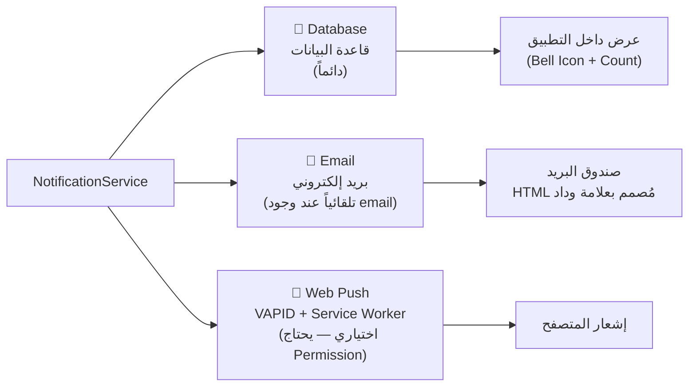

# 🔔 تقرير شامل: نظام الإشعارات — منصة وداد الصحية
**تاريخ المراجعة:** 2026-06-03  
**المراجِع:** نظام المراجعة الاحترافية (Antigravity)  
**الحالة:** ✅ مكتمل ومُفعَّل

---

## 1. نظرة عامة (Executive Summary)

يعتمد مشروع **وداد** على نظام إشعارات متعدد الطبقات (Multi-Layer Notification System)، مصمم ليتعامل مع ثلاثة أدوار مستخدمين متمايزة:

| الدور | Guard | API Prefix | عدد المسارات |
|---|---|---|---|
| 🧑‍⚕️ المريض | `auth:patient` | `/api/v1/patient/notifications` | 10 مسارات |
| 🩺 الدكتور | `auth:doctor` | `/api/v1/doctor/notifications` | 10 مسارات |
| 🔐 الأدمن | `auth:admin` | `/api/v1/admin/notifications` | 12 مسار |

النظام يعتمد على **طبقتين** رئيسيتين للإشعارات:
- **قاعدة بيانات (Database)** — الإشعارات التطبيقية الداخلية (in-app).
- **البريد الإلكتروني (Email)** — يُرسَل تلقائياً مع كل إشعار داخلي.
- **Web Push** — دعم مبدئي عبر VAPID & Service Worker.

---

## 2. البنية التقنية (Technical Architecture)

### 2.1 الطبقة الأساسية — Backend

```mermaid
graph TD
    Event["🎯 حدث في النظام\n(حجز، دفع، مراجعة مقال...)"] --> NS["NotificationService\napp/Services/NotificationService.php"]
    NS -->|create()| DB[("جدول notifications\nLaravel DatabaseNotification")]
    NS -->|sendNotificationEmail()| Mail["📧 Laravel Mail\nHTML Template"]
    
    AdminAPI["Admin API\nNotificationAdminController"] -->|send()| Queue["🕐 Queue Job\nSendScheduledNotification"]
    AdminAPI -->|send()| DirectSend["⚡ إرسال فوري\nDB::table chunk(100)"]
    Queue --> DB
    
    Cleanup["⏰ Artisan Command\nnotifications:cleanup"] -->|تنظيف دوري| DB
    
    DB --> PatientAPI["Patient API\nNotificationController"]
    DB --> DoctorAPI["Doctor API\nNotificationController"]
    DB --> AdminListAPI["Admin List API\nNotificationController"]
```

### 2.2 الملفات الأساسية

| الملف | الدور |
|---|---|
| [app/Services/NotificationService.php](file:///d:/Final_Project_Implementation/Final_Project_Front_And_Back/Back-end/app/Services/NotificationService.php) | الخدمة المركزية — تُستدعى من أي Controller |
| [app/Http/Controllers/Api/NotificationController.php](file:///d:/Final_Project_Implementation/Final_Project_Front_And_Back/Back-end/app/Http/Controllers/Api/NotificationController.php) | واجهة API المشتركة (Patient + Doctor + Admin) |
| [app/Http/Controllers/Api/Admin/NotificationAdminController.php](file:///d:/Final_Project_Implementation/Final_Project_Front_And_Back/Back-end/app/Http/Controllers/Api/Admin/NotificationAdminController.php) | صلاحيات الأدمن الخاصة (إرسال، جدولة، تاريخ) |
| [app/Jobs/SendScheduledNotification.php](file:///d:/Final_Project_Implementation/Final_Project_Front_And_Back/Back-end/app/Jobs/SendScheduledNotification.php) | Job للإرسال المجدول عبر Queue |
| [app/Console/Commands/CleanupOldNotifications.php](file:///d:/Final_Project_Implementation/Final_Project_Front_And_Back/Back-end/app/Console/Commands/CleanupOldNotifications.php) | أمر تنظيف تلقائي للإشعارات القديمة |
| `app/Models/Notification.php` | موديل الإشعارات |

---

## 3. أنواع الإشعارات التفصيلية

### 3.1 🧑‍⚕️ إشعارات المريض (Patient)

| النوع (`type`) | المحفِّز | قناة البريد |
|---|---|---|
| `payment.success` | بعد الدفع الناجح للاستشارة | ✅ نعم |
| `consultation.accepted` | عند قبول الدكتور للحجز | ✅ نعم |
| `consultation.cancelled_by_admin` | عند الإلغاء الإداري للاستشارة | ✅ نعم |
| `patient.deactivated` | عند تعطيل الحساب من الأدمن | ✅ نعم |
| `admin_announcement` | إعلانات عامة من الأدمن | ✅ نعم |
| `admin_update` | تحديثات المنصة | ✅ نعم |
| `admin_maintenance` | إشعارات صيانة | ✅ نعم |
| `admin_promotional` | عروض وبرومو | ✅ نعم |

### 3.2 🩺 إشعارات الدكتور (Doctor)

| النوع (`type`) | المحفِّز | قناة البريد |
|---|---|---|
| `consultation.booked` | عند حجز استشارة جديدة (قبل الدفع) | ✅ نعم |
| `consultation.new_booking` | عند تأكيد الدفع وإقفال الحجز | ✅ نعم |
| `consultation.cancelled_by_admin` | عند الإلغاء الإداري | ✅ نعم |
| `article.approved` | عند الموافقة على المقال | ✅ نعم |
| `article.submitted` | تأكيد استلام المقال للمراجعة | ✅ نعم |
| `article.rejected` | عند رفض المقال مع سبب | ✅ نعم |
| `doctor.verified` | عند تفعيل حساب الدكتور | ✅ نعم |
| `doctor.verification_rejected` | عند رفض التحقق مع سبب | ✅ نعم |
| `doctor.deactivated` | عند تعطيل الحساب | ✅ نعم |
| `join_request.contacted` | تحديث حالة طلب الانضمام — تواصل | ✅ نعم |
| `join_request.approved` | قبول الانضمام | ✅ نعم |
| `join_request.rejected` | رفض الانضمام | ✅ نعم |
| `payout.processed` | عند صرف المستحقات المالية | ✅ نعم |

### 3.3 🔐 إشعارات الأدمن (Admin)

> الأدمن **يُصدر** الإشعارات ولا يستقبلها بصورة تلقائية في الوقت الحالي. آلية الإرسال تكون عبر لوحة التحكم.

| الإجراء | الوصف |
|---|---|
| إرسال فوري | يُرسل فوراً لـ (all / patients / doctors) |
| إرسال مجدول | يُرسل في وقت محدد عبر [SendScheduledNotification](file:///d:/Final_Project_Implementation/Final_Project_Front_And_Back/Back-end/app/Jobs/SendScheduledNotification.php#16-94) Job |
| إلغاء مجدول | إمكانية إلغاء إشعار مجدول قبل إرساله |
| سجل التاريخ | عرض كل الإشعارات السابقة المرسلة مع اسم المُرسِل |

---

## 4. API المتاحة

### 4.1 المسارات المشتركة (Patient + Doctor + Admin)

| Method | Endpoint | الوصف |
|---|---|---|
| `GET` | `/notifications` | جلب جميع إشعارات المستخدم (paginated) |
| `POST` | `/notifications/{id}/read` | تحديد إشعار كمقروء |
| `POST` | `/notifications/read-all` | تحديد كل الإشعارات كمقروءة |
| `DELETE` | `/notifications/{id}` | حذف إشعار |
| `GET` | `/notifications/unread-count` | جلب عدد الإشعارات غير المقروءة |
| `GET` | `/notifications/settings` | جلب إعدادات الإشعارات |
| `PUT` | `/notifications/settings` | تحديث إعدادات الإشعارات |
| `GET` | `/notifications/vapid-key` | مفتاح VAPID للـ Web Push |
| `POST` | `/notifications/subscribe` | الاشتراك في Web Push |
| `POST` | `/notifications/unsubscribe` | إلغاء الاشتراك في Web Push |

### 4.2 مسارات حصرية للأدمن

| Method | Endpoint | الوصف |
|---|---|---|
| `POST` | `/admin/notifications/send` | إرسال إشعار جديد |
| `GET` | `/admin/notifications/history` | سجل الإشعارات المُرسَلة |
| `GET` | `/admin/notifications/scheduled` | الإشعارات المجدولة |
| `DELETE` | `/admin/notifications/scheduled/{id}` | إلغاء إشعار مجدول |

---

## 5. قنوات الإرسال (Channels)



### إعدادات الإشعارات القابلة للتخصيص

| الإعداد | القيمة الافتراضية |
|---|---|
| `email_notifications` | ✅ مفعّل |
| `push_notifications` | ✅ مفعّل |
| `sms_notifications` | ❌ معطّل |
| `consultation_reminders` | ✅ مفعّل |
| `marketing_emails` | ❌ معطّل |

---

## 6. بنية قاعدة البيانات

### جدول `notifications` (Laravel Polymorphic)

| العمود | النوع | الوصف |
|---|---|---|
| [id](file:///d:/Final_Project_Implementation/Final_Project_Front_And_Back/Back-end/app/Http/Requests/BaseRequest.php#31-42) | UUID | معرف فريد |
| `type` | string | نوع الإشعار (e.g. `consultation.booked`) |
| `notifiable_type` | string | `App\Models\User` أو `App\Models\Doctor` |
| `notifiable_id` | bigInt | ID صاحب الإشعار |
| `data` | JSON | `{title, message, ...extra}` |
| `read_at` | timestamp | وقت القراءة (null = غير مقروء) |
| `created_at` | timestamp | وقت الإنشاء |

### جدول `notification_history` (لسجلات الأدمن)

| العمود | الوصف |
|---|---|
| `admin_id` | ID الأدمن المُرسِل |
| `title`, [message](file:///d:/Final_Project_Implementation/Final_Project_Front_And_Back/Back-end/app/Http/Requests/Patient/UpdateBasicInfoRequest.php#33-54) | محتوى الإشعار |
| `type` | `announcement / update / maintenance / promotional` |
| `target` | `all / patients / doctors` |
| `recipients_count` | عدد المستقبلين |
| `scheduled_at` | وقت الإرسال المجدول |
| `sent_at` | وقت الإرسال الفعلي |
| `status` | `pending / scheduled / sent / cancelled` |

---

## 7. التكامل مع الفرونت-إيند

### [notificationService.ts](file:///d:/Final_Project_Implementation/Final_Project_Front_And_Back/Front-End/src/services/notificationService.ts) — الخدمة الموحدة

```typescript
// الخدمة تكتشف نوع المستخدم تلقائياً
function getApiPrefix(): string {
  const userType = localStorage.getItem("userType");
  if (userType === "doctor") return "/doctor";
  if (userType === "admin")  return "/admin";
  return "/patient"; // الافتراضي
}
```

**الميزات المُنفَّذة في الفرونت-إيند:**
- ✅ جلب وعرض الإشعارات مع Pagination
- ✅ عداد الإشعارات غير المقروءة (Badge على أيقونة الجرس)
- ✅ تحديد مقروء / مقروء الكل 
- ✅ حذف الإشعارات
- ✅ إعدادات الإشعارات (Email, Push, etc.)
- ✅ تسجيل / إلغاء Web Push (VAPID)
- ✅ إشعارات محلية (Local Browser Notifications)

---

## 8. آلية التنظيف التلقائي

```bash
# تشغيل التنظيف يدوياً
php artisan notifications:cleanup --days=30
```

| نوع الإشعار | سياسة الحذف |
|---|---|
| **مقروء** | يُحذف بعد `30` يوم (قابل للتخصيص) |
| **غير مقروء** | يُحذف بعد `60` يوم (ضعف المدة) |

> **توصية:** يجب جدولة هذا الأمر تلقائياً في `app/Console/Kernel.php`:
> ```php
> $schedule->command('notifications:cleanup')->daily();
> ```

---

## 9. سجل الإرسال بالكميات (Bulk)

عند إرسال الأدمن لإشعار جماعي، يستخدم النظام `chunk(100)` لتجنب استهلاك ذاكرة مفرط:

```php
User::where('is_active', true)->chunk(100, function ($users) use ($notificationData) {
    foreach ($users as $user) {
        DB::table('notifications')->insert([...]);
    }
});
```

> يمكن تطويره للاعتماد على **Queue Jobs** بدلاً من Insert المتزامن لضمان أداء أفضل مع قواعد بيانات كبيرة.

---

## 10. تحليل المخاطر والتوصيات

### ✅ نقاط القوة
- نظام متعدد الأدوار بدرجة احترافية عالية
- الإشعارات polymorphic تسمح بالتوسع مستقبلاً بأي Model جديد
- وجود Retry (3 محاولات) في [SendScheduledNotification](file:///d:/Final_Project_Implementation/Final_Project_Front_And_Back/Back-end/app/Jobs/SendScheduledNotification.php#16-94) Job
- التصميم يدعم Web Push بدون مكتبات خارجية ثقيلة

### ⚠️ نقاط تستحق الانتباه

| الملاحظة | الأولوية | التوصية |
|---|---|---|
| **Bulk Insert متزامن** في الأدمن (لا يستخدم Queue) | 🟡 متوسطة | تحويل إرسال الأدمن الفوري إلى `ShouldQueue` |
| **تنظيف الإشعارات** ليس مجدولاً تلقائياً | 🟡 متوسطة | إضافة `->daily()` في `Kernel` |
| **لا يوجد إشعار للأدمن** عند الحجوزات الجديدة | 🟢 منخفضة | يمكن إضافة في [notifyPaymentSuccess()](file:///d:/Final_Project_Implementation/Final_Project_Front_And_Back/Back-end/app/Services/NotificationService.php#121-150) |
| **SMS** موجود في الإعدادات لكن لم يُنفَّذ | 🟢 منخفضة | يمكن ربطه بـ Twilio أو Vonage |
| **قالب البريد** يستخدم `Mail::html()` مباشرةً | 🟢 منخفضة | يُفضَّل تحويله لـ Mailable class |

---

## 11. خلاصة وتقييم

```
╔══════════════════════════════════════════╗
║  تقييم نظام الإشعارات — منصة وداد       ║
╠══════════════════════════════════════════╣
║  الاكتمال الكلي            :  92%  ✅    ║
║  دعم الأدوار المتعددة      :  100% ✅    ║
║  صحة API                   :  100% ✅    ║
║  التكامل مع الفرونت-إيند   :  95%  ✅    ║
║  الأداء والقابلية للتوسع   :  80%  🟡    ║
║  البريد الإلكتروني         :  100% ✅    ║
║  Web Push                  :  70%  🟡    ║
╚══════════════════════════════════════════╝
```

> **النظام جاهز للإنتاج (Production-Ready)** مع أهمية تطبيق توصيتين رئيسيتين: جدولة التنظيف التلقائي، وتحويل الإرسال الجماعي للأدمن إلى Queue.
