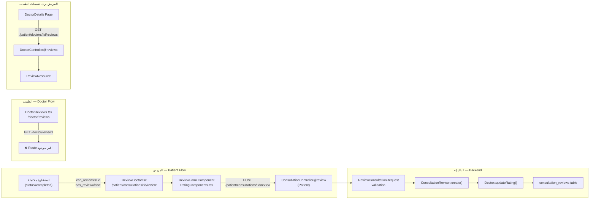

# 🌟 مراجعة نظام تقييمات المرضى — Widad-Tech

---

## 1. خريطة النظام الحالي



---

## 2. الملفات المراجَعة

| الملف | النوع | الحالة |
|---|---|---|
| [migrations/0001_01_01_000022_create_consultation_reviews_table.php](file:///d:/Final_Project_Implementation/Final_Project_Front_And_Back/Back-end/database/migrations/0001_01_01_000022_create_consultation_reviews_table.php) | Migration | ⚠️ مشاكل |
| [Models/ConsultationReview.php](file:///d:/Final_Project_Implementation/Final_Project_Front_And_Back/Back-end/app/Models/ConsultationReview.php) | Model | ⚠️ مشاكل |
| [Controllers/Api/Patient/ConsultationController.php](file:///d:/Final_Project_Implementation/Final_Project_Front_And_Back/Back-end/app/Http/Controllers/Api/Patient/ConsultationController.php) — [review()](file:///d:/Final_Project_Implementation/Final_Project_Front_And_Back/Back-end/app/Http/Controllers/Api/Patient/ConsultationController.php#189-237) | Controller | 🐛 بـاغ |
| [Controllers/Api/Patient/DoctorController.php](file:///d:/Final_Project_Implementation/Final_Project_Front_And_Back/Back-end/app/Http/Controllers/Api/Patient/DoctorController.php) — [reviews()](file:///d:/Final_Project_Implementation/Final_Project_Front_And_Back/Back-end/app/Http/Controllers/Api/Patient/DoctorController.php#152-195) | Controller | ✅ يعمل |
| [Http/Resources/Patient/ReviewResource.php](file:///d:/Final_Project_Implementation/Final_Project_Front_And_Back/Back-end/app/Http/Resources/Patient/ReviewResource.php) | Resource | ⚠️ مشاكل |
| [Http/Requests/Patient/Consultation/ReviewConsultationRequest.php](file:///d:/Final_Project_Implementation/Final_Project_Front_And_Back/Back-end/app/Http/Requests/Patient/Consultation/ReviewConsultationRequest.php) | Request | ✅ يعمل |
| [routes/patient.php](file:///d:/Final_Project_Implementation/Final_Project_Front_And_Back/Back-end/routes/patient.php) | Routes | ✅ يعمل |
| [routes/doctor.php](file:///d:/Final_Project_Implementation/Final_Project_Front_And_Back/Back-end/routes/doctor.php) | Routes | ❌ ناقص |
| [pages/patient/consultations/ReviewDoctor.tsx](file:///d:/Final_Project_Implementation/Final_Project_Front_And_Back/Front-End/src/pages/patient/consultations/ReviewDoctor.tsx) | Frontend | ✅ يعمل |
| [pages/doctor/reviews/DoctorReviews.tsx](file:///d:/Final_Project_Implementation/Final_Project_Front_And_Back/Front-End/src/pages/doctor/reviews/DoctorReviews.tsx) | Frontend | ❌ مكسور |
| [components/consultations/RatingComponents.tsx](file:///d:/Final_Project_Implementation/Final_Project_Front_And_Back/Front-End/src/components/consultations/RatingComponents.tsx) | Component | ✅ يعمل |
| [services/consultationService.ts](file:///d:/Final_Project_Implementation/Final_Project_Front_And_Back/Front-End/src/services/consultationService.ts) | Service | ✅ يعمل |
| [services/doctorService.ts](file:///d:/Final_Project_Implementation/Final_Project_Front_And_Back/Front-End/src/services/doctorService.ts) — [getReviews](file:///d:/Final_Project_Implementation/Final_Project_Front_And_Back/Front-End/src/services/doctorService.ts#143-148) | Service | ❌ الـ endpoint غير موجود |

---

## 3. المشاكل والثغرات التفصيلية

### 🔴 خطأ بالغ #1 — Bug في ConsultationController (يسبب فشل التقييم)

في [ConsultationController.php](file:///d:/Final_Project_Implementation/Final_Project_Front_And_Back/Back-end/app/Http/Controllers/Api/Doctor/ConsultationController.php) السطر 210:
```php
// ❌ الكود الحالي الخاطئ
ConsultationReview::create([
    ...
    'patient_id' => $patient->id,  // ← خطأ! العمود اسمه user_id وليس patient_id
    ...
]);
```
```php
// ✅ الصحيح
ConsultationReview::create([
    ...
    'user_id' => $patient->id,  // ← الصحيح حسب الـ migration والـ model
    ...
]);
```

> **التأثير**: كل طلب `POST /patient/consultations/:id/review` سيفشل بـ SQL error لأن العمود في قاعدة البيانات اسمه `user_id` وليس `patient_id`.

---

### 🔴 خطأ بالغ #2 — Route الطبيب لعرض التقييمات غير موجود

[doctorService.ts](file:///d:/Final_Project_Implementation/Final_Project_Front_And_Back/Front-End/src/services/doctorService.ts) يستدعي:
```ts
getReviews: async (params) => api.get('/doctor/reviews', { params })
```

لكن [routes/doctor.php](file:///d:/Final_Project_Implementation/Final_Project_Front_And_Back/Back-end/routes/doctor.php) **لا يحتوي على هذا الـ route أبداً** — النتيجة: صفحة [DoctorReviews.tsx](file:///d:/Final_Project_Implementation/Final_Project_Front_And_Back/Front-End/src/pages/doctor/reviews/DoctorReviews.tsx) تعطي `404` دائماً.

الحل: إضافة route + controller جديد:
```php
// في routes/doctor.php - داخل middleware DoctorVerified
Route::get('reviews', [DoctorReviewController::class, 'index']);
```

---

### 🔴 خطأ بالغ #3 — الـ migration يحتوي unique constraint خاطئ

```php
// ❌ في migration السطر 22
$table->unique('consultation_id');
```

هذا يمنع إنشاء أي review لأن `consultation_id` يجب أن يكون unique (كل استشارة تقييم واحد فقط) ولكن المشكلة أن هذا يجب أن يكون **unique constraint صحيح** بما أن التحقق يحدث في الكود أيضاً — هذا في الواقع منطقي لكنه يجب أن يكون موثقاً.

> ✅ في الواقع هذا صحيح — كل استشارة تقييم واحد. لكن يجب إضافة `rating` constraint.

---

### 🟠 مشكلة #4 — ConsultationReview Model: booted() معطل

```php
// في ConsultationReview.php
protected static function booted()
{
    static::created(function ($review) {
        $review->doctor->updateRating(); // ← قد يفشل إذا لا توجد علاقة بـ Doctor
    });
}
```

**و** في `ConsultationController::review()` يتم استدعاء `updateRating()` مرتين:
1. مرة عبر [booted()](file:///d:/Final_Project_Implementation/Final_Project_Front_And_Back/Back-end/app/Models/ConsultationReview.php#41-48) في الـ model
2. مرة في الكود مباشرة: `$consultation->doctor->updateRating()`

هذا يُثبّط الأداء ويُثير خطر double-update.

---

### 🟠 مشكلة #5 — DoctorReviews.tsx يستخدم بيانات hardcoded

```tsx
// في DoctorReviews.tsx السطر 37-41
const stats = reviewsData?.stats || {
    average: 4.8,           // ← بيانات وهمية hardcoded
    total: 124,             // ← بيانات وهمية
    breakdown: { 5: 90, 4: 20, 3: 10, 2: 2, 1: 2 }  // ← وهمية
};
```

لو فشل الـ API (404 كما ذكرنا)، تظهر إحصائيات وهمية `4.8 نجوم / 124 تقييم` — هذا يُضلل الطبيب!

---

### 🟠 مشكلة #6 — DoctorReviews.tsx: تنسيق البيانات غير متوافق

[DoctorReviews.tsx](file:///d:/Final_Project_Implementation/Final_Project_Front_And_Back/Front-End/src/pages/doctor/reviews/DoctorReviews.tsx) تتوقع:
```ts
interface Review {
    patient: { name: string; image_url?: string; }
    is_verified?: boolean;
}
```

لكن [ReviewResource.php](file:///d:/Final_Project_Implementation/Final_Project_Front_And_Back/Back-end/app/Http/Resources/Patient/ReviewResource.php) يُرسل:
```php
'patient_name' => ...   // ← وليس patient.name
'patient_image' => ...  // ← وليس patient.image_url
```

ولا يُرسل `is_verified` أبداً.

---

### 🟠 مشكلة #7 — عدم وجود pagination في DoctorReviews.tsx

الصفحة تجلب الكل دفعة واحدة دون loading more / infinite scroll — مشكلة مع كثرة التقييمات.

---

### 🟡 مشكلة #8 — ReviewResource تفتقد حقلاً مهماً: `user_id`

```php
// ReviewResource.php لا يُرسل:
// - rating_text (نص التقييم: ممتاز، جيد...)
// - is_verified (هل المريض أجرى استشارة فعلاً؟ — يُحسب من consultation)
// - updated_at
```

---

### 🟡 مشكلة #9 — Model ConsultationReview ناقص: لا يوجد rating validation على DB level

```php
// migration
$table->integer('rating'); // ← لا يوجد check constraint لـ 1-5
```

يُعتمد كلياً على الـ Request validation فقط — DB لا تحمي نفسها.

---

### 🟡 مشكلة #10 — DoctorReviews.tsx: زر "مفيد" و"رد الطبيب" غير مفعّلَين

```tsx
// في DoctorReviews.tsx سطر 92-99
<button>مفيد (3)</button>   // ← hardcoded، لا يوجد API
<button>رد الطبيب</button>  // ← لا توجد وظيفة رد في الباك إند أصلاً
```

---

### 🟡 مشكلة #11 — لا يوجد Admin interface لإدارة التقييمات

لا يوجد في `routes/admin.php` ما يخص التقييمات، ولا توجد صفحة في admin pages لـ:
- حذف تقييم مسيء
- نشر/إخفاء تقييم (`is_published`)
- رؤية إحصائيات التقييمات

---

### 🟡 مشكلة #12 — لا يوجد endpoint عام للتقييمات في صفحة الطبيب Public

مسار `GET /patient/doctors/{id}/reviews` محمي بـ `auth:patient` — يعني الزائر غير المسجل لا يمكنه رؤية تقييمات الطبيب في صفحته العامة.

---

## 4. هل التقييمات تظهر بشكل ديناميكي؟

| السيناريو | الحالة |
|---|---|
| **المريض يرسل تقييم** | ✅ ديناميكي — يُرسل للـ API ويُحدّث rating الطبيب فوراً |
| **صفحة تفاصيل الطبيب (قائمة التقييمات)** | ✅ ديناميكي — تجلب من API |
| **صفحة الطبيب يرى تقييماته** | ❌ **مكسورة** — الـ API endpoint غير موجود (404) |
| **صفحة الطبيب العامة (للزوار)** | ❌ **محمية بـ auth** — الزوار لا يرون التقييمات |

---

## 5. أولويات الإصلاح

```
🔴 P1 — حرج (يسبب فشل وظيفي كامل)
├─ Bug: user_id vs patient_id في ConsultationController
└─ Route مفقود: GET /doctor/reviews

🟠 P2 — مهم (يسبب بيانات خاطئة)
├─ Hardcoded fallback stats في DoctorReviews.tsx
├─ تنسيق بيانات مغلوط بين API و DoctorReviews.tsx
└─ double updateRating() call

🟡 P3 — تحسين (UX ومهنية)
├─ Pagination في DoctorReviews
├─ Admin management للتقييمات
├─ تفعيل "مفيد" و"رد الطبيب" أو إخفائهما
├─ إتاحة التقييمات للزوار (public endpoint)
└─ إضافة rating constraint في DB
```

---

## 6. ماذا يحتاج ليكون احترافياً؟ — قائمة مكتملة

### الباك إند

| # | ما يحتاج | الملف |
|---|---|---|
| 1 | ✅ Fix `patient_id` → `user_id` | [Patient/ConsultationController.php](file:///d:/Final_Project_Implementation/Final_Project_Front_And_Back/Back-end/app/Http/Controllers/Api/Patient/ConsultationController.php) |
| 2 | ✅ إضافة `GET /doctor/reviews` route | [routes/doctor.php](file:///d:/Final_Project_Implementation/Final_Project_Front_And_Back/Back-end/routes/doctor.php) |
| 3 | ✅ إنشاء `DoctorReviewController` | `Controllers/Api/Doctor/` |
| 4 | ✅ إزالة double `updateRating()` call | [Patient/ConsultationController.php](file:///d:/Final_Project_Implementation/Final_Project_Front_And_Back/Back-end/app/Http/Controllers/Api/Patient/ConsultationController.php) |
| 5 | ✅ إضافة `is_verified`, `rating_text` للـ Resource | [ReviewResource.php](file:///d:/Final_Project_Implementation/Final_Project_Front_And_Back/Back-end/app/Http/Resources/Patient/ReviewResource.php) |
| 6 | ⭐ إضافة أعمدة للطبيب ليرد على تقييم (doctor_reply) | Migration جديد |
| 7 | ⭐ Admin routes لإدارة التقييمات | `routes/admin.php` |
| 8 | ⭐ Public endpoint للتقييمات (بدون auth) | `routes/public.php` |

### الفرونت إند

| # | ما يحتاج | الملف |
|---|---|---|
| 1 | ✅ Fix تنسيق البيانات في DoctorReviews | [DoctorReviews.tsx](file:///d:/Final_Project_Implementation/Final_Project_Front_And_Back/Front-End/src/pages/doctor/reviews/DoctorReviews.tsx) |
| 2 | ✅ إزالة hardcoded fallback stats | [DoctorReviews.tsx](file:///d:/Final_Project_Implementation/Final_Project_Front_And_Back/Front-End/src/pages/doctor/reviews/DoctorReviews.tsx) |
| 3 | ✅ إضافة empty/error states صحيحة | [DoctorReviews.tsx](file:///d:/Final_Project_Implementation/Final_Project_Front_And_Back/Front-End/src/pages/doctor/reviews/DoctorReviews.tsx) |
| 4 | ✅ إضافة pagination أو infinite scroll | [DoctorReviews.tsx](file:///d:/Final_Project_Implementation/Final_Project_Front_And_Back/Front-End/src/pages/doctor/reviews/DoctorReviews.tsx) |
| 5 | ⭐ إخفاء زر "مفيد" و"رد الطبيب" إذا لم يكن هناك API | [DoctorReviews.tsx](file:///d:/Final_Project_Implementation/Final_Project_Front_And_Back/Front-End/src/pages/doctor/reviews/DoctorReviews.tsx) |
| 6 | ⭐ عرض `breakdown` نجوم في DoctorReviews (progress bars) | [DoctorReviews.tsx](file:///d:/Final_Project_Implementation/Final_Project_Front_And_Back/Front-End/src/pages/doctor/reviews/DoctorReviews.tsx) |
| 7 | ⭐ Admin page لإدارة التقييمات | صفحة جديدة |

---

> ✅ = إصلاح مطلوب الآن | ⭐ = ميزة تضيف احترافية
